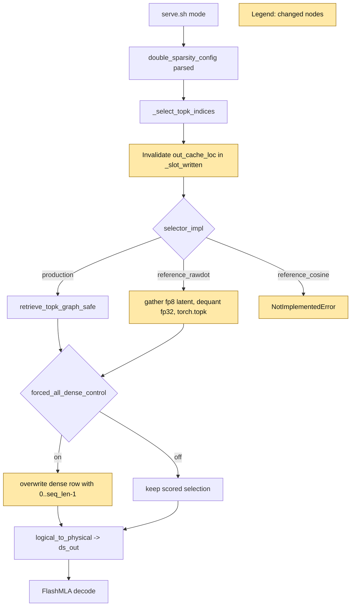

Your work is not finished. Read and execute the below with ultrathink.

## Original Implementation Plan

**IMPORTANT**: Before proceeding, review the original plan you are implementing:
@development/loop13/plan.md

This plan contains the full scope of work and requirements. Ensure your work aligns with this plan.

---

## Round Re-anchor (REQUIRED FIRST STEP)

Before writing code:
- Re-read @development/loop13/plan.md
- Re-read @/sgl-workspace/sglang/.humanize/rlcr/2026-06-20_09-57-51/goal-tracker.md
- Re-read the most recent round summaries/reviews that led to this round
- Write the current round contract to @/sgl-workspace/sglang/.humanize/rlcr/2026-06-20_09-57-51/round-1-contract.md

Your round contract must contain:
- Exactly one **mainline objective**
- The 1-2 target ACs for this round
- Which issues are truly **blocking** that mainline objective
- Which issues are **queued** and explicitly out of scope
- Concrete success criteria for this round

Do not start implementation until the round contract exists.

## Task Lane Rules

Use the Task system (TaskCreate, TaskUpdate, TaskList) with one required tag per task:
- `[mainline]` for plan-derived work that directly advances this round's objective
- `[blocking]` for issues that prevent the mainline objective from succeeding safely
- `[queued]` for non-blocking bugs, cleanup, or follow-up work

Rules:
- `[mainline]` work is the round's primary success condition
- `[blocking]` work is allowed only when it truly blocks the mainline objective
- `[queued]` work must be documented but must NOT replace the round objective
- If a new bug does not block the current objective, tag it `[queued]` and keep moving on mainline work

Before executing each task in this round:
1. Read @/sgl-workspace/sglang/.humanize/bitlesson.md
2. Run `bitlesson-selector` for each task/sub-task
3. Follow selected lesson IDs (or `NONE`) during implementation

---
Below is Codex's review result:
<!-- CODEX's REVIEW RESULT START -->
# Round 0 Review Result - Loop 13

Mainline Progress Verdict: ADVANCED

The dense-regime H3 diagnosis advanced the loop: the current-slot rescue result is strong evidence that production DS excludes the current decode slot and that this explains the dense 0.620 score. The round is not complete. Several required plan items were deferred or marked verified without the required artifacts, and the sparse verdict is not yet supported by the BAD-branch controls.

Goal Alignment Summary:
ACs: 6/8 addressed (0/8 fully satisfied) | Forgotten items: 5 | Unjustified deferrals: 4

Tracker update: I updated the mutable section of `goal-tracker.md` to reopen the incomplete mainline tasks, add blocking side issues, and remove false "completed and verified" status for ACs that still lack required evidence.

## PR Comprehension

Change summary:
- Adds diagnostic DS config fields `selector_impl` and `forced_all_dense_control`.
- Adds a raw-dot reference selector that gathers resident fp8 MLA latent slots, dequantizes them to fp32, computes absorbed scores, and calls exact `torch.topk`.
- Adds a forced-all dense control that overwrites selected logical positions with `[0..seq_len-1]` when the row fits within `top_k`.
- Extends the loop13 harness/evidence with `ref`, `ds_forced_all`, `ds_anchor`, and score/selection capture tooling.
- Writes a root-cause report concluding dense H3 plus sparse H0/H2-family secondary failure.



Walkthrough: the new diagnostic branches sit inside the same DS selection seam. Before either production or reference scoring runs, `_select_topk_indices` marks the current output cache location unwritten. The raw-dot reference path then scores through that same validity bitmap, so its dense run is useful for "same scorer under the same H3 condition" but is not a clean accuracy ceiling. The forced-all dense control overwrites the selected logical indices after scoring and before `logical_to_physical`, which explains why it can rescue dense while also bypassing the missing physical-slot assertions required by AC-2.1.

Corpus synthesis: the SGLang human-review corpus sweep matched 1232 threads across 486 PRs for DeepSeek/attention/fp8/KV-cache paths. The recurring maintainer pattern is to require exact accuracy evidence and targeted tests for DeepSeek/FP8 attention changes, benchmark details for hot-path claims, explicit KV layout/validity handling, and complete PR descriptions when a table claims coverage. That history weighs against accepting a "reference exact" or "AC complete" claim without the promised per-arm metadata, invariants, and missing variant runs.

## Mainline Gaps

1. AC-3.2 and AC-5 are not complete: the served cosine reference is missing, yet the gate requires best-of raw-dot/cosine.

Evidence: `DoubleSparsityConfig` advertises and accepts `reference_cosine` as an allowed selector (`python/sglang/srt/layers/attention/double_sparsity/config.py:130-138`, `:209-213`), but `_reference_selector_topk` immediately raises `NotImplementedError` for it (`python/sglang/srt/models/deepseek_v2.py:2192-2195`). The evidence table has no naive-cosine row (`development/loop13/evidence/evidence_table.md:7-17`). The plan explicitly required a served cosine GSM8K arm and a gate over the best of raw/cosine.

Impact: the BAD gate is not valid. A raw-dot collapse cannot prove the algorithm/mask ceiling when the user-confirmed Loop-7 cosine lever was never served.

Required fix: implement the served cosine reference path using the materialized per-head signature and normalize after mask-channel gather, add a `serve.sh` mode for it, run dense+sparse GSM8K in serial and batched modes, and recompute the AC-5 gate from best(raw-dot, cosine).

2. AC-3.3 and AC-3.4 are not satisfied: the raw-dot reference is H3-contaminated and not proven leak-free fp32.

Evidence: `_select_topk_indices` invalidates `out_cache_loc` before the reference path runs (`python/sglang/srt/models/deepseek_v2.py:2296-2319`), and `_reference_selector_topk` passes that same `slot_written[layer_id]` bitmap into `reference_rawdot_select` (`python/sglang/srt/models/deepseek_v2.py:2174-2212`). The writeup itself says dense DS keeps 715/716, not `selected == seq_len` (`development/loop13/ROOT_CAUSE.md:30-37`), which violates AC-3.3. Also, there is no code or harness setting `torch.backends.cuda.matmul.allow_tf32 = False` or the cuDNN equivalent; the only TF32 references are the plan requirement and unrelated kernels.

Impact: the current raw-dot run can exonerate some score-path optimizations under the production slot-validity bug, but it cannot be called the algorithmically faithful "accuracy ceiling" required by AC-3, and it cannot be used as a final AC-5 gate input.

Required fix: add an explicit leak-free reference setup that disables TF32 in every TP worker before reference scoring, or label the arm `GPU-fp32-with-TF32-risk`. For AC-3.3, add a reference/control mode whose dense selection includes all live logical positions and reports `selected == seq_len`; keep the current H3-contaminated raw-dot run as a separate scorer-isolation control.

3. AC-2 is incomplete: the decisive cheap controls were partly replaced by conclusions, and AC-2.1 lacks the required slot assertions.

Evidence: `apply_forced_all_dense` only overwrites logical indices (`python/sglang/srt/layers/attention/double_sparsity/absorbed_latent.py:362-389`) and the downstream call to `logical_to_physical` records only `error_count` for publication (`python/sglang/srt/models/deepseek_v2.py:2666-2675`). There is no persisted artifact showing physical slots equal `req_to_token[req_pool, 0:seq_len]`, no duplicate check, no `-1` check, no unwritten-slot check, and no adapter error count table. `analyze_captures.py` implements TP head-agg and selected-index checks, but there are no `.sglang_ds_scorecap`, `.sglang_ds_selcap`, or `cheap_controls.json` artifacts under `development/loop13/evidence`.

Impact: the dense H3 conclusion is strong from GSM8K, but AC-2's required negative controls are not met. This matters because the plan explicitly wanted to distinguish scorer, adapter, slot validity, and index equivalence with artifacts rather than narrative.

Required fix: run `ds_capture` on bounded dense and sparse requests, persist the capture directories or derived JSON, run `analyze_captures.py`, and add a forced-all assertion artifact with physical-slot equality, duplicate count, `-1` count, unwritten-slot count, and adapter error count per checked layer/step.

4. AC-1 and AC-4 evidence is incomplete despite the table existing.

Evidence: `run_meta.json` is run-level only and does not contain per-arm sample IDs/order. The committed GSM8K `.out` files mostly contain sampler setup, progress, and final `Score:` lines; they do not persist request IDs or `meta_info["double_sparsity"]` per arm. The evidence table lacks naive-cosine, lacks serial+batched cells for every required arm, lacks selected-vs-total summaries in columns, and lacks the length-cap garbage-rate columns required by AC-4 (`development/loop13/evidence/evidence_table.md:7-17`).

Impact: the numbers are useful but not reproducible to the AC-1/AC-4 standard, and subclaims like "DS genuinely active by regime" are not independently auditable from committed artifacts.

Required fix: make the harness emit one JSON per arm with git SHA, model path, mask hash, exact server args, cuda graph status, sample IDs/order, max_tokens, concurrency, serial/batched mode, selected-vs-total summaries, and invalid/unwritten/duplicate/out-of-range garbage counts. Generate the markdown table from those JSON files and fail closed when any required field is absent.

5. AC-7 and AC-8 are not complete: the BAD-branch no-mask/knob work was deferred, so the sparse H0/H2-family conclusion is not yet supported.

Evidence: the plan lower bound says no-mask is retained whenever BAD is taken (`development/loop13/plan.md:107-110`), and AC-7's negative test rejects an H0 verdict without no-mask (`development/loop13/plan.md:84-94`). The writeup says sparse is an "additional selection-quality failure (H0/H2)" and that channel-importance top-2048 does not capture needed tokens (`development/loop13/ROOT_CAUSE.md:51-58`), but no no-mask, cosine, label-dim, top-k, head-agg, score-reduce, selector-width, recalibration, or per-head oracle results are present.

Impact: the sparse evidence currently proves only that raw-dot production/reference plus current/recency anchors still fail under a known H3-tainted feed. It does not decide H0 versus H2, and it does not characterize the true selection ceiling.

Required fix: run the BAD branch now. First run no-mask/full-signature dense+sparse GSM8K. Then run one-knob-at-a-time accuracy-favoring arms for cosine, head_agg mean, score_reduce fp32, selector_width full, larger top_k, mask recalibration or alternate mask, label_dim variation, and the per-head offline oracle. Record whether any arm recovers sparse to within 5 points of DSA.

## Blocking Side Issues

1. The config surface is misleading because `reference_cosine` validates but crashes at runtime. Either implement it before accepting it or reject it in config until implemented; for this loop, implementation is required by AC-3.2.

2. The tracker previously marked AC-3.1/3.3/3.4, AC-4, AC-5, and AC-8 as verified complete despite missing artifacts. I corrected the mutable tracker so the next round does not inherit a false completion state.

## Queued Side Issues

1. Add committed CPU unit tests for the new diagnostic helpers. Claude's summary says CPU unit tests passed, but no test file in the diff covers `dequantize_resident_latent`, `apply_forced_all_dense`, `reference_rawdot_select`, TF32 handling, or config validation. This should not replace the mainline evidence work, but it should be added before this diagnostic code is kept around.

2. Fail closed if a reference selector is requested with CUDA graph enabled outside the harness. `serve.sh ref` disables CUDA graph, but the config itself allows users to select the reference path without an eager guard.

## Required Implementation Plan

1. Repair the reference selector deliverable. Disable TF32 in TP workers for reference modes. Implement `reference_cosine` as a real served selector with materialized per-head masked signatures and post-gather normalization. Add a harness mode and run dense+sparse, serial+batched.

2. Split H3-contaminated scorer isolation from faithful ceiling measurement. Preserve the current raw-dot result as "production-validity raw-dot scorer isolation"; add a faithful raw-dot control that includes all live dense slots and reports `selected == seq_len`, or explicitly run the faithful ceiling after the H3 diagnostic inclusion control.

3. Complete AC-2 artifacts. Run `ds_capture`, persist derived `cheap_controls.json`, and add forced-all/current-only slot invariant JSON covering physical-slot equality, duplicates, `-1`, unwritten slots, and adapter errors.

4. Complete the evidence ledger. Emit per-arm JSON and regenerate `evidence_table.md` with all AC-4 columns and every required arm x serial/batched cell. Include sample IDs/order and DS-active summaries in the committed evidence.

5. Recompute AC-5 only after steps 1-4. If the valid best-of reference ceiling is BAD, immediately run AC-7 no-mask, then the one-knob sweep and per-head offline oracle. If GOOD, run the AC-6 one-variable bisection.

6. Rewrite `ROOT_CAUSE.md` after the gate and conditional branch are valid. Keep the dense H3 verdict if the current evidence still holds, but do not assert sparse H0/H2 until no-mask/knob data supports it.

NOT COMPLETE
<!-- CODEX's REVIEW RESULT  END  -->
---

## Goal Tracker Reference

Before starting work, **read** @/sgl-workspace/sglang/.humanize/rlcr/2026-06-20_09-57-51/goal-tracker.md to understand:
- The Ultimate Goal and Acceptance Criteria you're working toward
- Which tasks are Active, Completed, or Deferred
- Which side issues are blocking vs queued
- Any Plan Evolution that has occurred
- The latest side-issue state that needs attention

**IMPORTANT**: Keep the mutable section of `goal-tracker.md` up to date during the round.
Do NOT change the immutable section after Round 0.
If you cannot safely reconcile the tracker yourself, include an optional "Goal Tracker Update Request" section in your summary (see below).

## Mainline Guardrails

- Keep the mainline objective from @/sgl-workspace/sglang/.humanize/rlcr/2026-06-20_09-57-51/round-1-contract.md stable for this round
- Do not let queued issues take over the round
- If Codex reported several findings, classify them into:
  - mainline gaps
  - blocking side issues
  - queued side issues
- Only mainline gaps and blocking side issues should drive the next code changes

---

Note: You MUST NOT try to exit by lying, editing loop state files, or executing `cancel-rlcr-loop`.

After completing the work, please:
0. If the `code-simplifier` plugin is installed, use it to review and optimize your code. Invoke via: `/code-simplifier`, `@agent-code-simplifier`, or `@code-simplifier:code-simplifier (agent)`
1. Commit your changes with a descriptive commit message
2. Write your work summary into @/sgl-workspace/sglang/.humanize/rlcr/2026-06-20_09-57-51/round-1-summary.md

## Task Tag Routing Reminder

Follow the plan's per-task routing tags strictly:
- `coding` task -> Claude executes directly
- `analyze` task -> execute via `/humanize:ask-codex`, then integrate the result
- Keep Goal Tracker Active Tasks columns `Tag` and `Owner` aligned with execution

**Optional fallback**: if you could not safely update the mutable section of `goal-tracker.md` directly, include this section in your summary:
```markdown
## Goal Tracker Update Request

### Requested Changes:
- [E.g., "Mark Task X as completed with evidence: tests pass"]
- [E.g., "Add to Blocking Side Issues: bug Y blocks AC-2"]
- [E.g., "Add to Queued Side Issues: cleanup Z is non-blocking"]
- [E.g., "Plan Evolution: changed approach from A to B because..."]
- [E.g., "Defer Task Z because... (impact on AC: none/minimal)"]

### Justification:
[Explain why these changes are needed and how they serve the Ultimate Goal]
```

Codex will review your request and reconcile the Goal Tracker if justified.
