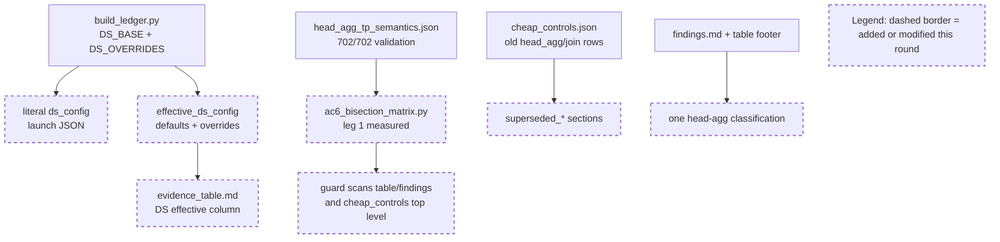

Your work is not finished. Read and execute the below with ultrathink.

## Original Implementation Plan

**IMPORTANT**: Before proceeding, review the original plan you are implementing:
@development/loop13/plan.md

This plan contains the full scope of work and requirements. Ensure your work aligns with this plan.

---

## Round Re-anchor (REQUIRED FIRST STEP)

Before writing code:
- Re-read @development/loop13/plan.md
- Re-read @/sgl-workspace/sglang/.humanize/rlcr/2026-06-20_09-57-51/goal-tracker.md
- Re-read the most recent round summaries/reviews that led to this round
- Write the current round contract to @/sgl-workspace/sglang/.humanize/rlcr/2026-06-20_09-57-51/round-11-contract.md

Your round contract must contain:
- Exactly one **mainline objective**
- The 1-2 target ACs for this round
- Which issues are truly **blocking** that mainline objective
- Which issues are **queued** and explicitly out of scope
- Concrete success criteria for this round

Do not start implementation until the round contract exists.

## Task Lane Rules

Use the Task system (TaskCreate, TaskUpdate, TaskList) with one required tag per task:
- `[mainline]` for plan-derived work that directly advances this round's objective
- `[blocking]` for issues that prevent the mainline objective from succeeding safely
- `[queued]` for non-blocking bugs, cleanup, or follow-up work

Rules:
- `[mainline]` work is the round's primary success condition
- `[blocking]` work is allowed only when it truly blocks the mainline objective
- `[queued]` work must be documented but must NOT replace the round objective
- If a new bug does not block the current objective, tag it `[queued]` and keep moving on mainline work

Before executing each task in this round:
1. Read @/sgl-workspace/sglang/.humanize/bitlesson.md
2. Run `bitlesson-selector` for each task/sub-task
3. Follow selected lesson IDs (or `NONE`) during implementation

---
Below is Codex's review result:
<!-- CODEX's REVIEW RESULT START -->
# Round 10 Review Result - Loop 13

Mainline Progress Verdict: ADVANCED

Round 10 advanced the CPU-only evidence-package cleanup. The head-aggregation classification is now consistent across the matrix, table, and findings; the stale top-level `cheap_controls.json` rows were moved under `superseded_*`; and DS arms now carry literal launch JSON plus resolved `effective_ds_config` defaults. This is real progress, but it is not complete. The new table column conflates resolved config defaults with the selector behavior actually used by the reference arms, and the original-plan GPU/instrumentation close-out remains active.

Tracker update: I updated the mutable section of `goal-tracker.md` to Plan Version 11. I accepted the R10 head-agg/cheap-controls/config provenance work, added a R10-review blocker for the AC-4 behavior-surface mismatch, and corrected task9 so it no longer says effective defaults are still missing. The immutable goal/AC section was not changed.

## PR Comprehension

Change summary:
- `build_ledger.py` adds `DS_DEFAULTS`, emits `effective_ds_config` beside the literal `ds_config`, asserts key AC-4 effective fields, and adds a "DS effective" table column.
- `build_ledger.py` and `findings.md` update the head-agg wording so `evidence_table.md` and `findings.md` match the measured AC-6 matrix classification.
- `ac6_bisection_matrix.py` extends the AC-2.2 consistency guard to scan table/findings stale wording and top-level `served_sum_matches` data in `cheap_controls.json`.
- `cheap_controls.json` is structurally rearranged so old head-agg/join rows live under `superseded_*`.



Walkthrough: Round 10 is an evidence-generator change, not a runtime selector change. The ledger now records both the launch config and a resolved config object for DS arms, then renders those values in `evidence_table.md`. The matrix guard consumes the settled AC-2.2 artifact and prevents old head-agg wording from reappearing in active generated surfaces.

Historical review synthesis: the SGLang corpus sweep scanned 32639 threads and matched 310 inline DeepSeek/MLA/FP8/top-k/evidence threads across 151 PRs. Broader non-inline sweeps matched 2889 PR conversations and 548 review submissions for DeepSeek/FP8/benchmark/accuracy/server-args/config/evidence terms. The recurring maintainer pattern is exact config and behavior provenance for accuracy claims: reviewers block inconsistent server args, missing benchmark commands, and precision-path claims that are not tied to the actual code path. Round 10 improves provenance, but the new "DS effective" column still violates that standard for reference selector arms.

## Mainline Gaps

1. P1 - The new "DS effective" table column reports dormant config defaults as if they were the reference arms' actual selector behavior.

Evidence: `build_ledger.py` formats the table directly from `effective_ds_config` (`development/loop13/build_ledger.py:289-293`). That object fills default `selector_width_buckets=[5120]` and `score_reduce_dtype="bf16"` for every DS arm (`development/loop13/build_ledger.py:98-105`, `development/loop13/build_ledger.py:119-124`). The generated table therefore says `ref_faithful`, `ref_cosine`, and `ref_cosine_noinc` used `W[5120] · bf16` (`development/loop13/evidence/evidence_table.md:13-15`).

But the reference selector path explicitly says the opposite: it "runs the exact absorbed channel-dot + full-width torch top-k" with "no ... bf16 reduce ... or selector-width bucketing" (`python/sglang/srt/models/deepseek_v2.py:2137-2143`). `config.py` also documents `reference_*` variants as exact fp32 with no bf16 reduce or selector-width bucketing (`python/sglang/srt/layers/attention/double_sparsity/config.py:132-136`).

Impact: AC-4 asks for selector width and score-reduce dtype/backend per arm. A reader comparing production vs reference now sees reference arms displayed as if they used the production width ladder and bf16 reduce, even though those knobs are bypassed by `selector_impl=reference_*`. That can mislead the final AC-8 writeup and reintroduces the exact provenance problem Round 10 was meant to close.

Required fix: keep `effective_ds_config` as config-object provenance, but add a separate behavioral selector surface for AC-4 display/comparison. For `selector_impl="production"`, render the resolved width/reduce/scorer/head-agg. For `selector_impl` starting with `reference_`, render full live width / exact fp32 / no cross-TP score reduce or clearly `not used`, plus exact `torch.topk`. Add a guard that reference arms cannot render `W[5120] · bf16` as the used selector width/reduce.

2. P1 - Original-plan close-out work remains pending and cannot be treated as deferred completion.

Evidence: Claude's own summary still lists AC-2.1 forced-all physical-slot assertions, AC-2.4 recall-oracle, AC-3.1 captured materialized-K equality, AC-4 garbage counters/serial cells, and AC-8 final writeup as remaining. The goal tracker also keeps these active.

Required implementation plan:
1. First fix the CPU AC-4 table/metadata issue above: add `ds_selector_behavior` (or equivalent) to every DS arm JSON and make `evidence_table.md` render behavioral width/reduce/top-k/scorer fields rather than dormant defaults. Include a fail-closed assertion for reference arms.
2. Add guarded adapter instrumentation at the `logical_to_physical` -> `transform_index_page_table_decode` boundary. Persist `evidence/forced_all_assertions.json` with per-layer/step equality to `req_to_token[req_pool, 0:seq_len]`, duplicate count, `-1` count, unwritten-slot count, out-of-range count, and adapter error count. Reuse the same counters for AC-4 length-cap garbage-rate columns.
3. Run the forced-all dense control through the guarded harness on GPU and wire the physical-slot/garbage artifacts into the ledger.
4. Extend the latent capture path to dump the resident latent/scales needed for AC-3.1, then run an offline/blockwise materialized fp32 `K_label` selected-index equality check against `absorbed_latent_score_logical` at top-2048 on captured decode rows.
5. Run the AC-2.4 recall-oracle workload as NIAH-only corroboration for dense and sparse; label it as corroboration, not selected-index equivalence.
6. Fill the remaining AC-4 serial cells (DSA-radix serial and production DS sparse serial) through `serve.sh` one TP=8 server at a time, and complete selected-vs-total metadata where still absent.
7. Regenerate `build_ledger.py` outputs, `findings.md`, and `ROOT_CAUSE.md`; the AC-8 writeup should name the accepted ranked verdict, include the fixed AC-4 behavior surface, and land no selector/adapter fix.

## Blocking Side Issues

- P1 - AC-4 behavior provenance: split `effective_ds_config` from actual selector behavior for reference arms, then guard the table display.
- P1 - AC-2.1/AC-4 adapter instrumentation: forced-all physical-slot assertions and garbage counters are still missing.
- P1 - AC-3.1 captured materialized-K proof is still missing.
- P1 - AC-2.4 recall-oracle@2048 corroboration is still missing.
- P1 - AC-4 remaining serial cells / selected-vs-total gaps and AC-8 final writeup remain incomplete.

## Queued Side Issues

- Plan terminology remains in diagnostic code/comments. Keep queued unless loop13 diagnostics are retained beyond this investigation.
- Reference selector modes still rely on guarded eager harness discipline rather than general config-level fail-closed validation. Keep queued until reference modes are promoted outside this diagnosis loop.

## Goal Alignment

| AC | Status | Evidence if met | Blocker if not met | Deferral justification |
|----|--------|-----------------|--------------------|------------------------|
| AC-1 | PARTIAL | Baseline/prod DS scores and launch/config provenance exist; R10 added resolved config object. | DSA-radix serial and production DS sparse serial cells are still missing. | n/a |
| AC-2 | PARTIAL | AC-2.2 settled and integrated; AC-2.3 pruning-valid radix/width retired. | AC-2.1 `forced_all_assertions.json` absent; AC-2.4 recall-oracle absent. | n/a |
| AC-3 | PARTIAL | Reference raw/cosine served; TF32-off tests pass. | Captured-row materialized fp32 `K_label` selected-index equality is still missing. | n/a |
| AC-4 | PARTIAL | Per-arm table, sample IDs/order, literal DS config, and `effective_ds_config` exist. | New behavior-surface mismatch for reference arms; garbage counters, selected-vs-total gaps, and some serial cells remain missing. | n/a |
| AC-5 | MET | GOOD gate remains recorded from measured DSA and best naive DS. | n/a | n/a |
| AC-6 | PARTIAL | Matrix is internally consistent: measured [1,2,3,7], retired [4,5], blocked [6]. | Final AC-8 cannot rely on the AC-4 table until the behavior-surface mismatch is fixed. | n/a |
| AC-7 | DEFERRED/MOOT | n/a | n/a | Justified while AC-5 remains GOOD; reconsider immediately if AC-5 flips. |
| AC-8 | PARTIAL | Interim evidence exists. | Final writeup waits on AC-2.1, AC-2.4, AC-3.1, AC-4 behavior/garbage/serial gaps. | n/a |

Forgotten items detection:
- No original plan tasks are absent from Active/Completed/Deferred.
- The tracker had drifted after Claude's R10 update: task9 still listed "expand effective DS defaults" as remaining even though R10 added `effective_ds_config`. I corrected this and added the behavior-surface blocker instead.

Deferred items audit:
- AC-7 remains the only explicit conditional deferral and is justified while the GOOD gate stands.
- The GPU/instrumentation items are not accepted deferrals; they are active incomplete work.

Goal Alignment Summary:
```text
ACs: 8/8 addressed | Forgotten items: 0 | Unjustified deferrals: 0
```

## Goal Tracker Update Requests

Applied directly:
- Plan Version moved to 11 with a Round 10 review row.
- Accepted R10 head-agg/table/findings consistency and `cheap_controls` superseding.
- Accepted `effective_ds_config` as resolved config-object provenance.
- Corrected task9 to remove the stale "expand effective DS defaults" remaining item.
- Added a blocking side issue for the `DS effective` table behavior mismatch on reference arms.

Rejected:
- Rejected closing AC-4's selector-width/reduce evidence surface while reference arms are rendered as `W[5120] · bf16` despite using full-width exact fp32/no reduce.
- Rejected treating Round 10 as complete because the original-plan GPU/instrumentation close-out remains active.

## Validation Performed

- Read `development/loop13/plan.md` first.
- Read `round-10-prompt.md`, `round-10-contract.md`, `goal-tracker.md`, and Round 7-9 summaries/review results.
- Read Pensieve review pipeline/maxims and the relevant DS score-reduce knowledge note.
- Read SGLang Humanize Review skill and corpus summary; ran corpus sweeps:
  - inline path/risk sweep: 32639 scanned / 310 matched / 151 PRs
  - PR conversation sweep: 32639 scanned / 2889 matched
  - review submission sweep: 32639 scanned / 548 matched
- Inspected commit `75158e505`.
- Reran `python3 development/loop13/test_reference_selectors.py`: 5/5 pass.
- Reran `python3 development/loop13/verify_ac2_3.py development/loop13/evidence/.sglang_ds_scorecap_sparse`: 4992/4992 pruning rows, exit 0.
- Reran `python3 development/loop13/ac6_score_reduce_corrob.py`: 702 groups, median Jaccard 0.998, exit 0.
- Reran `python3 development/loop13/ac2_2_head_agg.py`: 702 groups, `sum(pre)==post` 702/702, exit 0.
- Reran `python3 development/loop13/ac6_bisection_matrix.py`: measured [1,2,3,7], retired [4,5], blocked [6], exit 0.
- Reran `python3 development/loop13/ac4_sample_ids.py`: deterministic dense/sparse slices, exit 0.
- Reran `python3 development/loop13/ac6_corrob_ref_cosine_noinc.py`: sparse 4992/4992 and dense 3744/3744 invariants pass, exit 0.
- Confirmed `git status --short` was clean before writing the review/tracker files.

NOT COMPLETE
<!-- CODEX's REVIEW RESULT  END  -->
---

## Goal Tracker Reference

Before starting work, **read** @/sgl-workspace/sglang/.humanize/rlcr/2026-06-20_09-57-51/goal-tracker.md to understand:
- The Ultimate Goal and Acceptance Criteria you're working toward
- Which tasks are Active, Completed, or Deferred
- Which side issues are blocking vs queued
- Any Plan Evolution that has occurred
- The latest side-issue state that needs attention

**IMPORTANT**: Keep the mutable section of `goal-tracker.md` up to date during the round.
Do NOT change the immutable section after Round 0.
If you cannot safely reconcile the tracker yourself, include an optional "Goal Tracker Update Request" section in your summary (see below).

## Mainline Guardrails

- Keep the mainline objective from @/sgl-workspace/sglang/.humanize/rlcr/2026-06-20_09-57-51/round-11-contract.md stable for this round
- Do not let queued issues take over the round
- If Codex reported several findings, classify them into:
  - mainline gaps
  - blocking side issues
  - queued side issues
- Only mainline gaps and blocking side issues should drive the next code changes

---

Note: You MUST NOT try to exit by lying, editing loop state files, or executing `cancel-rlcr-loop`.

After completing the work, please:
0. If the `code-simplifier` plugin is installed, use it to review and optimize your code. Invoke via: `/code-simplifier`, `@agent-code-simplifier`, or `@code-simplifier:code-simplifier (agent)`
1. Commit your changes with a descriptive commit message
2. Write your work summary into @/sgl-workspace/sglang/.humanize/rlcr/2026-06-20_09-57-51/round-11-summary.md

## Task Tag Routing Reminder

Follow the plan's per-task routing tags strictly:
- `coding` task -> Claude executes directly
- `analyze` task -> execute via `/humanize:ask-codex`, then integrate the result
- Keep Goal Tracker Active Tasks columns `Tag` and `Owner` aligned with execution

**Optional fallback**: if you could not safely update the mutable section of `goal-tracker.md` directly, include this section in your summary:
```markdown
## Goal Tracker Update Request

### Requested Changes:
- [E.g., "Mark Task X as completed with evidence: tests pass"]
- [E.g., "Add to Blocking Side Issues: bug Y blocks AC-2"]
- [E.g., "Add to Queued Side Issues: cleanup Z is non-blocking"]
- [E.g., "Plan Evolution: changed approach from A to B because..."]
- [E.g., "Defer Task Z because... (impact on AC: none/minimal)"]

### Justification:
[Explain why these changes are needed and how they serve the Ultimate Goal]
```

Codex will review your request and reconcile the Goal Tracker if justified.
