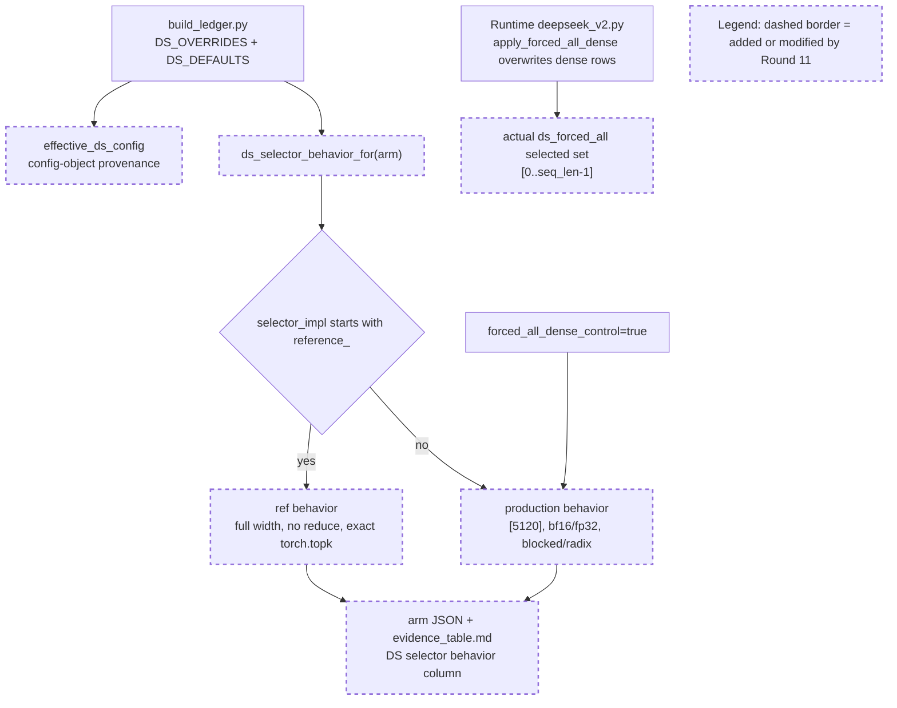

Your work is not finished. Read and execute the below with ultrathink.

## Original Implementation Plan

**IMPORTANT**: Before proceeding, review the original plan you are implementing:
@development/loop13/plan.md

This plan contains the full scope of work and requirements. Ensure your work aligns with this plan.

---

## Round Re-anchor (REQUIRED FIRST STEP)

Before writing code:
- Re-read @development/loop13/plan.md
- Re-read @/sgl-workspace/sglang/.humanize/rlcr/2026-06-20_09-57-51/goal-tracker.md
- Re-read the most recent round summaries/reviews that led to this round
- Write the current round contract to @/sgl-workspace/sglang/.humanize/rlcr/2026-06-20_09-57-51/round-12-contract.md

Your round contract must contain:
- Exactly one **mainline objective**
- The 1-2 target ACs for this round
- Which issues are truly **blocking** that mainline objective
- Which issues are **queued** and explicitly out of scope
- Concrete success criteria for this round

Do not start implementation until the round contract exists.

## Task Lane Rules

Use the Task system (TaskCreate, TaskUpdate, TaskList) with one required tag per task:
- `[mainline]` for plan-derived work that directly advances this round's objective
- `[blocking]` for issues that prevent the mainline objective from succeeding safely
- `[queued]` for non-blocking bugs, cleanup, or follow-up work

Rules:
- `[mainline]` work is the round's primary success condition
- `[blocking]` work is allowed only when it truly blocks the mainline objective
- `[queued]` work must be documented but must NOT replace the round objective
- If a new bug does not block the current objective, tag it `[queued]` and keep moving on mainline work

Before executing each task in this round:
1. Read @/sgl-workspace/sglang/.humanize/bitlesson.md
2. Run `bitlesson-selector` for each task/sub-task
3. Follow selected lesson IDs (or `NONE`) during implementation

---
Below is Codex's review result:
<!-- CODEX's REVIEW RESULT START -->
# Round 11 Review Result - Loop 13

Mainline Progress Verdict: ADVANCED

Round 11 fixed the specific R10 blocker for reference selector arms: `ref_faithful`, `ref_cosine`, and `ref_cosine_noinc` no longer render dormant production `[5120]` / `bf16` defaults as actual behavior. That is real AC-4 progress. It is not a full behavior-surface close-out, because the same helper still ignores the `forced_all_dense_control` selector override and renders `ds_forced_all` as ordinary production top-k. The original-plan GPU/instrumentation close-out also remains active.

Tracker update: I updated the mutable section of `goal-tracker.md` to Plan Version 12. I accepted the reference-arm fix, rejected closing the whole AC-4 behavior surface, and added a Round 11 review blocker for the forced-all behavior metadata mismatch. The immutable goal/AC section was not changed.

## PR Comprehension

Change summary:
- `build_ledger.py` adds `ds_selector_behavior_for(arm)` beside `effective_ds_config`.
- Reference arms now render `full (no bucketing)` / `none (per-rank-local fp32; no cross-TP reduce)` / `exact torch.topk`.
- Production arms render resolved width/reduce/top-k/scorer behavior from the effective config.
- A fail-closed assertion guards only `reference_*` arms against showing production `5120` or `bf16` as used.
- Generated arm JSONs and `evidence_table.md` now consume `ds_selector_behavior`.



Walkthrough: the new ledger path is generated, not runtime selection code. It derives a behavior record from `selector_impl` and writes it into each DS arm JSON, then formats the table from that record. That correctly separates reference arms from production arms, but the runtime also has another selector override: when `forced_all_dense_control` is true, `_select_topk_indices` applies `apply_forced_all_dense()` after the production selector and replaces dense selected indices with logical `[0..seq_len-1]`. The new generator falls through to the generic production behavior for that arm.

Historical review synthesis: the corpus sweep scanned 32639 threads and matched 166 inline DeepSeek/FP8/top-k/config/evidence threads across 95 PRs. The non-inline sweeps matched 2899 PR conversations and 543 review submissions for DeepSeek/FP8/benchmark/accuracy/config/evidence terms. The repeated human-review pattern is that accuracy and model-path claims need exact launch/config/path provenance, end-to-end accuracy evidence, and no stale or misleading generated docs. R11 follows that standard for reference arms, but the forced-all diagnostic arm still violates it.

## Mainline Gaps

1. P1 - `ds_forced_all` still renders as normal production top-k even though the runtime overrides the selected set.

Evidence: `ds_selector_behavior_for()` only branches on `selector_impl`; every non-reference arm falls through to `"production (graph-safe, fp8 absorbed)"`, `"[5120]"`, `"bf16"`, and `"blocked/radix"` (`development/loop13/build_ledger.py:128`, `development/loop13/build_ledger.py:149`). The guard added in R11 also only checks `selector_impl.startswith("reference_")`, so it cannot catch a forced-all mismatch (`development/loop13/build_ledger.py:302`). The generated `ds_forced_all.json` has `forced_all_dense_control=true` but still records `topk: "blocked/radix"` and `score_reduce: "bf16"` as selector behavior (`development/loop13/evidence/meta/arms/ds_forced_all.json:50`, `development/loop13/evidence/meta/arms/ds_forced_all.json:76`). The table repeats that as `prod · [5120] · bf16 · blocked/radix` (`development/loop13/evidence/evidence_table.md:17`).

Actual runtime behavior differs: after production selection, `_select_topk_indices` checks `forced_all_dense_control` and calls `apply_forced_all_dense()` (`python/sglang/srt/models/deepseek_v2.py:2631`). That helper replaces rows where `seq_len <= max_top_k` with the logical sweep `[0..seq_len-1]`, explicitly replacing the scored selection (`python/sglang/srt/layers/attention/double_sparsity/absorbed_latent.py:501`). For the committed arm, dense reports selected==total 716/716, so this override is the behavior AC-4 readers need to see.

Impact: the original R10 issue was that the table showed knobs as used when a selector path bypassed them. This is the same class of provenance bug on the forced-all diagnostic path. It is narrower than the reference-arm problem, but it still affects AC-2.1/AC-4/AC-8 because `ds_forced_all` is the downstream-isolation control whose purpose is to bypass scored top-k in dense.

Required fix:
1. In `ds_selector_behavior_for()`, branch on `eff["forced_all_dense_control"]` before the generic production case.
2. For `ds_forced_all`, render a path such as `forced-all dense diagnostic`; selector width `full live dense rows (seq_len <= top_k)`; score_reduce `not used for final dense selected set`; topk `forced [0..seq_len-1] after production scoring`; scoring `production pre-override only`; scorer/head_agg from config if retained as pre-override context.
3. Add a fail-closed assertion: if `forced_all_dense_control=true`, `ds_selector_behavior.topk` must contain `forced` or equivalent and must not render plain `blocked/radix` as the used top-k behavior.
4. Regenerate arm JSONs, `evidence_table.md`, and `run_meta.json`. Confirm `production_ds` and `ds_reduce_fp32` still render as production top-k, reference arms still render full/no-reduce/exact-topk, and `ds_forced_all` clearly renders the dense forced-all override.

2. P1 - Original-plan close-out work is still unfinished and remains mandatory.

Evidence: Claude's summary still lists AC-2.1 forced-all physical-slot assertions, AC-2.4 recall-oracle, AC-3.1 captured materialized-K equality, AC-4 garbage counters/serial cells/selected-vs-total gaps, and AC-8 final writeup as remaining. The tracker keeps these active.

Required implementation plan:
1. Fix the forced-all behavior surface above first; it is CPU-only and keeps the AC-4 table honest before more GPU evidence is added.
2. Add guarded adapter instrumentation at the `logical_to_physical` -> `transform_index_page_table_decode` boundary. Persist `evidence/forced_all_assertions.json` with equality to `req_to_token[req_pool, 0:seq_len]`, duplicate count, `-1` count, unwritten-slot count, out-of-range count, and adapter error count.
3. Reuse the same adapter counters as AC-4 length-cap garbage-rate columns and wire them into the ledger.
4. Run the forced-all dense control on GPU through the guarded harness and regenerate the ledger.
5. Extend latent capture for AC-3.1, then run offline/blockwise materialized fp32 `K_label` selected-index equality against `absorbed_latent_score_logical` at top-2048 on captured decode rows.
6. Run the AC-2.4 recall-oracle workload as NIAH-only corroboration for dense and sparse; label it as corroboration, not selected-index equivalence.
7. Fill the remaining AC-4 serial cells and selected-vs-total gaps.
8. Regenerate `build_ledger.py` outputs, `findings.md`, and `ROOT_CAUSE.md`; the final AC-8 writeup must name the ranked verdict and land no selector/adapter fix.

## Blocking Side Issues

- P1 - `ds_selector_behavior` ignores `forced_all_dense_control`; `ds_forced_all` must render the dense forced-all override and be guarded against plain production top-k display.
- P1 - AC-2.1/AC-4 adapter instrumentation: forced-all physical-slot assertions and garbage counters are still missing.
- P1 - AC-3.1 captured materialized-K proof is still missing.
- P1 - AC-2.4 recall-oracle@2048 corroboration is still missing.
- P1 - AC-4 remaining serial cells / selected-vs-total gaps and AC-8 final writeup remain incomplete.

## Queued Side Issues

- Plan terminology remains in diagnostic code/comments. Keep queued unless loop13 diagnostics are retained beyond this investigation.
- Reference selector modes still rely on guarded eager harness discipline rather than general config-level fail-closed validation. Keep queued until reference modes are promoted outside this diagnosis loop.

## Goal Alignment

| AC | Status | Evidence if met | Blocker if not met | Deferral justification |
|----|--------|-----------------|--------------------|------------------------|
| AC-1 | PARTIAL | Baseline/prod DS scores and launch/config/effective config provenance exist. | DSA-radix serial and production DS sparse serial cells are still missing. | n/a |
| AC-2 | PARTIAL | AC-2.2 settled and integrated; AC-2.3 pruning-valid radix/width retired. | AC-2.1 `forced_all_assertions.json` absent; AC-2.4 recall-oracle absent; forced-all behavior display still inaccurate. | n/a |
| AC-3 | PARTIAL | Reference raw/cosine served; TF32-off tests pass. | Captured-row materialized fp32 `K_label` selected-index equality is still missing. | n/a |
| AC-4 | PARTIAL | Per-arm table, sample IDs/order, literal DS config, `effective_ds_config`, and reference-arm behavior surface exist. | `ds_forced_all` behavior surface is wrong; garbage counters, selected-vs-total gaps, and some serial cells remain missing. | n/a |
| AC-5 | MET | GOOD gate remains recorded from measured DSA and best naive DS. | n/a | n/a |
| AC-6 | PARTIAL | Matrix is internally consistent for measured/retired legs after R10; R11 reference behavior no longer misleads the table. | AC-8 still cannot close until forced-all behavior surface and GPU/instrumentation artifacts are complete. | n/a |
| AC-7 | DEFERRED/MOOT | n/a | n/a | Justified while AC-5 remains GOOD; reconsider immediately if AC-5 flips. |
| AC-8 | PARTIAL | Interim evidence exists. | Final writeup waits on AC-2.1, AC-2.4, AC-3.1, AC-4 forced-all behavior/garbage/serial gaps. | n/a |

Forgotten items detection:
- No original plan tasks are absent from Active/Completed/Deferred.
- Tracker drift existed after Claude's R11 update: it marked the whole AC-4 behavior surface closed even though `ds_forced_all` still shows production top-k behavior. I corrected this in the mutable section.

Deferred items audit:
- AC-7 remains the only explicit conditional deferral and is justified while the GOOD gate stands.
- GPU/instrumentation items are active incomplete work, not accepted deferrals.

Goal Alignment Summary:
```text
ACs: 8/8 addressed | Forgotten items: 0 | Unjustified deferrals: 0
```

## Goal Tracker Update Requests

Applied directly:
- Plan Version moved to 12 with a Round 11 review row.
- Accepted the R11 reference-arm behavior fix.
- Rejected closing the entire AC-4 behavior surface because `ds_forced_all` still renders as normal production top-k.
- Updated task9 to track the forced-all behavior mismatch.
- Added a blocking side issue for `ds_selector_behavior` ignoring `forced_all_dense_control`.

Rejected:
- Rejected Claude's request to mark AC-4 selector behavior fully closed. It is advanced, but not closed until the forced-all diagnostic path is represented and guarded.
- Rejected treating Round 11 or the loop as complete because the original-plan GPU/instrumentation close-out remains active.

## Validation Performed

- Read `development/loop13/plan.md` first, plus `round-11-prompt.md`, `round-11-contract.md`, `round-11-summary.md`, `goal-tracker.md`, and Round 8-10 summaries/reviews.
- Read Pensieve review pipeline and taste-review knowledge.
- Read SGLang Humanize Review skill and corpus summary; ran corpus sweeps:
  - inline path/risk sweep: 32639 scanned / 166 matched / 95 PRs
  - PR conversation sweep: 32639 scanned / 2899 matched
  - review submission sweep: 32639 scanned / 543 matched
- Inspected commit `482ff8083`.
- Verified the runtime reference path still bypasses width/reduce/radix/fp8 (`deepseek_v2.py:2137-2143`, `config.py:131-139`).
- Verified the forced-all runtime override (`deepseek_v2.py:2631-2645`, `absorbed_latent.py:501-527`).
- Queried committed arm JSONs with `jq`; confirmed `ds_forced_all` has `forced_all_dense_control=true` but behavior `production ... blocked/radix ... bf16`.
- Ran `python3 development/loop13/test_reference_selectors.py`: 5/5 pass.
- Ran `python3 -m py_compile development/loop13/build_ledger.py`: pass.
- Ran `git diff --check 75158e505 482ff8083`: pass.
- Confirmed worktree was clean before tracker/review edits.

NOT COMPLETE
<!-- CODEX's REVIEW RESULT  END  -->
---

## Goal Tracker Reference

Before starting work, **read** @/sgl-workspace/sglang/.humanize/rlcr/2026-06-20_09-57-51/goal-tracker.md to understand:
- The Ultimate Goal and Acceptance Criteria you're working toward
- Which tasks are Active, Completed, or Deferred
- Which side issues are blocking vs queued
- Any Plan Evolution that has occurred
- The latest side-issue state that needs attention

**IMPORTANT**: Keep the mutable section of `goal-tracker.md` up to date during the round.
Do NOT change the immutable section after Round 0.
If you cannot safely reconcile the tracker yourself, include an optional "Goal Tracker Update Request" section in your summary (see below).

## Mainline Guardrails

- Keep the mainline objective from @/sgl-workspace/sglang/.humanize/rlcr/2026-06-20_09-57-51/round-12-contract.md stable for this round
- Do not let queued issues take over the round
- If Codex reported several findings, classify them into:
  - mainline gaps
  - blocking side issues
  - queued side issues
- Only mainline gaps and blocking side issues should drive the next code changes

---

Note: You MUST NOT try to exit by lying, editing loop state files, or executing `cancel-rlcr-loop`.

After completing the work, please:
0. If the `code-simplifier` plugin is installed, use it to review and optimize your code. Invoke via: `/code-simplifier`, `@agent-code-simplifier`, or `@code-simplifier:code-simplifier (agent)`
1. Commit your changes with a descriptive commit message
2. Write your work summary into @/sgl-workspace/sglang/.humanize/rlcr/2026-06-20_09-57-51/round-12-summary.md

## Task Tag Routing Reminder

Follow the plan's per-task routing tags strictly:
- `coding` task -> Claude executes directly
- `analyze` task -> execute via `/humanize:ask-codex`, then integrate the result
- Keep Goal Tracker Active Tasks columns `Tag` and `Owner` aligned with execution

**Optional fallback**: if you could not safely update the mutable section of `goal-tracker.md` directly, include this section in your summary:
```markdown
## Goal Tracker Update Request

### Requested Changes:
- [E.g., "Mark Task X as completed with evidence: tests pass"]
- [E.g., "Add to Blocking Side Issues: bug Y blocks AC-2"]
- [E.g., "Add to Queued Side Issues: cleanup Z is non-blocking"]
- [E.g., "Plan Evolution: changed approach from A to B because..."]
- [E.g., "Defer Task Z because... (impact on AC: none/minimal)"]

### Justification:
[Explain why these changes are needed and how they serve the Ultimate Goal]
```

Codex will review your request and reconcile the Goal Tracker if justified.
