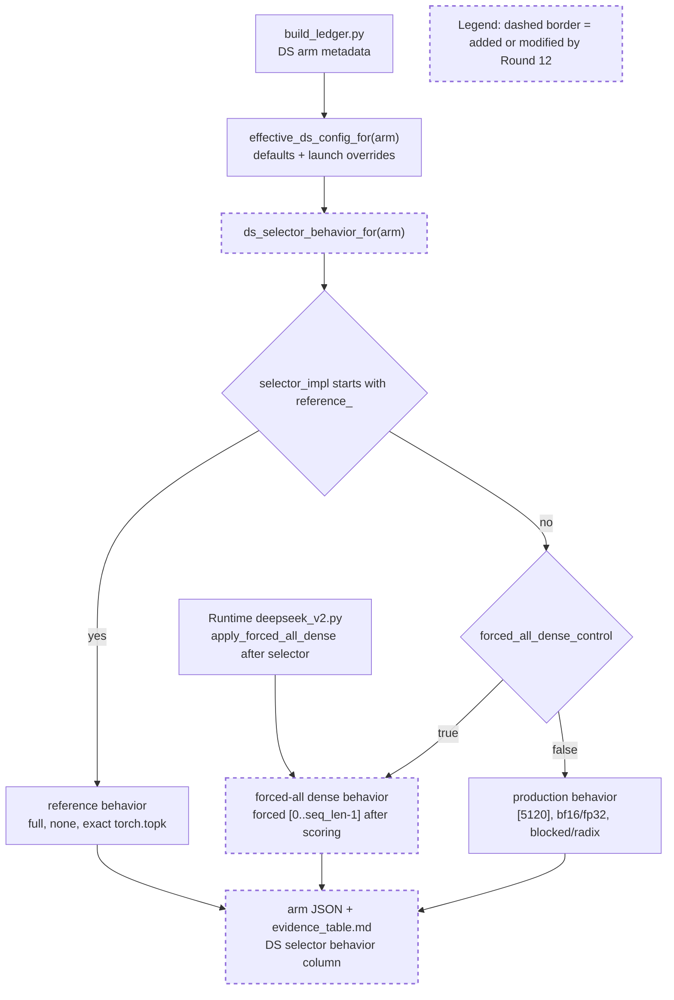

# Round 12 Review Result - Loop 13

Mainline Progress Verdict: ADVANCED

Round 12 correctly fixes the narrow R11 blocker: `ds_forced_all` no longer renders as ordinary production `[5120] / bf16 / blocked-radix` behavior. The generated behavior surface now reflects the runtime `apply_forced_all_dense()` override, and the guard covers future `forced_all_dense_control=true` arms. This is real AC-4/AC-2.1 provenance progress, but it is not loop completion. The original-plan GPU/instrumentation artifacts remain mandatory and still block AC-8.

I updated the mutable section of `goal-tracker.md`: Plan Version is now 13 with a Round 12 review row, the broad evidence-package blocker no longer says forced-all behavior display is missing, and task9 now explicitly tracks the missing reference raw/cosine serial cells in addition to the other AC-4 gaps. The immutable section was not changed.

## PR Comprehension

Change summary:
- `build_ledger.py` now derives `ds_selector_behavior` from both `selector_impl` and the post-selector `forced_all_dense_control` override.
- Reference arms still render full-width / no cross-TP reduce / exact `torch.topk`.
- Production arms still render resolved selector width, score-reduce dtype, blocked/radix top-k, and raw-dot scorer.
- `ds_forced_all` now renders a forced-all dense diagnostic path: production scoring happens first, then dense rows are overwritten with logical `[0..seq_len-1]`.
- Generated arm JSONs and `evidence_table.md` were regenerated; `run_meta.json` generator provenance was synced.



Walkthrough: this is a generated evidence/provenance change, not a runtime selector change. Runtime selection still computes the production DS selected set first, then when `forced_all_dense_control` is true, `_select_topk_indices` calls `apply_forced_all_dense()` and replaces dense rows with the logical sweep. The ledger now mirrors that final selected-set behavior before it falls back to the generic production rendering.

## Historical Review Synthesis

Corpus coverage:
- Inline/path sweep: 32639 threads scanned, 73 matched across 40 PRs, 164 human comments.
- PR conversation sweep: 32639 scanned, 2855 matched across 2855 PRs, 17951 human comments.
- Review submission sweep: 32639 scanned, 540 matched across 540 PRs, 818 human comments.

Recurring SGLang review pattern: DeepSeek/MLA/FP8 changes are reviewed around exact runtime behavior, launch/config provenance, and concrete accuracy evidence. Reviewers repeatedly ask for commands, hardware/config details, accuracy outputs, and no stale generated docs. Round 12 satisfies that bar for the forced-all behavior display, but the same standard keeps the remaining AC-2.1/AC-3.1/AC-4/AC-8 artifacts blocking.

## Mainline Gaps

1. P1 - Original-plan close-out work remains incomplete and mandatory.

Round 12 fixed only the forced-all behavior-surface label. It did not produce the physical-slot assertions, adapter garbage counters, captured materialized-K proof, recall-oracle corroboration, missing serial cells, or final writeup required by the original plan.

Evidence:
- The forced-all metadata itself is now correct: `development/loop13/build_ledger.py:149` branches on `forced_all_dense_control`, `development/loop13/build_ledger.py:153` returns the forced-all behavior record, and `development/loop13/build_ledger.py:327` asserts forced-all top-k cannot render as plain `blocked/radix`.
- The generated table now shows `ds_forced_all` as `forced-all ... forced [0..seq_len-1]` at `development/loop13/evidence/evidence_table.md:17`.
- The table still states garbage counters are not instrumented at `development/loop13/evidence/evidence_table.md:21`.
- Strict AC-4 serial cells are still blank for core rows: `dsa_noradix` at `development/loop13/evidence/evidence_table.md:11`, production DS sparse serial at `development/loop13/evidence/evidence_table.md:12`, and reference raw/cosine serial cells at `development/loop13/evidence/evidence_table.md:13` and `development/loop13/evidence/evidence_table.md:14`.
- Selected-vs-total is still absent for some DS/bisection rows, for example `ref_cosine_noinc` and `ds_reduce_fp32` at `development/loop13/evidence/evidence_table.md:15` and `development/loop13/evidence/evidence_table.md:16`.
- No committed evidence artifact exists for `forced_all_assertions`, recall-oracle AC-2.4, materialized-K captured equality, or garbage counters under `development/loop13/evidence`.
- Current `latent_capture` only hashes resident latent bytes (`python/sglang/srt/layers/attention/double_sparsity/latent_capture.py:107`); that is useful identity evidence but is not yet the captured-row offline/blockwise materialized `K_label` selected-index equality demanded by AC-3.1.

Impact: AC-8 still cannot be closed without theory-only or metadata-only reasoning. The plan lower bound explicitly requires the physical-slot assertions, reference proof, per-arm evidence table, gate, and writeup. The GOOD branch makes AC-7 moot, but it does not make the active close-out artifacts optional.

Required implementation plan:
1. Add a diagnostic adapter assertion helper at the existing `logical_to_physical` seam in `deepseek_v2.py:2693`. Gate it through a config-borne diagnostic flag or through `forced_all_dense_control` for the forced-all arm. Persist `evidence/forced_all_assertions.json` with per-layer/per-step totals for: equality to `req_to_token[req_pool, 0:seq_len]`, duplicate physical slots, live-lane `-1`, pad-lane non-`-1`, logical out-of-range, physical out-of-range, unwritten slots via `_ds_slot_written[layer_id, slot]`, and adapter `error_count`. The reducer must fail closed if no dense forced-all rows are observed or if any required counter is absent.
2. Reuse that same helper for AC-4 length-cap garbage counters. Emit one normalized artifact that `build_ledger.py` can read into per-arm garbage-rate columns instead of the current `fields_not_instrumented` prose.
3. Run `ds_forced_all` dense through the guarded GPU harness with the assertion helper enabled, one TP=8 server at a time. Regenerate the ledger only after the assertion artifact passes with zero adapter/slot errors.
4. Extend the captured-row AC-3.1 path so it stores the actual bounded resident latent/scales/query data needed for offline/blockwise materialized `K_label`, not only hashes. Add an analyzer that computes raw absorbed scores and materialized raw `Q_label * K_label` scores on the same captured decode rows, compares selected-index equality at top-2048, and writes `evidence/ac3_1_materialized_k_selected_index_equality.json`. Fail closed on empty captures, mismatched row identity, or any mismatch.
5. Run the AC-2.4 NIAH-only recall-oracle flow with `recall_oracle=true` and a valid `.sglang_ds_oracle/trial.json`. Write `evidence/ac2_4_recall_oracle.json` and label it as corroboration only, not selected-index equivalence.
6. Fill every AC-4 serial/batched table cell for the original core arms: DSA, DSA-radix-off control, production DS, `ref_faithful`, and `ref_cosine`. At minimum the current blanks in `evidence_table.md` for DSA-radix serial, production DS sparse serial, and reference raw/cosine serial must be populated. Keep using `run_gsm8k.sh` with `THREADS=1` for serial, `--api completion`, and the guarded `serve.sh` modes.
7. Complete selected-vs-total metadata for DS rows that still show `--` where the server reports `meta_info["double_sparsity"]`. If a row cannot produce it, record a concrete reason and guard the ledger against silently treating missing DS summary as complete.
8. Regenerate `build_ledger.py` outputs, `findings.md`, and `ROOT_CAUSE.md`. The final AC-8 writeup must cite the new physical-slot, garbage-counter, materialized-K, recall-oracle, and serial-cell artifacts, name the ranked verdict, and land no selector/adapter fix.

## Blocking Side Issues

- AC-2.1 / AC-4 adapter instrumentation is still missing: no `forced_all_assertions.json`, no persisted adapter error counts, and no length-cap garbage counters.
- AC-3.1 captured materialized fp32 `K_label` selected-index equality is still missing; current synthetic/unit evidence does not replace captured decode-row proof.
- AC-2.4 recall-oracle@2048 corroboration is still missing.
- AC-4 serial cells and selected-vs-total gaps remain; the tracker now explicitly includes reference raw/cosine serial cells.
- AC-8 final writeup remains partial until the above artifacts exist.

## Queued Side Issues

- Plan-workflow terms remain in diagnostic comments and generated descriptions. Keep queued unless loop13 diagnostics are promoted outside this investigation.
- Reference selector modes still rely on guarded eager harness discipline rather than general config-level fail-closed validation. Keep queued until these modes become non-loop13 serving features.

## Goal Alignment

| AC | Status | Evidence if met | Blocker if not met | Deferral justification |
|----|--------|-----------------|--------------------|------------------------|
| AC-1 | PARTIAL | Baseline/prod DS scores and launch/config/effective config provenance exist. | Some serial cells remain blank in the ledger. | n/a |
| AC-2 | PARTIAL | AC-2.2 settled; AC-2.3 pruning-valid radix/width retired; forced-all behavior display now correct. | AC-2.1 physical-slot assertions absent; AC-2.4 recall-oracle absent. | n/a |
| AC-3 | PARTIAL | Reference raw/cosine served; TF32-off reference path tests pass. | Captured-row offline/blockwise materialized `K_label` selected-index equality absent. | n/a |
| AC-4 | PARTIAL | Per-arm table, sample IDs/order, literal DS config, effective config, and selector-behavior surface exist. | Garbage counters, selected-vs-total gaps, and serial cells remain missing. | n/a |
| AC-5 | MET | GOOD gate remains recorded from measured DSA and best naive DS. | n/a | n/a |
| AC-6 | PARTIAL | Matrix is internally consistent for measured/retired/blocked legs. | AC-8 cannot close until remaining corroboration and table artifacts are complete. | n/a |
| AC-7 | DEFERRED/MOOT | n/a | n/a | Justified while AC-5 remains GOOD; reconsider if AC-5 flips. |
| AC-8 | PARTIAL | Interim evidence and root-cause notes exist. | Final writeup waits on AC-2.1, AC-2.4, AC-3.1, AC-4 garbage/serial/selected-vs-total. | n/a |

Forgotten items detection:
- Tracker drift corrected during review: task9 now explicitly includes the missing reference raw/cosine serial cells under the AC-4 serial/batched requirement.
- No original-plan task remains absent from Active/Completed/Deferred after the tracker correction.

Deferred items audit:
- AC-7 is the only explicit deferral and remains justified because the AC-5 gate is GOOD.
- The GPU/instrumentation items are active incomplete work, not accepted deferrals.

Goal Alignment Summary:
```text
ACs: 8/8 addressed | Forgotten items: 0 | Unjustified deferrals: 0
```

## Goal Tracker Update Requests

Applied directly:
- Updated Plan Version to 13 with a Round 12 review row.
- Accepted the Round 12 forced-all behavior-surface fix.
- Kept AC-1/AC-2/AC-3/AC-4/AC-8 partial because original-plan artifacts remain missing.
- Removed stale wording from the broad evidence-package blocker that still implied forced-all behavior display was missing.
- Updated task9 to track strict AC-4 serial/batched gaps for reference raw/cosine cells as well as the previously named serial gaps.

Rejected:
- Rejected treating Round 12 as complete.
- Rejected treating GPU/instrumentation close-out as deferrable merely because Round 12 was CPU-only.

## Validation Performed

- Read `development/loop13/plan.md` first, then `round-12-prompt.md`, `round-12-contract.md`, `round-12-summary.md`, `goal-tracker.md`, and Round 9-11 summaries/reviews.
- Read Pensieve review pipeline and taste-review knowledge.
- Read SGLang Humanize Review skill and corpus summary; ran inline, PR-conversation, and review-submission corpus sweeps listed above.
- Inspected commit `d11e752b8` and the `HEAD~1..HEAD` diff.
- Verified runtime forced-all override in `python/sglang/srt/models/deepseek_v2.py:2631` and `python/sglang/srt/layers/attention/double_sparsity/absorbed_latent.py:501`.
- Reran CPU validation:
  - `python3 development/loop13/test_reference_selectors.py`: 5/5 pass.
  - `python3 development/loop13/verify_ac2_3.py development/loop13/evidence/.sglang_ds_scorecap_sparse`: 4992/4992 pruning rows, exit 0.
  - `python3 development/loop13/ac6_corrob_ref_cosine_noinc.py`: sparse 4992/4992 and dense 3744/3744 invariants, exit 0.
  - `python3 development/loop13/ac6_score_reduce_corrob.py`: median Jaccard 0.998, exit 0.
  - `python3 development/loop13/ac2_2_head_agg.py`: 702/702 validation, exit 0.
  - `python3 development/loop13/ac4_sample_ids.py`: deterministic dense/sparse slices, exit 0.
  - `python3 development/loop13/ac6_bisection_matrix.py`: measured [1,2,3,7], retired [4,5], blocked [6], exit 0.
  - `python3 -m py_compile development/loop13/build_ledger.py`: pass.
  - `git diff --check HEAD~1..HEAD`: pass.
- Did not rerun `build_ledger.py` directly during review because it rewrites generated provenance to the current HEAD and would dirty committed evidence; instead I verified the committed generated artifacts and reran the non-ledger CPU checks.

NOT_DONE
