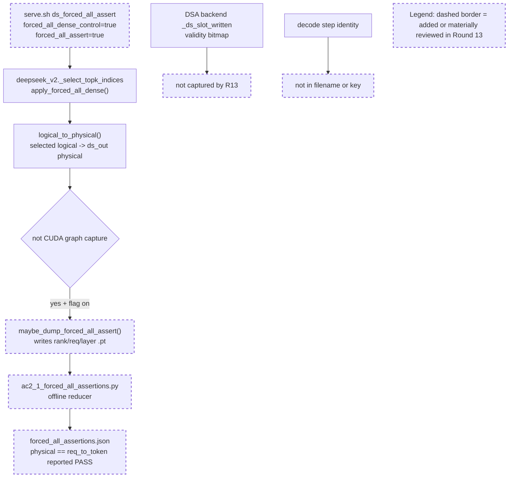

Your work is not finished. Read and execute the below with ultrathink.

## Original Implementation Plan

**IMPORTANT**: Before proceeding, review the original plan you are implementing:
@development/loop13/plan.md

This plan contains the full scope of work and requirements. Ensure your work aligns with this plan.

---

## Round Re-anchor (REQUIRED FIRST STEP)

Before writing code:
- Re-read @development/loop13/plan.md
- Re-read @/sgl-workspace/sglang/.humanize/rlcr/2026-06-20_09-57-51/goal-tracker.md
- Re-read the most recent round summaries/reviews that led to this round
- Write the current round contract to @/sgl-workspace/sglang/.humanize/rlcr/2026-06-20_09-57-51/round-14-contract.md

Your round contract must contain:
- Exactly one **mainline objective**
- The 1-2 target ACs for this round
- Which issues are truly **blocking** that mainline objective
- Which issues are **queued** and explicitly out of scope
- Concrete success criteria for this round

Do not start implementation until the round contract exists.

## Task Lane Rules

Use the Task system (TaskCreate, TaskUpdate, TaskList) with one required tag per task:
- `[mainline]` for plan-derived work that directly advances this round's objective
- `[blocking]` for issues that prevent the mainline objective from succeeding safely
- `[queued]` for non-blocking bugs, cleanup, or follow-up work

Rules:
- `[mainline]` work is the round's primary success condition
- `[blocking]` work is allowed only when it truly blocks the mainline objective
- `[queued]` work must be documented but must NOT replace the round objective
- If a new bug does not block the current objective, tag it `[queued]` and keep moving on mainline work

Before executing each task in this round:
1. Read @/sgl-workspace/sglang/.humanize/bitlesson.md
2. Run `bitlesson-selector` for each task/sub-task
3. Follow selected lesson IDs (or `NONE`) during implementation

---
Below is Codex's review result:
<!-- CODEX's REVIEW RESULT START -->
# Round 13 Review Result - Loop 13

Mainline Progress Verdict: ADVANCED

Round 13 made real mainline progress: it added a guarded `forced_all_assert` diagnostic, ran the forced-all dense control, and produced an artifact proving that the retained forced-all records gather physical slots equal to `req_to_token[req, 0:seq_len]`. That is useful adapter-gather evidence. It is not the AC-2.1 close-out Claude claims, because the round contract and original plan required `_ds_slot_written`/unwritten-slot proof and per-layer/step garbage counters. The current capture never records `_ds_slot_written`, overwrites repeated decode steps for the same `(rank, req, layer)`, and checks physical out-of-range against the request-table width rather than the KV-slot/slot-written capacity.

I updated the mutable section of `goal-tracker.md`: Plan Version is now 14 with a Round 13 review row; task2 is back to partial; task9 no longer treats forced-all garbage counters as complete; the broad evidence-package blocker now records Round 13 as partial adapter-gather evidence, not AC-2.1 completion. The immutable section was not changed.

## PR Comprehension

Change summary:
- `DoubleSparsityConfig` gains `forced_all_assert`, default `False`, parsed and validated as a bool.
- `serve.sh ds_forced_all_assert` runs the existing dense forced-all control in eager mode with `forced_all_assert=true`.
- `deepseek_v2.py` calls `maybe_dump_forced_all_assert()` after `logical_to_physical()` and outside CUDA graph capture.
- `forced_all_assert_capture.py` writes one `.pt` file per `(tp_rank, req_pool_index, layer_id)` containing logical positions, physical slots, expected `req_to_token` slice, and adapter error count.
- `ac2_1_forced_all_assertions.py` reduces those `.pt` files into `evidence/forced_all_assertions.json`.
- `build_ledger.py` links that artifact from `ds_forced_all`, and `findings.md` presents it as AC-2.1/AC-4 proof.



Walkthrough: the new path is diagnostic-only and runs after the selector has already forced dense logical positions to `[0..seq_len-1]`. The reducer checks the adapter gather against `req_to_token`. The missing piece is the validity bitmap: production DS masks selection with `_ds_slot_written`, the reference selector requires it, and the round contract explicitly asked to dump those bits. R13 never passes them into the capture module, so the artifact cannot prove the "all selected slots are written" part of AC-2.1 or the unwritten component of AC-4 garbage rate.

## Historical Review Synthesis

Corpus coverage:
- Inline/path sweep: 32639 threads scanned, 311 matched across 152 PRs, 598 human comments.
- PR conversation sweep: 32639 scanned, 5711 matched across 5711 PRs, 29318 human comments.
- Review submission sweep: 32639 scanned, 926 matched across 926 PRs, 1418 human comments.

Recurring SGLang review pattern: DeepSeek/FP8/KV-cache changes are judged on exact runtime path, launch/config provenance, accuracy artifacts, and no stale generated evidence. Reviewers repeatedly ask for real commands, hardware/config context, and precise validity checks around CUDA graph, KV cache, TP, and quantized paths. Round 13 meets the "real artifact" bar for adapter gather, but not the "claim exactly what was measured" bar for slot-written validity and per-step garbage.

## Mainline Gaps

1. P1 - AC-2.1 is still incomplete: the forced-all artifact never measures `_ds_slot_written`, even though the plan and round contract require unwritten-slot assertions.

Evidence:
- The Round 13 contract required dumping `_ds_slot_written` bits and reducing per-layer/step unwritten-slot counts (`round-13-contract.md`, success criteria 3).
- Production/reference selection makes `_ds_slot_written` load-bearing: the reference selector requires the bitmap (`python/sglang/srt/models/deepseek_v2.py:2172`), passes `written=slot_written[layer_id]` (`python/sglang/srt/models/deepseek_v2.py:2230`), and production retrieval masks through `written=_written_arg` (`python/sglang/srt/models/deepseek_v2.py:2532`).
- The bitmap is real backend state, not derivable from `req_to_token`: `dsa_backend.py` allocates `_ds_slot_written` as `[local_layers, kv_slots]` (`python/sglang/srt/layers/attention/dsa_backend.py:493`) and marks slots written after KV write (`python/sglang/srt/layers/attention/dsa_backend.py:1635`).
- The new hook passes only `ds_out`, `selected_indices`, `valid_lengths`, `req_pool_indices`, `req_to_token`, `seq_lens`, and `error_count` (`python/sglang/srt/models/deepseek_v2.py:2728`). The capture module signature has no slot-written argument (`python/sglang/srt/layers/attention/double_sparsity/forced_all_assert_capture.py:35`), and the saved record has no written bits (`python/sglang/srt/layers/attention/double_sparsity/forced_all_assert_capture.py:67`).
- The reducer's required fields omit any written/slot-validity field (`development/loop13/ac2_1_forced_all_assertions.py:31`) and reports `"unwritten": "0 (subsumed by physical==req_to_token equality)"` (`development/loop13/ac2_1_forced_all_assertions.py:110`). That statement is the core bug: equality to the request mapping proves the gather, not that the physical KV slot is marked written.

Impact: the artifact can exonerate the `logical_to_physical` gather for retained records, but it cannot satisfy AC-2.1's "all selected slots are written" positive test or AC-4's invalid/unwritten garbage-rate column. Marking task2 done would let AC-8 close on an unmeasured validity claim, exactly where H3 lives.

Required implementation plan:
1. Extend `maybe_dump_forced_all_assert()` to accept `slot_written` for the current global layer and, for each live physical slot, dump the boolean `slot_written[layer_id, physical_slot]`. Resolve the bitmap exactly as the selector already does through the ForwardContext attention backend; fail closed in the diagnostic if `forced_all_assert=true` and the bitmap is absent.
2. Dump the true physical-slot capacity used by the bitmap (`slot_written.shape[1]`) and use it for physical out-of-range checks. Keep `req_to_token.shape[1]` only as the logical-position bound.
3. Add a decode-step identity to the dump filename and record. Do not key only by `(tp_rank, req_pool_index, layer_id)`, because that overwrites earlier decode steps for multi-token completions.
4. Update `ac2_1_forced_all_assertions.py` to require the new fields, count unwritten live slots from the dumped bits, count physical out-of-range against the KV-slot capacity, and fail closed if any dense forced-all record lacks step id, written bits, or capacity.
5. Rerun `ds_forced_all_assert` on the dense workload and regenerate `forced_all_assertions.json`, `findings.md`, ledger arm JSONs, and `evidence_table.md`. Only then mark AC-2.1 done.

2. P1 - The current reducer is not per-step and can miss transient decode failures.

Evidence:
- The capture file name is `rank{tp}_req{req}_layer{layer}.pt` (`forced_all_assert_capture.py:79`), so every later decode step for the same request/layer overwrites the earlier one.
- The reducer deduplicates by `(tp_rank, req_pool_index, layer_id)` (`ac2_1_forced_all_assertions.py:58`) and never expects a decode-step key.
- The artifact's 4368 records therefore mean retained rank/request/layer records, not all layer/step rows.

Impact: AC-4 asks for per-step length-cap garbage rates, and the Round 13 contract explicitly requested per-layer/step totals. The current artifact cannot catch a one-step invalid-slot event that is overwritten by a later clean step.

Required fix: make step identity part of the runtime capture contract and reducer key. If there is no existing decode step counter available at this seam, add a diagnostic-only monotonically increasing counter on `forward_batch` or a capture module counter keyed by rank/layer/request for eager runs, and record it in every `.pt`.

3. P1 - The "out-of-range physical" counter uses the wrong bound.

Evidence:
- The capture stores `req_to_token_width = req_to_token.shape[1]` (`forced_all_assert_capture.py:77`).
- The reducer uses that width for `physical >= width` (`ac2_1_forced_all_assertions.py:64`, `ac2_1_forced_all_assertions.py:88`).
- `ReqToTokenPool.req_to_token` is shaped `(request_pool_size + 1, max_context_len)` (`memory_pool.py:138`), while physical KV slots are bounded by the token/KV pool and the `_ds_slot_written` bitmap (`dsa_backend.py:493`). These are different dimensions.

Impact: an invalid physical KV slot can pass if it is below `max_context_len` but outside the KV pool/bitmap capacity, and a valid slot could falsely fail on configurations where the KV pool exceeds max context length. This invalidates the reported `rows_with_out_of_range_physical=0` as an AC-4 garbage counter.

Required fix: compare physical slots against `slot_written.shape[1]` or the token-to-KV pool capacity captured from the backend, not against `req_to_token.shape[1]`.

4. P1 - Original-plan close-out work remains incomplete and cannot be deferred as loop completion.

Round 13's own summary still leaves AC-3.1 captured materialized-K equality, AC-2.4 recall-oracle, AC-4 scored-arm garbage counters, serial cells, selected-vs-total gaps, and AC-8 final writeup. Those are active plan obligations, not optional polish.

Required implementation plan after AC-2.1 repair:
1. Run AC-2.4 NIAH-only recall-oracle with `recall_oracle=true` and persist a corroboration-only artifact.
2. Extend latent capture to store bounded latent/scales/query for captured decode rows, then add the offline/blockwise materialized fp32 `K_label` selected-index equality analyzer at top-2048.
3. Enable the repaired adapter/slot-written garbage capture on scored DS/reference arms and wire per-arm garbage columns into the ledger.
4. Fill the missing AC-4 serial cells: DSA-radix serial, production DS sparse serial, `ref_faithful` serial, and `ref_cosine` serial, plus selected-vs-total gaps.
5. Regenerate the evidence package and write the final AC-8 root-cause document with no selector/adapter fix.

## Blocking Side Issues

- P1 - `build_ledger.py`'s `DS_DEFAULTS` is stale after adding `DoubleSparsityConfig.forced_all_assert`: the generated `effective_ds_config` still omits the new field while claiming to be the fully resolved config (`development/loop13/build_ledger.py:98`). Add `forced_all_assert: false`, include it in generated arm JSONs, and record the `ds_forced_all_assert` artifact run config/provenance explicitly.
- P1 - `findings.md` and `evidence_table.md` overclaim the current artifact as AC-2.1 / AC-4 garbage completion. `findings.md` says the adapter has "zero garbage" and AC-4 counters are all zero (`development/loop13/evidence/findings.md:97`), while `evidence_table.md` still says per-step garbage counters need adapter instrumentation (`development/loop13/evidence/evidence_table.md:21`). Reconcile these after the repaired reducer exists; until then, label Round 13 as adapter-gather evidence only.

## Queued Side Issues

- Plan-workflow terms remain in production diagnostic comments and harness text. Keep queued unless loop13 diagnostics are retained beyond the investigation.
- `serve.sh` help/error text still omits some valid modes such as `ds_forced_all_assert`, `ds_reduce_fp32`, and reference variants. This is non-blocking for the current evidence loop but should be cleaned before handing the harness to another operator.

## Goal Alignment

| AC | Status | Evidence if met | Blocker if not met | Deferral justification |
|----|--------|-----------------|--------------------|------------------------|
| AC-1 | PARTIAL | Baseline/prod DS scores and launch/config provenance exist. | Some serial cells remain blank; effective DS config now omits the new `forced_all_assert` field. | n/a |
| AC-2 | PARTIAL | AC-2.2 settled; AC-2.3 pruning-valid radix/width retired; R13 proves forced-all adapter gather equals `req_to_token` on retained dense records. | AC-2.1 still lacks `_ds_slot_written`, true range, and per-step records; AC-2.4 recall-oracle absent. | n/a |
| AC-3 | PARTIAL | Reference raw/cosine served; TF32-off reference path exists. | Captured-row materialized fp32 `K_label` selected-index equality absent. | n/a |
| AC-4 | PARTIAL | Per-arm table, sample IDs/order, literal config, effective config, selector behavior, and R13 forced-all gather artifact exist. | Length-cap garbage counters are not valid/per-step; scored-arm garbage, selected-vs-total gaps, and serial cells remain missing. | n/a |
| AC-5 | MET | GOOD gate recorded from measured DSA and best naive DS. | n/a | n/a |
| AC-6 | PARTIAL | Matrix is internally consistent for measured/retired/blocked legs. | AC-8 cannot close until AC-2.1/2.4/3.1/4 artifacts are complete. | n/a |
| AC-7 | DEFERRED/MOOT | n/a | n/a | Justified while AC-5 remains GOOD; reconsider if AC-5 flips. |
| AC-8 | PARTIAL | Interim findings exist. | Final writeup waits on repaired AC-2.1, AC-2.4, AC-3.1, AC-4 garbage/serial/selected-vs-total. | n/a |

Forgotten items detection:
- No original-plan task is absent from Active/Completed/Deferred.
- Tracker drift existed after Round 13: task2 was marked done and forced-all AC-4 garbage counters were treated as complete despite missing written bits/per-step records. I corrected that in the mutable section.

Deferred items audit:
- AC-7 remains the only explicit conditional deferral and is justified while the GOOD gate stands.
- AC-3.1, AC-2.4, AC-4 scored-arm garbage/serial/selected-vs-total, and AC-8 are active incomplete work, not accepted deferrals.

Goal Alignment Summary:
```text
ACs: 8/8 addressed | Forgotten items: 0 | Unjustified deferrals: 0
```

## Goal Tracker Update Requests

Applied directly:
- Updated Plan Version to 14 with a Round 13 review row.
- Rejected the request to mark AC-2.1/task2 done; task2 is now partial with the accepted adapter-gather evidence and the missing slot-written/per-step requirements called out.
- Rejected treating forced-all AC-4 garbage counters as complete; task9 now says the artifact lacks unwritten/per-step/true-range counters.
- Updated the broad evidence-package blocker so Round 13 is partial adapter-gather evidence, not AC-2.1 closure.

Rejected:
- Rejected "unwritten is subsumed by physical==req_to_token equality." It is not: `_ds_slot_written` is a separate backend validity bitmap.
- Rejected "AC-4 garbage counters for the forced-all control are all zero." Duplicate/live `-1`/adapter error were counted on retained records; unwritten and true physical-range were not.

## Validation Performed

- Read `development/loop13/plan.md` first, then `round-13-prompt.md`, `round-13-contract.md`, `round-13-summary.md`, `goal-tracker.md`, and Round 10-12 summaries/reviews.
- Read Pensieve review pipeline and taste-review knowledge.
- Read SGLang Humanize Review skill and corpus summary; ran inline, PR-conversation, and review-submission corpus sweeps listed above.
- Inspected commit `e62112335` and the `HEAD~1..HEAD` diff.
- Reran `python3 development/loop13/ac2_1_forced_all_assertions.py development/loop13/evidence/.sglang_ds_forcedall`: reducer exits 0 and rewrites the same report content.
- Ran `python3 -m py_compile` on the new reducer/capture/config/deepseek files: pass.
- Ran `git diff --check HEAD~1..HEAD`: pass.
- Checked capture cardinality: 4368 `.pt` files; sampled records show `req_to_token_width=202756`, confirming the out-of-range counter is using max-context width, not KV-slot capacity.

NOT_COMPLETE
<!-- CODEX's REVIEW RESULT  END  -->
---

## Goal Tracker Reference

Before starting work, **read** @/sgl-workspace/sglang/.humanize/rlcr/2026-06-20_09-57-51/goal-tracker.md to understand:
- The Ultimate Goal and Acceptance Criteria you're working toward
- Which tasks are Active, Completed, or Deferred
- Which side issues are blocking vs queued
- Any Plan Evolution that has occurred
- The latest side-issue state that needs attention

**IMPORTANT**: Keep the mutable section of `goal-tracker.md` up to date during the round.
Do NOT change the immutable section after Round 0.
If you cannot safely reconcile the tracker yourself, include an optional "Goal Tracker Update Request" section in your summary (see below).

## Mainline Guardrails

- Keep the mainline objective from @/sgl-workspace/sglang/.humanize/rlcr/2026-06-20_09-57-51/round-14-contract.md stable for this round
- Do not let queued issues take over the round
- If Codex reported several findings, classify them into:
  - mainline gaps
  - blocking side issues
  - queued side issues
- Only mainline gaps and blocking side issues should drive the next code changes

---

Note: You MUST NOT try to exit by lying, editing loop state files, or executing `cancel-rlcr-loop`.

After completing the work, please:
0. If the `code-simplifier` plugin is installed, use it to review and optimize your code. Invoke via: `/code-simplifier`, `@agent-code-simplifier`, or `@code-simplifier:code-simplifier (agent)`
1. Commit your changes with a descriptive commit message
2. Write your work summary into @/sgl-workspace/sglang/.humanize/rlcr/2026-06-20_09-57-51/round-14-summary.md

## Task Tag Routing Reminder

Follow the plan's per-task routing tags strictly:
- `coding` task -> Claude executes directly
- `analyze` task -> execute via `/humanize:ask-codex`, then integrate the result
- Keep Goal Tracker Active Tasks columns `Tag` and `Owner` aligned with execution

**Optional fallback**: if you could not safely update the mutable section of `goal-tracker.md` directly, include this section in your summary:
```markdown
## Goal Tracker Update Request

### Requested Changes:
- [E.g., "Mark Task X as completed with evidence: tests pass"]
- [E.g., "Add to Blocking Side Issues: bug Y blocks AC-2"]
- [E.g., "Add to Queued Side Issues: cleanup Z is non-blocking"]
- [E.g., "Plan Evolution: changed approach from A to B because..."]
- [E.g., "Defer Task Z because... (impact on AC: none/minimal)"]

### Justification:
[Explain why these changes are needed and how they serve the Ultimate Goal]
```

Codex will review your request and reconcile the Goal Tracker if justified.
