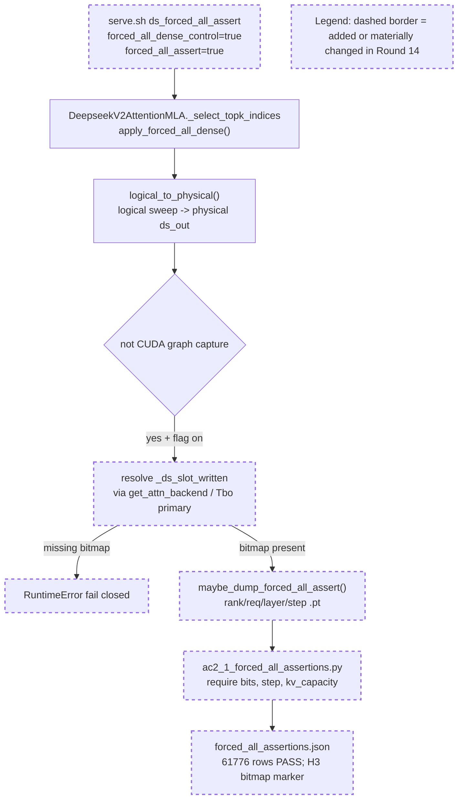

# Round 14 Review Result - Loop 13

Mainline Progress Verdict: ADVANCED

Round 14 repaired the Round 13 AC-2.1 overclaim. I accept the forced-all dense downstream control as verified: `_ds_slot_written` is measured directly, records are per `(rank, req, layer, step)`, physical range is checked against true KV-slot capacity, and the committed artifact shows 61776/61776 dense rows with exact `req_to_token` gather, zero real garbage, and the current decode slot as the only unwritten live slot. This is real mainline progress, not merely side-issue cleanup.

I updated `goal-tracker.md` directly: Plan Version is now 15, a `14-review` evolution row is present, task2 is marked verified, task9 no longer carries stale Round-13 wording, and AC-2.1 is added to Completed and Verified. The immutable section was not changed.

## PR Comprehension

Change summary:
- `deepseek_v2.py` now resolves `_ds_slot_written` at the same attention-backend seam as production/reference selection and fails closed when `forced_all_assert=true` but the bitmap is absent.
- `forced_all_assert_capture.py` now writes one record per request/layer/decode-step with physical slots, logical positions, expected `req_to_token` slots, `_ds_slot_written` bits, `kv_capacity`, and adapter error count.
- `ac2_1_forced_all_assertions.py` now requires `slot_written_bits`, `decode_step`, and `kv_capacity`; it splits expected current-slot unwritten from non-current unwritten garbage.
- `build_ledger.py` adds `forced_all_assert: false` to `DS_DEFAULTS` and generated evidence now describes forced-all garbage counters as real for the forced-all control only.



Walkthrough: the runtime selected set is still the forced dense logical sweep. Round 14 only adds guarded observation after `logical_to_physical()`: it looks up the backend validity bitmap, dumps the physical mapping and validity bits, and the reducer verifies the adapter gather plus slot state offline. The production path remains byte-identical when `forced_all_assert` is false.

## Historical Review Synthesis

Corpus sweep: 32639 SGLang human-review threads scanned; 312 matched across 153 PRs and 600 human comments for `deepseek_v2.py`, `dsa_backend.py`, Double Sparsity paths, KV cache, CUDA graph, `req_to_token`, and evidence terms.

Recurring reviewer pattern: DeepSeek/FP8/KV-cache changes are judged on exact runtime path, CUDA-graph safety, precise config provenance, and evidence that measures the state being claimed rather than a proxy. Round 14 now meets that bar for AC-2.1: it measures the validity bitmap directly instead of inferring written-state from `physical==req_to_token`, and it keeps the host-side capture outside CUDA graph capture.

Design-doc cross-check: `development/loop13/plan.md` explicitly makes H3 about `logical_to_physical`, selected-index set, and slot validity, while `development/past_implementations/study/08-current-system-architecture.md` documents `logical_to_physical` as the handoff into unchanged FlashMLA. The Round 14 seam matches that design intent.

## Goal Tracker Audit

| AC | Status | Evidence if MET | Blocker if NOT MET | Deferral Justification |
|----|--------|-----------------|--------------------|------------------------|
| AC-1 | PARTIAL | Baseline DSA / DSA-radix-off / production DS scores and launch/config metadata exist. | Some strict serial cells remain blank, especially DSA-radix serial and production DS sparse serial. | n/a |
| AC-2 | PARTIAL | AC-2.1 verified this round; AC-2.2 settled; AC-2.3 pruning-valid radix/width retired. | AC-2.4 recall-oracle@2048 is still absent. | n/a |
| AC-3 | PARTIAL | Reference raw/cosine served; cosine recovers; TF32-off reference path exists. | AC-3.1 captured-row materialized fp32 `K_label` selected-index equality is still missing. | n/a |
| AC-4 | PARTIAL | Per-arm table, sample IDs/order, literal/effective config, behavior surface, and forced-all garbage counters exist. | Scored-arm garbage counters, selected-vs-total gaps, and serial cells remain missing. | n/a |
| AC-5 | MET | GOOD gate recorded from measured DSA and best naive DS: dense 0.950 within 3pp, sparse 0.940 within 5pp. | n/a | n/a |
| AC-6 | PARTIAL | Matrix is internally consistent for measured/retired/blocked legs; current-slot and reduce corroboration rerun cleanly. | Final AC-8 verdict still depends on AC-2.4, AC-3.1, and AC-4 close-out evidence. | n/a |
| AC-7 | DEFERRED/MOOT | n/a | n/a | Still justified because AC-5 gate is GOOD; reconsider only if the gate flips to BAD. |
| AC-8 | PARTIAL | Interim findings and root-cause notes exist. | Final writeup must be regenerated after AC-2.4, AC-3.1, and AC-4 are complete. | n/a |

Forgotten items detection:
- No original-plan task is absent from Active, Completed, or Deferred.
- The tracker had stale task9 text from Round 13; I corrected it so forced-all garbage counters are accepted, while scored-arm garbage/serial/selected-vs-total remain active.

Deferred items audit:
- AC-7 is the only explicit deferral. It remains valid because the GOOD gate stands.
- AC-3.1, AC-2.4, AC-4 scored-arm garbage/serial/selected-vs-total, and AC-8 are not deferred; they remain active blockers.

Goal Completion Summary:
```text
Acceptance Criteria: 1/8 met (1 deferred)
Active Tasks: 8 partial/remaining tracker tasks
Estimated remaining rounds: 4-6 if GPU access stays smooth
Critical blockers: AC-2.4 recall-oracle; AC-3.1 captured materialized-K proof; AC-4 scored-arm garbage counters, serial cells, selected-vs-total; AC-8 final writeup
```

## Mainline Drift Audit

The current round's mainline objective was clear and singular: repair AC-2.1. It directly addressed the three Round 13 blocking defects and produced a stronger bitmap-backed H3 measurement. This is advancement, not drift.

Recent pattern: R11-R12 were CPU evidence-surface cleanup, R13 attempted the GPU/instrumentation close-out but overclaimed, and R14 fixed that overclaim with the required measurements. There is still a risk of slow closure because many rounds have been spent on evidence reconciliation, but the last two rounds did move a load-bearing AC.

```text
Mainline Progress Verdict: ADVANCED
Blocking Side Issues: 5
Queued Side Issues: 1
```

Blocking side issues:
- AC-2.4 recall-oracle@2048.
- AC-3.1 captured-row materialized fp32 `K_label` equality.
- AC-4 garbage counters on scored arms.
- AC-4 serial cells and selected-vs-total gaps.
- AC-8 final root-cause writeup.

Queued side issue:
- Tighten `ac2_1_forced_all_assertions.py` so the `h3_finding` prose is conditional or the reducer fails if a future rerun does not have `current_unwritten == dense_rows`. Current committed evidence does have 61776/61776, so this is a reuse-hardening note, not a Round 14 blocker.

## Implementation Review

No new blocking implementation defect found in the Round 14 repair.

Verified claims:
- `_ds_slot_written` is passed to the capture module and indexed by the same global `layer_id` convention used by production/reference selection (`deepseek_v2.py:2741-2760`, `forced_all_assert_capture.py:68-99`, `dsa_backend.py` comments around `_ds_slot_written` allocation).
- The hook fail-closes if the diagnostic flag is enabled and `_ds_slot_written` is absent (`deepseek_v2.py:2741-2746`).
- The reducer requires `slot_written_bits`, `decode_step`, and `kv_capacity` (`ac2_1_forced_all_assertions.py:35-37`) and checks physical range against `kv_capacity` (`ac2_1_forced_all_assertions.py:89`).
- The reducer distinguishes current-slot unwritten from non-current unwritten garbage (`ac2_1_forced_all_assertions.py:99-114`).
- `DS_DEFAULTS` now includes `forced_all_assert: false` (`build_ledger.py:98-105`).
- The artifact reports 61776 records / 61776 dense rows; physical equality 61776/61776; non-current unwritten 0; current-slot unwritten 61776/61776; duplicate/live-`-1`/out-of-range/adapter-error all zero.

Residual risk:
- The decode-step id is a per `(rank, req, layer)` monotonic capture counter, not a global forward-step identity. That is sufficient for AC-2.1 no-overwrite/per-step garbage counting, but it should not be reused later for cross-instrument joins without a shared step id.

## Action Items

Mainline Gaps:
- Run AC-2.4 NIAH-only recall-oracle and persist a corroboration-only artifact.
- Produce AC-3.1 captured-row materialized fp32 `K_label` selected-index equality @2048.
- Enable the repaired garbage capture on scored DS/reference arms and wire the per-arm counters into the ledger.
- Fill the missing AC-4 serial cells and selected-vs-total gaps.
- Regenerate the final AC-8 root-cause writeup after those artifacts land.

Blocking Side Issues:
- No new Round 14 implementation blocker. Existing blockers are the remaining original-plan artifacts listed above.

Queued Side Issues:
- Make the AC-2.1 reducer's H3-marker prose/pass condition future-proof as described in the drift section.
- Existing queued cleanup remains: remove plan-workflow terms before retaining diagnostics outside loop13.

## Goal Tracker Update Requests

Applied directly:
- Accepted the request to mark AC-2.1/task2 done, with Codex verification noted.
- Accepted that forced-all AC-4 garbage counters are now real for the forced-all control.
- Closed the R13-review `DS_DEFAULTS` missing `forced_all_assert` blocker.
- Added a Round 14 review row and corrected task9's stale Round-13 wording.

Rejected:
- Rejected full-loop completion. Multiple immutable ACs remain partial or deferred.

## Validation Performed

- Read `development/loop13/plan.md` first, then `goal-tracker.md`, Round 11-13 summaries/reviews, and the relevant design docs under `development/past_implementations/study/`.
- Read Pensieve review pipeline and taste-review knowledge.
- Read SGLang Humanize Review skill and corpus summary; ran the corpus sweep above.
- Inspected commit `08caeda27` vs `e62112335`.
- Reran `python3 development/loop13/ac2_1_forced_all_assertions.py /sgl-workspace/sglang/development/loop13/evidence/.sglang_ds_forcedall`: exit 0, 61776/61776 pass.
- Sampled `.pt` records: `kv_capacity=504704`, layers 0-77, sample max step 22, false slot-written bit exactly at `valid_length-1`.
- Ran `python3 -m py_compile` on the changed Python files: pass.
- Ran `python3 development/loop13/test_reference_selectors.py`: 5/5 pass.
- Ran `python3 development/loop13/verify_ac2_3.py development/loop13/evidence/.sglang_ds_scorecap_sparse`: 4992/4992 pruning rows pass.
- Ran `python3 development/loop13/ac6_corrob_ref_cosine_noinc.py`: sparse and dense invariants pass.
- Ran `python3 development/loop13/ac6_score_reduce_corrob.py`: exit 0.
- Ran `python3 development/loop13/ac2_2_head_agg.py`: exit 0.
- Ran `python3 development/loop13/ac4_sample_ids.py`: exit 0.
- Ran `python3 development/loop13/ac6_bisection_matrix.py`: exit 0.
- Ran `git diff --check e62112335..08caeda27`: pass.

NOT_COMPLETE
