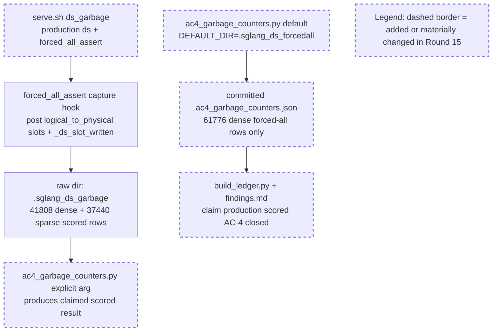

# Round 15 Review Result - Loop 13

Mainline Progress Verdict: REGRESSED

Round 15 added useful infrastructure (`serve.sh ds_garbage`) and the raw `.sglang_ds_garbage` capture on disk does contain the claimed scored-selection rows. However, the committed evidence package does not contain that result. `evidence/ac4_garbage_counters.json` is generated from `.sglang_ds_forcedall`, contains only the 61776 dense forced-all rows, has no sparse regime, and reports `current_slot_unwritten=61776`. That directly contradicts Claude's claimed production scored result of 41808 dense + 37440 sparse rows with `current_slot_unwritten=0`.

I updated `goal-tracker.md` directly: Plan Version is now 17, a `15-review` row is present, task9 no longer marks production_ds scored garbage counters done, and a new blocking issue records the invalid R15 artifact. The immutable section was not changed.

## PR Comprehension

Change summary:
- `serve.sh` adds `ds_garbage`, intended to run production DS scoring in eager mode with `forced_all_assert=true` and no forced-all dense override.
- `ac4_garbage_counters.py` reduces the capture records into dense/sparse garbage counters for the production scored selection.
- `ac2_1_forced_all_assertions.py` hardens the H3 prose with `h3_marker_on_all_rows`.
- `build_ledger.py`, `findings.md`, `evidence_table.md`, and `production_ds.json` now claim `evidence/ac4_garbage_counters.json` closes production scored garbage counters.
- The committed `ac4_garbage_counters.json` is not the scored artifact; it is sourced from the forced-all capture.



Walkthrough: the runtime capture path can observe the scored production selection, and the raw scored capture exists locally. The failure is in the reducer/evidence path: the reducer defaults to the old forced-all directory and does not require both dense and sparse regimes, so the forced-all artifact exits 0 and is then wired into the ledger as if it were production scored evidence.

## Historical Review Synthesis

Corpus sweep: 32639 SGLang human-review threads scanned; 24 matched across 15 PRs and 69 human comments for `deepseek_v2.py`, DSA/Double Sparsity paths, KV cache, CUDA graph, `req_to_token`, and evidence/benchmark terms.

Recurring reviewer pattern: DeepSeek/FP8/KV-cache changes get reviewed around exact runtime path, CUDA-graph safety, and evidence provenance. Reviewers ask for the artifact to prove exactly the state claimed, not a nearby proxy. Round 15 violates that standard: the generated JSON says "production SCORED DS selection" but its own `source` points at the forced-all capture.

## Mainline Gaps

1. P1 - The committed AC-4 production scored garbage artifact is the wrong dataset.

Evidence:
- `development/loop13/evidence/ac4_garbage_counters.json:3` says the source is `.sglang_ds_forcedall`, not `.sglang_ds_garbage`.
- `development/loop13/evidence/ac4_garbage_counters.json:5-17` contains only a dense regime with 61776 rows and `current_slot_unwritten=61776`.
- The claimed scored result requires dense and sparse regimes and `current_slot_unwritten=0`; the real scored capture on disk has 41808 dense + 37440 sparse rows, but that is not what was committed.
- `development/loop13/evidence/findings.md:111-121` and `development/loop13/evidence/evidence_table.md:21` now overclaim the committed artifact as dense+sparse scored evidence.

Impact: AC-4 production_ds scored garbage counters cannot be marked done. Worse, the evidence package now asserts a scored-selection conclusion using forced-all data, which regresses the ledger's trustworthiness.

Required implementation plan:
1. Change `development/loop13/ac4_garbage_counters.py:26` so `DEFAULT_DIR` is `evidence/.sglang_ds_garbage`.
2. Make the production scored reducer fail closed unless both `"dense"` and `"sparse"` regimes are present with `rows > 0`.
3. Regenerate `development/loop13/evidence/ac4_garbage_counters.json` with:
   `python3 development/loop13/ac4_garbage_counters.py development/loop13/evidence/.sglang_ds_garbage`
4. Confirm the committed JSON has 41808 dense rows, 37440 sparse rows, real garbage 0 in both regimes, and `current_slot_unwritten=0`.
5. Regenerate `findings.md`, `evidence_table.md`, and `evidence/meta/arms/*.json` only after the JSON is correct.

2. P1 - The reducer and ledger fail open on exactly the mistake that occurred.

Evidence:
- `development/loop13/ac4_garbage_counters.py:95-97` silently skips a missing regime.
- `development/loop13/ac4_garbage_counters.py:128-132` fails only on total zero rows or real garbage, so a dense-only forced-all capture exits 0.
- `development/loop13/build_ledger.py:291-292` attaches `SCORED_GARBAGE_ARTIFACT` to `production_ds` without loading or validating the artifact.

Required implementation plan:
1. In `ac4_garbage_counters.py`, assert `set(regimes) == {"dense", "sparse"}` for the production scored reducer.
2. Add a `capture_kind` or `source_dir_basename` field to the report and set it from the actual capture directory.
3. In `build_ledger.py`, load `evidence/ac4_garbage_counters.json` before wiring it to `production_ds`.
4. Assert the artifact has `arm == "production_ds"`, source/capture kind `.sglang_ds_garbage`, dense and sparse rows > 0, and `real_garbage_total == 0` for both regimes.
5. Because the generated footer says the current slot is not in scored selection, also assert both regimes have `current_slot_unwritten (H3 marker; not garbage) == 0` before emitting that prose.

3. P1 - Original-plan close-out work remains incomplete and cannot be treated as deferred completion.

Still active:
- AC-2.4 recall-oracle@2048 corroboration is absent.
- AC-3.1 captured decode-row materialized fp32 `K_label` selected-index equality is absent.
- AC-4 reference-arm garbage counters are absent.
- AC-4 serial cells and selected-vs-total gaps remain.
- AC-8 final root-cause writeup remains partial.

Required implementation plan after the R15 artifact repair:
1. Run the NIAH-only recall-oracle flow with `recall_oracle=true`, persist `evidence/ac2_4_recall_oracle.json`, and label it as corroboration only.
2. Extend latent capture to store the bounded latent/scales/query data needed for offline materialized `K_label`; add a fail-closed analyzer for absorbed raw-dot vs materialized fp32 selected-index equality @2048 on captured decode rows; persist `evidence/ac3_1_materialized_k_selected_index_equality.json`.
3. Run `forced_all_assert` capture on `ref_faithful` and `ref_cosine`, reduce them with the same garbage counters, and wire per-arm artifacts into the ledger.
4. Fill strict serial/batched cells for the original AC-4 core arms: DSA-radix serial, production DS sparse serial, `ref_faithful` serial, and `ref_cosine` serial.
5. Fill selected-vs-total gaps where server DS summaries exist; otherwise record a concrete reason and guard against silently treating missing summaries as complete.
6. Regenerate `build_ledger.py` outputs, `findings.md`, and the final AC-8 writeup only after all artifacts above pass.

## Blocking Side Issues

- The R15 committed artifact/ledger mismatch blocks AC-4 and AC-8. Fix it before moving to reference-arm garbage or final writeup.
- The reducer lacks regime/source fail-closed checks, allowing the forced-all capture to be accepted as scored production evidence.

## Queued Side Issues

- `serve.sh` usage/help text still omits newer modes including `ds_garbage` (`development/loop13/serve.sh:3`, `development/loop13/serve.sh:134`). Non-blocking for the evidence fix, but clean it before handing the harness to another operator.
- Existing queued cleanup remains: remove plan-workflow terms from retained diagnostics and keep reference selector CUDA-graph validation queued until these modes leave loop13 diagnostics.

## Goal Alignment

| AC | Status | Evidence if met | Blocker if not met | Deferral justification |
|----|--------|-----------------|--------------------|------------------------|
| AC-1 | PARTIAL | Baseline scores and metadata exist. | Serial cells remain blank. | n/a |
| AC-2 | PARTIAL | AC-2.1, AC-2.2, AC-2.3 accepted. | AC-2.4 recall-oracle absent. | n/a |
| AC-3 | PARTIAL | Reference raw/cosine served; TF32-off path exists. | AC-3.1 captured materialized-K equality absent. | n/a |
| AC-4 | PARTIAL | Forced-all garbage counters accepted; raw scored capture exists locally. | Committed production scored artifact is wrong; reference garbage, serial cells, selected-vs-total remain. | n/a |
| AC-5 | MET | GOOD gate recorded from measured DSA and best naive DS. | n/a | n/a |
| AC-6 | PARTIAL | Matrix is internally consistent for measured/retired/blocked legs. | Final AC-8 depends on AC-2.4/3.1/4 close-out. | n/a |
| AC-7 | DEFERRED/MOOT | n/a | n/a | Justified while AC-5 remains GOOD. |
| AC-8 | PARTIAL | Interim findings exist. | Final writeup waits on the active artifacts above. | n/a |

Forgotten items detection:
- No original-plan task is absent from Active/Completed/Deferred after the tracker correction.
- The tracker had drift from Claude's R15 update request; I corrected it.

Deferred items audit:
- AC-7 remains the only explicit deferral and is justified while the GOOD gate stands.
- AC-2.4, AC-3.1, AC-4 production/reference garbage, serial cells, selected-vs-total, and AC-8 are active incomplete work, not accepted deferrals.

Goal Alignment Summary:
```text
ACs: 8/8 addressed | Forgotten items: 0 | Unjustified deferrals: 0
```

## Goal Tracker Update Requests

Applied directly:
- Plan Version -> 17.
- Added a `15-review` plan-evolution row.
- Rejected the request to mark AC-4 production_ds scored garbage counters done.
- Restored task9 to partial with the R15 artifact defect called out.
- Added a blocking side issue for the forced-all-vs-scored artifact mismatch.

Rejected:
- Rejected the Round-15 closure request because the committed JSON contradicts the claimed scored-selection result.
- Rejected narrowing the AC-4 garbage blocker to reference arms only; production_ds scored garbage remains open until the committed artifact is regenerated and guarded.

## Validation Performed

- Read `development/loop13/plan.md` first, then `goal-tracker.md`, `round-15-prompt.md`, `round-15-contract.md`, `round-15-summary.md`, and Round 12-14 summaries/reviews.
- Read Pensieve review pipeline and taste-review knowledge.
- Read SGLang Humanize Review skill and corpus summary; ran the corpus sweep above.
- Inspected commit `e0f28d547` vs `08caeda27`.
- Verified committed artifact with `git show e0f28d547:development/loop13/evidence/ac4_garbage_counters.json`: source `.sglang_ds_forcedall`, 61776 dense rows only, `current_slot_unwritten=61776`.
- Counted raw local captures: `.sglang_ds_forcedall` = 61776 dense rows with current unwritten 61776; `.sglang_ds_garbage` = 41808 dense + 37440 sparse rows with current/noncurrent unwritten 0.
- Ran `python3 development/loop13/ac4_garbage_counters.py` with no args: exit 0, incorrectly rewrites the forced-all dense artifact as production scored evidence.
- Ran `python3 development/loop13/ac4_garbage_counters.py development/loop13/evidence/.sglang_ds_garbage`: exit 0 and produces the claimed 41808/37440 clean scored result; this confirms the raw capture is useful but not what is committed.
- Ran `python3 development/loop13/ac2_1_forced_all_assertions.py development/loop13/evidence/.sglang_ds_forcedall`: exit 0, forced-all R14 evidence still passes.
- Ran `python3 -m py_compile development/loop13/ac4_garbage_counters.py development/loop13/ac2_1_forced_all_assertions.py development/loop13/build_ledger.py`: pass.
- Ran `git diff --check 08caeda27..e0f28d547`: pass.
- Did not rerun GPU servers; the defect is in committed evidence/reducer validation, and the raw captures already exist on disk.

NOT_COMPLETE
