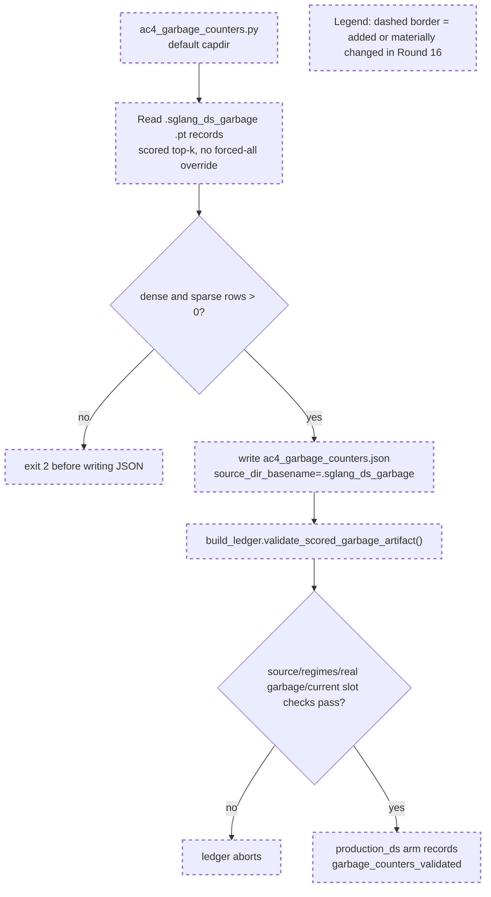

# Round 16 Review Result - Loop 13

Mainline Progress Verdict: ADVANCED

Round 16 repaired the Round 15 evidence regression. The committed production scored garbage artifact now comes from `.sglang_ds_garbage`, contains both dense and sparse regimes, and the ledger reloads and validates it before wiring it onto `production_ds`. I found no new R16-specific implementation blocker.

This is still not full loop completion. The original plan still has active unfinished artifacts: AC-2.4 recall-oracle, AC-3.1 captured materialized-K selected-index equality, AC-4 reference-arm garbage counters plus serial/selected-vs-total cells, and AC-8 final writeup.

## PR Comprehension

Change summary:
- `development/loop13/ac4_garbage_counters.py` now defaults to `evidence/.sglang_ds_garbage`, stamps `source_dir_basename`, and refuses single-regime captures before writing the canonical JSON.
- `development/loop13/evidence/ac4_garbage_counters.json` is regenerated from the scored production capture: dense 41808, sparse 37440, real garbage 0, current-slot-unwritten 0 in both regimes.
- `development/loop13/build_ledger.py` adds `validate_scored_garbage_artifact()` and records `garbage_counters_validated` on the `production_ds` arm only after source/regime/counter assertions pass.
- The generated table and per-arm metadata were refreshed; `production_ds.json` carries the validated dense/sparse summary.



Walkthrough: the write-side reducer now starts from the scored capture, not the forced-all control. It can still reduce the valid scored capture, but a dense-only forced-all directory exits before it reaches the write. The read-side ledger then independently validates the committed JSON provenance and counters before producing `production_ds` metadata.

## Historical Review Synthesis

Corpus sweeps:
- Script-specific sweep over `development/loop13/ac4_garbage_counters.py`, `build_ledger.py`, and evidence terms: 32639 scanned, 0 matched.
- Widened Double Sparsity / DeepSeek / KV-cache sweep: 32639 scanned, 107 matched threads across 68 PRs and 248 human comments.

Recurring SGLang review pattern: DeepSeek/MLA/KV-cache changes are judged on exact runtime path, correctness evidence, benchmark or artifact provenance, and config/metadata that matches what actually ran. That maps directly to this round: the artifact must self-identify the scored capture and the ledger must refuse a nearby proxy. R16 now follows that standard for the production scored garbage artifact.

## Implementation Review

No new R16 blocking implementation defect found.

Verified R16 claims:
- `DEFAULT_DIR` is now the scored capture: `development/loop13/ac4_garbage_counters.py:37`.
- The reducer checks for both dense and sparse rows and exits before writing on a missing/empty regime: `development/loop13/ac4_garbage_counters.py:124-136`.
- The committed JSON has `source_dir_basename: ".sglang_ds_garbage"`, dense rows 41808, sparse rows 37440, `real_garbage_total: 0`, and `current_slot_unwritten: 0` in both regimes: `development/loop13/evidence/ac4_garbage_counters.json:4-28`.
- The ledger validates `arm`, `source_dir_basename`, exact dense/sparse regimes, rows > 0, real garbage 0, and current-slot-unwritten 0 before wiring the artifact: `development/loop13/build_ledger.py:253-283` and `development/loop13/build_ledger.py:324-327`.
- `production_ds.json` records the validated dense/sparse summary: `development/loop13/evidence/meta/arms/production_ds.json:89-101`.

Validation performed:
- `python3 development/loop13/ac4_garbage_counters.py development/loop13/evidence/.sglang_ds_forcedall` exits 2 with missing sparse regime, and the artifact hash stays unchanged.
- `python3 development/loop13/ac4_garbage_counters.py` exits 0 and reports `.sglang_ds_garbage`, dense 41808, sparse 37440, clean counters.
- `python3 development/loop13/build_ledger.py` exits 0 and reports provenance consistent.
- Temporarily changed `source_dir_basename` to `.sglang_ds_forcedall`; `build_ledger.py` aborts with the expected assertion, then the mutation was restored.
- `python3 -m py_compile development/loop13/ac4_garbage_counters.py development/loop13/build_ledger.py` passes.
- `git diff --check e0f28d547..3238c78dc` passes.

## Mainline Gaps

1. P1 - Original-plan close-out work remains incomplete.

Evidence:
- `goal-tracker.md` still marks AC-2.4 pending under task4.
- `goal-tracker.md` still marks AC-3.1 materialized-K captured-row proof partial under task7.
- `goal-tracker.md` still marks AC-4 partial under task9: reference-arm garbage counters, selected-vs-total, and strict serial/batched cells remain.
- `goal-tracker.md` still marks AC-8 partial under task13/task14.

Required implementation plan:
1. Run the NIAH-only recall-oracle flow with `recall_oracle=true`, persist `development/loop13/evidence/ac2_4_recall_oracle.json`, and label it as corroboration only, not scorer exoneration.
2. Extend the latent/value capture to store the bounded query, latent/scales, mask metadata, and row identity needed for offline materialized fp32 `K_label`; add a fail-closed analyzer for absorbed raw-dot vs materialized fp32 selected-index equality @2048 on captured decode rows; persist `development/loop13/evidence/ac3_1_materialized_k_selected_index_equality.json`.
3. Capture reference-arm garbage counters for `ref_faithful` and `ref_cosine` with the repaired slot-validity instrumentation. Add a per-arm reducer or parameterize the current reducer with explicit arm/source expectations, require dense+sparse rows and required fields, and wire artifacts into the ledger without treating missing reference counters as complete.
4. Fill the missing strict AC-4 serial cells: DSA-radix serial, production DS sparse serial, `ref_faithful` serial, and `ref_cosine` serial. Reuse guarded `serve.sh` modes, one TP=8 server at a time.
5. Fill selected-vs-total gaps from server DS summaries where applicable; where an arm cannot emit the metric, record the concrete reason and guard the ledger against silently marking it complete.
6. Regenerate `build_ledger.py` outputs, `evidence_table.md`, `findings.md`, and the final AC-8 root-cause writeup only after the above artifacts pass.

## Blocking Side Issues

- No new R16 implementation blocker.
- The R15 forced-all-vs-scored artifact blocker is resolved by R16.
- Existing blockers remain only insofar as they are the original-plan mainline gaps listed above: captured materialized-K proof, AC-2.4 recall-oracle, reference-arm garbage counters, serial cells, selected-vs-total, and final AC-8 writeup.

## Queued Side Issues

- `serve.sh` usage/help text still omits newer modes such as `ds_garbage`; keep queued until the next harness cleanup pass.
- Existing cleanup remains queued: remove plan-workflow terms from retained diagnostics and handle reference selector CUDA-graph safety before these diagnostics leave `development/loop13`.

## Goal Alignment

| AC | Status | Evidence if met | Blocker if not met | Deferral justification |
|----|--------|-----------------|--------------------|------------------------|
| AC-1 | PARTIAL | Baselines and metadata exist. | Some serial cells remain blank. | n/a |
| AC-2 | PARTIAL | AC-2.1, AC-2.2, AC-2.3 accepted. | AC-2.4 recall-oracle absent. | n/a |
| AC-3 | PARTIAL | Reference raw/cosine served; TF32-off path exists. | AC-3.1 captured materialized-K equality absent. | n/a |
| AC-4 | PARTIAL | Forced-all garbage and production scored garbage are now valid and guarded. | Reference garbage, selected-vs-total gaps, and serial cells remain. | n/a |
| AC-5 | MET | GOOD gate recorded from measured DSA and best naive DS. | n/a | n/a |
| AC-6 | PARTIAL | Matrix is internally consistent for measured/retired/blocked legs. | Final AC-8 still depends on AC-2.4/AC-3.1/AC-4 close-out. | n/a |
| AC-7 | DEFERRED/MOOT | n/a | n/a | Justified while AC-5 remains GOOD. |
| AC-8 | PARTIAL | Interim findings exist. | Final writeup waits on active artifacts above. | n/a |

Forgotten items detection:
- No original-plan task is absent from Active, Completed, or Deferred.

Deferred items audit:
- AC-7 remains the only explicit deferral and is justified while the GOOD gate stands.
- AC-2.4, AC-3.1, AC-4 reference garbage/serial/selected-vs-total, and AC-8 are active incomplete work, not accepted deferrals.

Goal Alignment Summary:
```text
ACs: 8/8 addressed | Forgotten items: 0 | Unjustified deferrals: 0
```

## Goal Tracker Update Requests

Applied directly:
- Accepted Claude's R16 tracker changes already present: Plan Version 18, Round-16 evolution row, task9 partial with production scored garbage now valid, and the R15 blocker resolved.
- Corrected one stale sentence in the older broad evidence-package blocker: it no longer says a valid committed `production_ds` scored garbage artifact is still required. It now says R16 resolved production scored garbage counters and leaves only reference-arm garbage, selected-vs-total, and serial cells in that blocker.

Rejected:
- No R16 tracker request rejected.
- Full-loop completion remains rejected because original-plan artifacts are still pending.

## Validation Performed

- Read `development/loop13/plan.md` first.
- Read `round-16-prompt.md`, `round-16-contract.md`, `round-16-summary.md`, `goal-tracker.md`, and R13-R15 summaries/reviews.
- Read Pensieve review pipeline and taste-review knowledge.
- Read SGLang Humanize Review skill and corpus summary; ran the script-specific and widened corpus sweeps above.
- Inspected commit `3238c78dc` against `e0f28d547`.
- Verified raw capture counts: `.sglang_ds_garbage` has 79248 `.pt` records; `.sglang_ds_forcedall` has 61776.
- Ran the reducer positive and negative paths, py_compile, ledger generation, injected-bad ledger validation, and diff whitespace checks as listed in Implementation Review.
- Reverted review-induced generated provenance churn after the validation reruns; only this review result and the goal-tracker mutable correction remain as review changes.

NOT_COMPLETE
