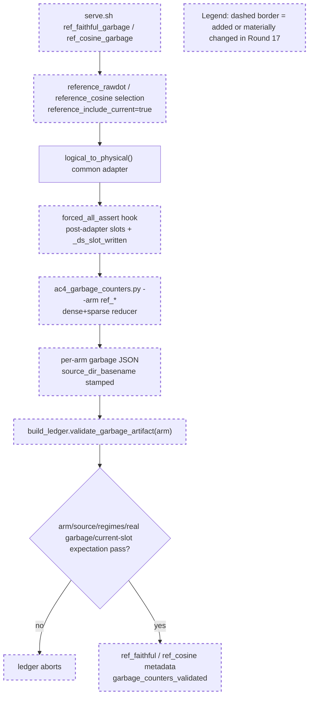

# Round 17 Review Result - Loop 13

Mainline Progress Verdict: ADVANCED

Round 17 advances the stated narrow mainline: reference-arm AC-4 garbage counters now exist for `ref_faithful` and `ref_cosine`, the reducer emits per-arm artifacts, and `build_ledger.py` validates arm/source/regime/current-slot expectations before wiring those artifacts onto the reference arms. I found no new Round-17 blocking implementation defect in the reference garbage-counter path.

This is still not full loop completion. The original plan still has active unfinished artifacts: AC-2.4 recall-oracle, AC-3.1 captured-row materialized fp32 `K_label` selected-index equality, AC-4 serial cells and selected-vs-total gaps, and AC-8 final root-cause writeup.

## PR Comprehension

Change summary:
- `serve.sh` adds `ref_faithful_garbage` and `ref_cosine_garbage`: the existing reference selector configs plus `forced_all_assert=true`, eager mode, and no forced-all override.
- `ac4_garbage_counters.py` accepts `--arm`, writes arm-specific JSON names, and still fails closed on missing dense/sparse regimes or real non-current garbage.
- `build_ledger.py` generalizes the production scored-garbage validator into `validate_garbage_artifact(arm)`, keyed by expected artifact path, source dir basename, and current-slot expectation.
- The evidence package now includes `ac4_garbage_counters_ref_faithful.json` and `ac4_garbage_counters_ref_cosine.json`, each with dense 41808 + sparse 37440 rows, zero real garbage, and current-slot-unwritten equal to rows.



Walkthrough: the reference selector computes the real served reference scored set, then falls through to the same `logical_to_physical()` handoff as production. The diagnostic hook is gated by `forced_all_assert`, so the new serve modes can dump reference-arm post-adapter slots without a new runtime seam. The reducer writes one artifact per arm, and the ledger independently checks that each artifact came from the expected capture dir and has the expected current-slot inclusion behavior before generated metadata can claim it.

## Historical Review Synthesis

Corpus sweep: 32639 SGLang human-review threads scanned; 310 matched across 151 PRs and 595 human comments for `deepseek_v2.py`, Double Sparsity, KV cache, benchmark/evidence, `forced_all_assert`, and `req_to_token` terms.

Recurring SGLang review pattern: DeepSeek/MLA/KV-cache work is judged on exact runtime path, config provenance, CUDA-graph/host-side safety, and artifacts that prove the state claimed rather than a nearby proxy. Round 17 follows that standard for the reference garbage artifacts: the committed JSONs self-identify the reference capture dirs, and the ledger refuses missing regimes, wrong arm/source, nonzero real garbage, or wrong current-slot direction.

## Implementation Review

No new Round-17 blocking implementation defect found.

Verified Round-17 claims:
- New reference garbage modes are present and use reference configs plus `forced_all_assert=true`: `development/loop13/serve.sh:124-142`.
- The reference selector falls through the common adapter and hook: `python/sglang/srt/models/deepseek_v2.py:2443`, `python/sglang/srt/models/deepseek_v2.py:2693`, `python/sglang/srt/models/deepseek_v2.py:2722`.
- The committed artifacts are correctly sourced and shaped:
  - `development/loop13/evidence/ac4_garbage_counters_ref_faithful.json`: arm `ref_faithful`, source `.sglang_ds_ref_faithful_garbage`, dense 41808, sparse 37440, real garbage 0, current-slot-unwritten 41808/37440.
  - `development/loop13/evidence/ac4_garbage_counters_ref_cosine.json`: arm `ref_cosine`, source `.sglang_ds_ref_cosine_garbage`, dense 41808, sparse 37440, real garbage 0, current-slot-unwritten 41808/37440.
- `build_ledger.py` validates artifact path/source/regimes/real garbage/current-slot expectation before wiring metadata: `development/loop13/build_ledger.py:255-300` and `development/loop13/build_ledger.py:344-349`.
- `ref_faithful.json` and `ref_cosine.json` now carry `garbage_counters_artifact` and `garbage_counters_validated` summaries.

Validation performed:
- Counted raw capture records: `.sglang_ds_garbage`, `.sglang_ds_ref_faithful_garbage`, and `.sglang_ds_ref_cosine_garbage` each contain 79248 `.pt` files; `.sglang_ds_forcedall` contains 61776.
- Reran:
  - `python3 development/loop13/ac4_garbage_counters.py development/loop13/evidence/.sglang_ds_garbage`
  - `python3 development/loop13/ac4_garbage_counters.py --arm ref_faithful development/loop13/evidence/.sglang_ds_ref_faithful_garbage`
  - `python3 development/loop13/ac4_garbage_counters.py --arm ref_cosine development/loop13/evidence/.sglang_ds_ref_cosine_garbage`
- Verified the forced-all dir fails closed with exit 2 and leaves the canonical artifact hash unchanged.
- Reran `python3 development/loop13/build_ledger.py`; it reports provenance consistent.
- Reran `python3 -m py_compile development/loop13/ac4_garbage_counters.py development/loop13/build_ledger.py`.
- Restored review-induced generated provenance churn after validation; only `goal-tracker.md` and this review result remain as review changes.

## Mainline Gaps

1. P1 - Original-plan close-out work remains incomplete.

Evidence:
- `goal-tracker.md` still marks AC-2.4 pending under task4.
- `goal-tracker.md` still marks AC-3.1 captured materialized-K proof partial under task7; the committed `development/loop13/evidence/ac3_1_materialized_k.json` is a synthetic CPU proof, not the captured decode-row artifact required by the plan.
- `goal-tracker.md` still marks AC-4 partial under task9: garbage counters are closed, but selected-vs-total and strict serial/batched cells remain.
- `goal-tracker.md` still marks AC-8 partial under task13/task14.

Required implementation plan:
1. Implement the AC-2.4 NIAH-only recall-oracle artifact. Add a guarded `serve.sh` mode using the production DS config plus `"recall_oracle": true` and eager/no-CUDA-graph if required by `validator.py`; drive the NIAH recall-oracle flow so the config-borne sink in `oracle_artifact_sink.py` writes `sink.jsonl`; reduce it into `development/loop13/evidence/ac2_4_recall_oracle.json` with dense and sparse recall@2048 sections. The artifact must state this is corroboration only, not scorer exoneration, and `build_ledger.py` must fail closed if the artifact is absent when AC-2.4 is rendered complete.
2. Produce the AC-3.1 captured decode-row materialized-K proof. Extend the existing capture path around `deepseek_v2.py` latent/scales/query availability to dump the bounded query, resident latent/scales, mask metadata, selected indices, row identity, layer, rank, req, and decode step needed to reconstruct offline/blockwise materialized fp32 `K_label`. Add a reducer that computes absorbed raw-dot selected-index sets and materialized fp32 `K_label` selected-index sets @2048 on the same captured rows, fails on any mismatch or missing row identity, and persists `development/loop13/evidence/ac3_1_materialized_k_selected_index_equality.json`.
3. Fill the remaining strict AC-4 serial cells using the existing guarded harness. Run one TP=8 server at a time and use `THREADS=1` plus `REGIME` as needed for DSA-radix serial, production DS sparse serial, `ref_faithful` serial dense+sparse, and `ref_cosine` serial dense+sparse. Wire the resulting `.out` labels into `build_ledger.py` so `evidence_table.md` no longer has blank serial cells for the original AC-4 core arms.
4. Fill selected-vs-total gaps from server DS summaries. For production DS and the reference arms, replace static or missing selected/total summaries with evidence-backed values from the actual run logs or per-request summaries. If a native DSA arm cannot emit DS selected/total because DS is off, keep `—`; do not silently use `None` for DS arms that should have summaries.
5. Regenerate `build_ledger.py` outputs, `evidence_table.md`, `findings.md`, and finally `ROOT_CAUSE.md` only after steps 1-4 pass. The AC-8 writeup must name the primary/root-ranked cause with the final evidence table, recall/selected-index corroboration, and no selection/adapter fix.

## Blocking Side Issues

- No new Round-17 implementation blocker.
- Existing blockers remain only because they are original-plan mainline gaps: AC-2.4 recall-oracle, AC-3.1 captured materialized-K equality, AC-4 serial/selected-vs-total completion, and AC-8 final writeup.

## Queued Side Issues

- `serve.sh` mode-error text still omits `ds_reduce_fp32` even though Round 17 claimed the mode-error string listed all current modes (`development/loop13/serve.sh:153`). This is non-blocking for the reference garbage evidence because the new modes are listed and callable.
- `ac4_garbage_counters.py --arm <non-production>` still defaults to the production capture dir if CAPDIR is omitted (`development/loop13/ac4_garbage_counters.py:71`). The ledger catches the wrong source before accepting it, so this is a reuse-hardening issue, not a Round-17 blocker. I added this combined harness/reducer ergonomics item to the tracker queued section.
- Existing cleanup remains queued: remove plan-workflow terms from retained diagnostics and keep reference selector CUDA-graph safety checks queued until these modes leave `development/loop13`.

## Goal Alignment

| AC | Status | Evidence if met | Blocker if not met | Deferral justification |
|----|--------|-----------------|--------------------|------------------------|
| AC-1 | PARTIAL | Baseline scores, metadata, and sample IDs exist. | Some serial cells remain blank. | n/a |
| AC-2 | PARTIAL | AC-2.1, AC-2.2, AC-2.3 accepted. | AC-2.4 recall-oracle absent. | n/a |
| AC-3 | PARTIAL | Reference raw/cosine served; TF32-off path exists. | Captured decode-row materialized-K equality absent. | n/a |
| AC-4 | PARTIAL | Production + reference garbage counters now valid and guarded. | Serial cells and selected-vs-total gaps remain. | n/a |
| AC-5 | MET | GOOD gate recorded from measured DSA and best naive DS. | n/a | n/a |
| AC-6 | PARTIAL | Matrix is internally consistent for measured/retired/blocked legs. | Final AC-8 still depends on AC-2.4/AC-3.1/AC-4 close-out. | n/a |
| AC-7 | DEFERRED/MOOT | n/a | n/a | Justified while AC-5 remains GOOD. |
| AC-8 | PARTIAL | Interim findings exist. | Final writeup waits on active artifacts above. | n/a |

Forgotten items detection:
- No original-plan task is absent from Active, Completed, or Deferred.

Deferred items audit:
- AC-7 remains the only explicit deferral and is justified while the GOOD gate stands.
- AC-2.4, AC-3.1, AC-4 serial/selected-vs-total, and AC-8 are active incomplete work, not accepted deferrals.

Goal Alignment Summary:
```text
ACs: 8/8 addressed | Forgotten items: 0 | Unjustified deferrals: 0
```

## Goal Tracker Update Requests

Applied directly:
- Accepted the Round-17 tracker state already present: Plan Version 19, task9 partial with reference-arm garbage counters closed, and the broad AC-4 blocker narrowed to selected-vs-total plus serial cells.
- Added one queued side issue for remaining harness help / reducer ergonomics (`serve.sh` missing `ds_reduce_fp32` in the mode-error text; `ac4_garbage_counters.py --arm <non-production>` defaulting to the production capture dir if CAPDIR is omitted).

Rejected:
- Full-loop completion remains rejected because original-plan artifacts are still pending.
- No Round-17 mainline tracker change was rejected.

## Validation Performed

- Read `development/loop13/plan.md` first, then `round-17-prompt.md`, `round-17-contract.md`, `round-17-summary.md`, `goal-tracker.md`, and R14-R16 summaries/reviews.
- Read Pensieve review pipeline and taste-review knowledge.
- Read SGLang Humanize Review skill and corpus summary; ran the corpus sweep reported above.
- Inspected commit `082510939` against `3238c78dc`.
- Reran the reducer/ledger/compile validation listed in Implementation Review.
- Audited the mutable tracker and updated only the queued side-issue section; immutable section untouched.

NOT_COMPLETE
