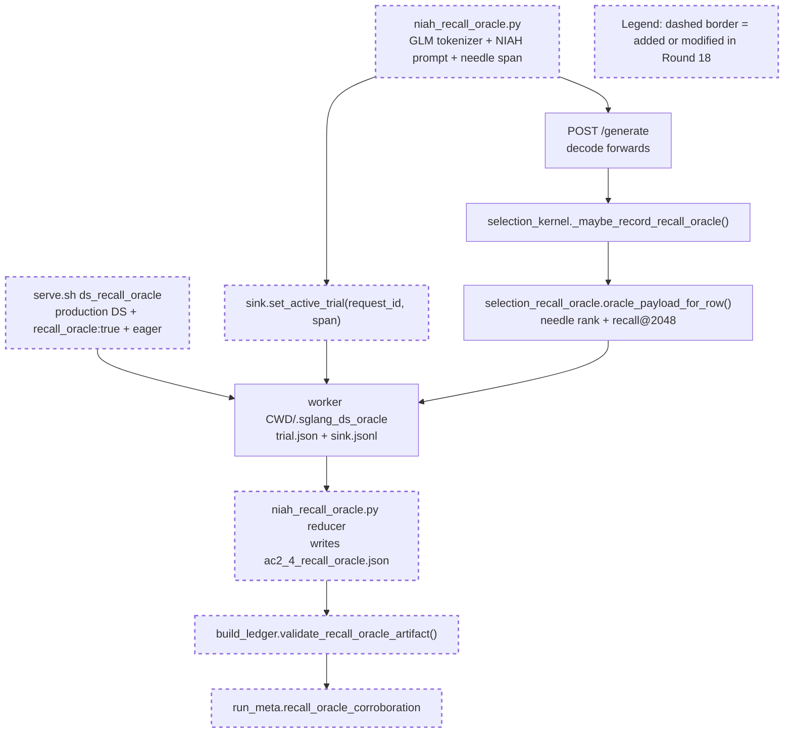

Your work is not finished. Read and execute the below with ultrathink.

## Original Implementation Plan

**IMPORTANT**: Before proceeding, review the original plan you are implementing:
@development/loop13/plan.md

This plan contains the full scope of work and requirements. Ensure your work aligns with this plan.

---

## Round Re-anchor (REQUIRED FIRST STEP)

Before writing code:
- Re-read @development/loop13/plan.md
- Re-read @/sgl-workspace/sglang/.humanize/rlcr/2026-06-20_09-57-51/goal-tracker.md
- Re-read the most recent round summaries/reviews that led to this round
- Write the current round contract to @/sgl-workspace/sglang/.humanize/rlcr/2026-06-20_09-57-51/round-19-contract.md

Your round contract must contain:
- Exactly one **mainline objective**
- The 1-2 target ACs for this round
- Which issues are truly **blocking** that mainline objective
- Which issues are **queued** and explicitly out of scope
- Concrete success criteria for this round

Do not start implementation until the round contract exists.

## Task Lane Rules

Use the Task system (TaskCreate, TaskUpdate, TaskList) with one required tag per task:
- `[mainline]` for plan-derived work that directly advances this round's objective
- `[blocking]` for issues that prevent the mainline objective from succeeding safely
- `[queued]` for non-blocking bugs, cleanup, or follow-up work

Rules:
- `[mainline]` work is the round's primary success condition
- `[blocking]` work is allowed only when it truly blocks the mainline objective
- `[queued]` work must be documented but must NOT replace the round objective
- If a new bug does not block the current objective, tag it `[queued]` and keep moving on mainline work

Before executing each task in this round:
1. Read @/sgl-workspace/sglang/.humanize/bitlesson.md
2. Run `bitlesson-selector` for each task/sub-task
3. Follow selected lesson IDs (or `NONE`) during implementation

---
Below is Codex's review result:
<!-- CODEX's REVIEW RESULT START -->
# Round 18 Review Result - Loop 13

Mainline Progress Verdict: ADVANCED

Round 18 advanced the mainline measurement: `evidence/ac2_4_recall_oracle.json` contains coherent dense+sparse recall-oracle numbers for production DS (`dense=1.0`, `sparse=0.4103`, 8/8 trials per regime, zero recorded `span_out_of_range`/`exception`). However, I reject marking AC-2.4 complete because the new fail-closed artifact contract is incomplete. A failed or partial run can still leave a canonical JSON, and the ledger can accept that JSON as AC-2.4 evidence.

I updated `goal-tracker.md` directly: Plan Version is now 21, task4 is back to partial, and two Round-18 blocking issues are recorded. Immutable AC text was not changed.

## PR Comprehension

Change summary:
- `serve.sh` adds `ds_recall_oracle`: production DS config plus `recall_oracle:true`, eager mode.
- `niah_recall_oracle.py` builds GLM NIAH prompts, computes a needle token span, registers the active trial through `oracle_artifact_sink`, drives `/generate`, reads `sink.jsonl`, and writes `ac2_4_recall_oracle.json`.
- The server-side hook in `selection_kernel.py` records score-rank / recall@K rows for the active trial.
- `build_ledger.py` adds `validate_recall_oracle_artifact()` and records the reduced dense/sparse summary in `run_meta.json`.



Walkthrough: the driver writes each trial's expected needle positions to the cross-process trial file, then the eager DS selector records rank/recall rows to the sink on decode. The new reducer turns those rows into a committed JSON artifact, and the ledger consumes that JSON before adding the AC-2.4 summary to `run_meta.json`.

## Historical Review Synthesis

Corpus sweep: 32639 SGLang human-review threads scanned; 147 matched across 91 PRs and 334 human comments for Double Sparsity, DeepSeek/MLA, CUDA graph, TP, tokenizer, benchmark, and artifact terms.

Recurring SGLang review pattern: DeepSeek/MLA/KV-cache changes are reviewed around exact runtime path, CUDA-graph safety, distributed rank assumptions, and evidence provenance. Reviewers ask for artifacts and metadata to prove the state claimed rather than a nearby proxy. That maps directly to Round 18: the recall-oracle evidence must prove the server and driver shared the same trial/sink path, and the ledger must reject partial or failure-marker artifacts.

## Mainline Gaps

1. P1 - AC-2.4 fail-closed validation is incomplete.

Evidence:
- `niah_recall_oracle.py` writes the canonical `evidence/ac2_4_recall_oracle.json` before checking `problems` and exiting non-zero (`development/loop13/niah_recall_oracle.py:243-250`).
- The driver only treats `span_out_of_range` and `exception` as hard failures (`development/loop13/niah_recall_oracle.py:49`, `development/loop13/niah_recall_oracle.py:223-226`), but the server hook explicitly records `no_active_trial` as a fail-closed marker (`python/sglang/srt/layers/attention/double_sparsity/selection_kernel.py:653-666`).
- `build_ledger.py` only checks arm, `corroboration_only`, regime presence, non-zero `oracle_records`, and non-null recall (`development/loop13/build_ledger.py:253-276`). It does not check failure markers, issued-vs-recorded trials, `recall_at_2048_records`, or selected-containing-needle parity.

Impact: a run with some successful rows plus missing trials, `no_active_trial` markers, or other non-whitelisted failure markers can leave a JSON that the ledger accepts as AC-2.4 evidence. This is the same class of evidence-integrity hole that caused the Round-15 forced-all-vs-scored artifact regression.

Required implementation plan:
1. In `niah_recall_oracle.py`, build the report in memory and write it to `ac2_4_recall_oracle.json.tmp` only after all checks pass, then atomically rename it to the canonical path.
2. Treat any non-zero `failure_markers` entry as fatal, including `no_active_trial` and future marker names.
3. For each regime, require `trials_issued == args.num`, `trials_with_records == trials_issued`, `oracle_records > 0`, `recall_at_2048_records == oracle_records`, and the count used for `selected_contains_needle_rate` equals `oracle_records`.
4. Assert `recall_at_2048 == selected_contains_needle_rate` for `index_topk == 2048`, since the server payload records that invariant per row.
5. In `build_ledger.py`, assert the same artifact invariants before writing `run_meta.json`: exact dense+sparse regimes, zero failure markers, issued/recorded equality, recall-record counts, non-null prompt-token samples, expected `index_topk=2048`, and `source_oracle_dir_basename == ".sglang_ds_oracle"`.
6. Add explicit negative checks used during validation: a partial-record artifact, a `no_active_trial` marker artifact, a hard-failure marker artifact, and a missing-regime artifact must all make `build_ledger.py` abort.

2. P1 - `serve.sh ds_recall_oracle` does not enforce oracle trial/sink path agreement.

Evidence:
- The new mode documents that the TP worker resolves the oracle dir from server CWD (`development/loop13/serve.sh:143-149`).
- The actual launch keeps the caller's CWD (`development/loop13/serve.sh:167-168`).
- The driver default is fixed at `development/loop13/evidence/.sglang_ds_oracle` (`development/loop13/niah_recall_oracle.py:125`).

Impact: a normal invocation from the repo root or from `development/loop13` makes the server write/read a different `.sglang_ds_oracle` than the driver. Claude's run succeeded because it manually launched with cwd=`evidence/`, but the guarded harness does not encode that requirement.

Required implementation plan:
1. Add a launch-cwd variable in `serve.sh`, defaulting to the caller's CWD for existing modes.
2. In the `ds_recall_oracle` case, set that launch cwd to `$EVID`.
3. Launch the server with `(cd "$LAUNCH_CWD" && nohup python3 -m sglang.launch_server ...)` while keeping `LOG` and `PIDFILE` absolute.
4. Verify `bash development/loop13/serve.sh ds_recall_oracle` works from the repo root and that `niah_recall_oracle.py` with its default `--oracle-dir` receives records.

3. P1 - Original-plan close-out work remains incomplete.

Still active:
- AC-3.1 captured decode-row materialized fp32 `K_label` selected-index equality is missing; the existing artifact is still a synthetic CPU proof.
- AC-4 serial cells and selected-vs-total gaps remain.
- AC-8 final root-cause writeup remains partial.

Required implementation plan after the AC-2.4 guard repair:
1. Produce the captured-row AC-3.1 artifact: capture the bounded query, resident latent/scales, mask metadata, selected indices, row identity, layer, rank, request, and decode step needed to reconstruct offline/blockwise materialized fp32 `K_label`, then fail closed on any selected-index mismatch @2048.
2. Fill the remaining AC-4 serial cells with the guarded harness: DSA-radix serial, production DS sparse serial, `ref_faithful` serial dense+sparse, and `ref_cosine` serial dense+sparse.
3. Fill selected-vs-total from actual server DS summaries for production/reference DS arms; keep native DSA as `—` with a concrete reason.
4. Regenerate ledger artifacts and write the final AC-8 root-cause document only after AC-2.4, AC-3.1, and AC-4 pass their fail-closed checks.

## Blocking Side Issues

- R18 recall-oracle artifact/ledger guard is fail-open for partial or failure-marker runs. This blocks AC-2.4 and AC-8.
- `serve.sh ds_recall_oracle` does not enforce oracle-dir/CWD agreement. This blocks reproducible AC-2.4.

## Queued Side Issues

- `serve.sh` top-level usage text is stale, `.gitignore` now lists `.sglang_ds_oracle/` twice, and `ac4_garbage_counters.py --arm <non-production>` still defaults to the production capture dir if no CAPDIR is passed. These are non-blocking once the R18 oracle-dir guard is fixed.
- Existing cleanup remains queued: remove plan-workflow terms from retained diagnostics and keep reference selector CUDA-graph safety checks queued until these modes leave `development/loop13`.

## Goal Alignment

| AC | Status | Evidence if met | Blocker if not met | Deferral justification |
|----|--------|-----------------|--------------------|------------------------|
| AC-1 | PARTIAL | Baseline scores, metadata, and sample IDs exist. | Some serial cells remain blank. | n/a |
| AC-2 | PARTIAL | AC-2.1, AC-2.2, AC-2.3 accepted; AC-2.4 measurement exists. | AC-2.4 fail-closed producer/consumer guard incomplete. | n/a |
| AC-3 | PARTIAL | Reference raw/cosine served; TF32-off path exists. | Captured decode-row materialized-K equality absent. | n/a |
| AC-4 | PARTIAL | Garbage counters are complete for primary served DS arms. | Serial cells and selected-vs-total gaps remain. | n/a |
| AC-5 | MET | GOOD gate recorded from measured DSA and best naive DS. | n/a | n/a |
| AC-6 | PARTIAL | Matrix is internally consistent for measured/retired/blocked legs. | Final AC-8 still depends on AC-2.4/AC-3.1/AC-4 close-out. | n/a |
| AC-7 | DEFERRED/MOOT | n/a | n/a | Justified while AC-5 remains GOOD. |
| AC-8 | PARTIAL | Interim findings exist. | Final writeup waits on active artifacts above. | n/a |

Forgotten items detection:
- No original-plan task is absent from Active, Completed, or Deferred.

Deferred items audit:
- AC-7 remains the only explicit deferral and is justified while the GOOD gate stands.
- AC-2.4, AC-3.1, AC-4 serial/selected-vs-total, and AC-8 are active incomplete work, not accepted deferrals.

Goal Alignment Summary:
```text
ACs: 8/8 addressed | Forgotten items: 0 | Unjustified deferrals: 0
```

## Goal Tracker Update Requests

Applied directly:
- Plan Version -> 21.
- Added an `18-review` Plan Evolution row.
- Rejected the request to mark task4 / AC-2.4 done; task4 is now partial.
- Added blocking side issues for the incomplete recall-oracle fail-closed guard and the unenforced oracle-dir/CWD agreement.
- Updated queued harness ergonomics to remove the now-fixed mode-error nit and add the stale usage / duplicate `.gitignore` nits.

Rejected:
- Rejected full AC-2.4 closure. The recall numbers are useful, but the artifact producer and ledger consumer do not yet satisfy the fail-closed contract.
- Full-loop completion remains rejected because AC-3.1, AC-4 serial/selected-vs-total, and AC-8 are still pending.

## Validation Performed

- Read `development/loop13/plan.md` first, then `round-18-prompt.md`, `round-18-contract.md`, `round-18-summary.md`, `goal-tracker.md`, and R15-R17 summaries/reviews.
- Read Pensieve review pipeline and SGLang Humanize Review skill; read corpus summary; ran the required corpus sweep reported above.
- Inspected commit `4a16c082a` against `082510939`.
- Read the new driver, ledger validator, serve mode, committed recall artifact, run metadata, findings, and the server-side oracle sink/hook.
- Ran `python3 -m py_compile development/loop13/niah_recall_oracle.py development/loop13/build_ledger.py`.
- Ran `git diff --check 082510939 4a16c082a`.
- Did not rerun GPU; the defects are in the committed guard/harness logic around the already-recorded evidence.

NOT_COMPLETE
<!-- CODEX's REVIEW RESULT  END  -->
---

## Goal Tracker Reference

Before starting work, **read** @/sgl-workspace/sglang/.humanize/rlcr/2026-06-20_09-57-51/goal-tracker.md to understand:
- The Ultimate Goal and Acceptance Criteria you're working toward
- Which tasks are Active, Completed, or Deferred
- Which side issues are blocking vs queued
- Any Plan Evolution that has occurred
- The latest side-issue state that needs attention

**IMPORTANT**: Keep the mutable section of `goal-tracker.md` up to date during the round.
Do NOT change the immutable section after Round 0.
If you cannot safely reconcile the tracker yourself, include an optional "Goal Tracker Update Request" section in your summary (see below).

## Mainline Guardrails

- Keep the mainline objective from @/sgl-workspace/sglang/.humanize/rlcr/2026-06-20_09-57-51/round-19-contract.md stable for this round
- Do not let queued issues take over the round
- If Codex reported several findings, classify them into:
  - mainline gaps
  - blocking side issues
  - queued side issues
- Only mainline gaps and blocking side issues should drive the next code changes

---

Note: You MUST NOT try to exit by lying, editing loop state files, or executing `cancel-rlcr-loop`.

After completing the work, please:
0. If the `code-simplifier` plugin is installed, use it to review and optimize your code. Invoke via: `/code-simplifier`, `@agent-code-simplifier`, or `@code-simplifier:code-simplifier (agent)`
1. Commit your changes with a descriptive commit message
2. Write your work summary into @/sgl-workspace/sglang/.humanize/rlcr/2026-06-20_09-57-51/round-19-summary.md

## Task Tag Routing Reminder

Follow the plan's per-task routing tags strictly:
- `coding` task -> Claude executes directly
- `analyze` task -> execute via `/humanize:ask-codex`, then integrate the result
- Keep Goal Tracker Active Tasks columns `Tag` and `Owner` aligned with execution

**Optional fallback**: if you could not safely update the mutable section of `goal-tracker.md` directly, include this section in your summary:
```markdown
## Goal Tracker Update Request

### Requested Changes:
- [E.g., "Mark Task X as completed with evidence: tests pass"]
- [E.g., "Add to Blocking Side Issues: bug Y blocks AC-2"]
- [E.g., "Add to Queued Side Issues: cleanup Z is non-blocking"]
- [E.g., "Plan Evolution: changed approach from A to B because..."]
- [E.g., "Defer Task Z because... (impact on AC: none/minimal)"]

### Justification:
[Explain why these changes are needed and how they serve the Ultimate Goal]
```

Codex will review your request and reconcile the Goal Tracker if justified.
