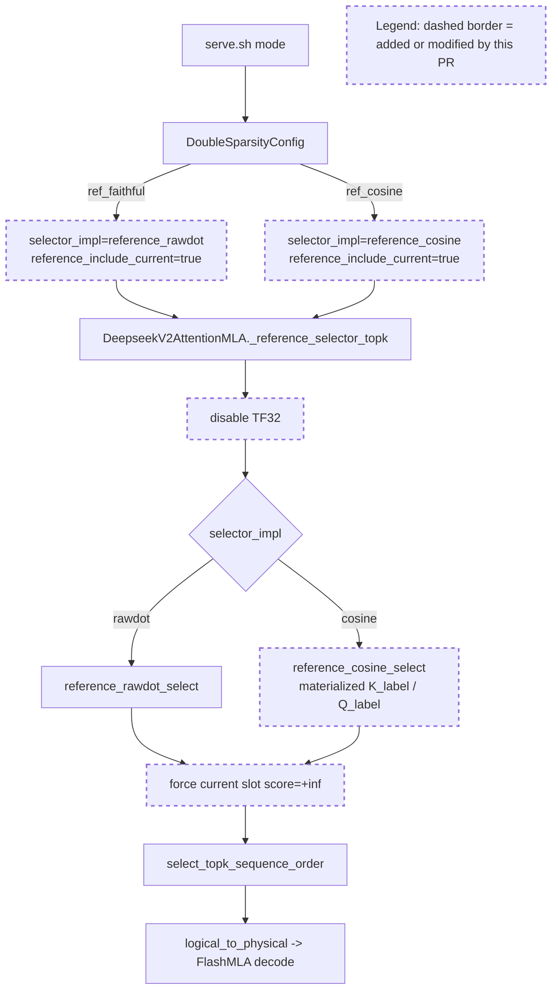

Your work is not finished. Read and execute the below with ultrathink.

## Original Implementation Plan

**IMPORTANT**: Before proceeding, review the original plan you are implementing:
@development/loop13/plan.md

This plan contains the full scope of work and requirements. Ensure your work aligns with this plan.

---

## Round Re-anchor (REQUIRED FIRST STEP)

Before writing code:
- Re-read @development/loop13/plan.md
- Re-read @/sgl-workspace/sglang/.humanize/rlcr/2026-06-20_09-57-51/goal-tracker.md
- Re-read the most recent round summaries/reviews that led to this round
- Write the current round contract to @/sgl-workspace/sglang/.humanize/rlcr/2026-06-20_09-57-51/round-2-contract.md

Your round contract must contain:
- Exactly one **mainline objective**
- The 1-2 target ACs for this round
- Which issues are truly **blocking** that mainline objective
- Which issues are **queued** and explicitly out of scope
- Concrete success criteria for this round

Do not start implementation until the round contract exists.

## Task Lane Rules

Use the Task system (TaskCreate, TaskUpdate, TaskList) with one required tag per task:
- `[mainline]` for plan-derived work that directly advances this round's objective
- `[blocking]` for issues that prevent the mainline objective from succeeding safely
- `[queued]` for non-blocking bugs, cleanup, or follow-up work

Rules:
- `[mainline]` work is the round's primary success condition
- `[blocking]` work is allowed only when it truly blocks the mainline objective
- `[queued]` work must be documented but must NOT replace the round objective
- If a new bug does not block the current objective, tag it `[queued]` and keep moving on mainline work

Before executing each task in this round:
1. Read @/sgl-workspace/sglang/.humanize/bitlesson.md
2. Run `bitlesson-selector` for each task/sub-task
3. Follow selected lesson IDs (or `NONE`) during implementation

---
Below is Codex's review result:
<!-- CODEX's REVIEW RESULT START -->
# Round 1 Review Result - Loop 13

Mainline Progress Verdict: ADVANCED

Round 1 materially advanced the diagnosis: `reference_cosine` now serves, the H3-clean/TF32-off ceiling is measured, and the AC-5 gate flips to GOOD. The loop is not complete. The current writeup over-claims AC-6 completion and still lacks required AC-2, AC-3.1, and AC-4 artifacts from the original plan.

Goal Alignment Summary:
ACs: 7/8 addressed (0/8 fully closed; AC-7 is not taken while the GOOD gate stands) | Forgotten items: 4 | Unjustified deferrals: 3

Tracker update: I updated the mutable section of `goal-tracker.md` to record Round-1 review state, reopen AC-6, keep AC-7 as a justified conditional moot item, and add the missing AC-3.1 / AC-4 / AC-6 blockers.

## PR Comprehension

Change summary:
- Adds `reference_include_current` to the Double Sparsity config and wires `ref_faithful` / `ref_cosine` harness modes.
- Implements a materialized per-head cosine reference scorer in `absorbed_latent_cosine_logical_fp8`.
- Disables TF32 inside `_reference_selector_topk` before reference scoring.
- Forces the current decode slot into the reference top-k by setting its score to `+inf` before `select_topk_sequence_order`.
- Rewrites the evidence and root-cause report around a GOOD ceiling: dense regression = current-slot exclusion, sparse regression = raw-dot scorer lock.



Walkthrough: the harness selects either raw-dot or cosine reference mode. Both run through `_reference_selector_topk`, which disables TF32 and calls the chosen reference selector. The cosine branch materializes per-head masked signatures, normalizes after mask-channel gather, and then uses the same top-k/adapter/decode path shape as the raw-dot reference. `reference_include_current` modifies the score tensor before top-k so the current decode slot is selected despite the production `_slot_written` invalidation.

Historical review synthesis: the SGLang review corpus sweep scanned 32639 threads and matched 715 threads across 309 PRs for `deepseek_v2.py`, attention, double-sparsity-adjacent paths, FP8/KV-cache, top-k, CUDA graph, benchmark, and accuracy terms. The recurring maintainer pattern is to require exact evaluation evidence, hardware/model/config details, and targeted tests for DeepSeek/MLA/FP8 attention changes. Non-inline DeepSeek MLA review discussions also repeatedly ask for GSM8K/MMLU-style evals, radix-cache controls, TP/H100 environment details, and regression tests before accepting performance or accuracy claims. That history supports accepting the new cosine run as useful, but not accepting a final root-cause close-out while the promised AC-2/AC-4 artifacts and GOOD-branch bisection are absent.

## Mainline Gaps

1. AC-6 is not complete: the GOOD gate routes to a full single-variable bisection, but the implementation stops after the reference raw-dot-vs-cosine comparison.

Evidence: the plan requires walking from reference toward production with exactly one variable changed per arm, covering head aggregation, raw vs cosine, fp8 absorbed vs materialized fp32, bf16 vs fp32 reduce, radix/top-k, and selector width, with recall or selected-index corroboration (`development/loop13/plan.md:77-83`). The gate doc instead declares the culprits "already isolated" from faithful raw-dot vs faithful cosine and current-slot controls (`development/loop13/evidence/gate_ac5.md:16-24`), then explicitly defers the production-style cosine control (`development/loop13/evidence/gate_ac5.md:42-45`).

Impact: the reference ceiling is good evidence that cosine can recover accuracy, but it does not finish the production-path bisection. Production still differs by graph-safe scoring, TP aggregation/reduce, radix/top-k, selector width, and resident-fp8 scoring. The final sparse production culprit should remain "strong candidate: raw-dot scorer lock" until the production-style one-variable arms are measured.

Required fix: run AC-6 now. Start from faithful cosine reference and introduce one production variable at a time: production-style cosine through the graph-safe path, head_agg semantics, materialized vs resident-fp8 absorbed scoring, bf16 vs fp32 reduce, radix/top-k, and selector width. For each arm, record dense+sparse GSM8K and recall/selected-index or score-rank corroboration. Only then name the production culprit and commit cost as final.

2. AC-1/AC-4 evidence remains incomplete and internally inconsistent.

Evidence: AC-1 requires per-arm git SHA, model path, mask hash, full server args, CUDA graph state, sample IDs/order, max tokens, concurrency, and serial/batched mode (`development/loop13/plan.md:28-36`). AC-4 requires every required arm in serial and batched mode plus selected-vs-total and length-cap garbage-rate columns (`development/loop13/plan.md:62-67`). The table still has only batched new reference arms, no selected-vs-total columns, no invalid/unwritten/duplicate/out-of-range columns, and missing serial cells (`development/loop13/evidence/evidence_table.md:7-19`). `run_meta.json` is stale at git `180f6dd6d`, not the Round-1 commits `fea920c06` / `62ad64346` (`development/loop13/evidence/meta/run_meta.json:1-15`). The gate uses DSA sparse `0.953` (`development/loop13/evidence/gate_ac5.md:6-9`), while the evidence table lists DSA batched sparse `0.973` (`development/loop13/evidence/evidence_table.md:9`).

Impact: the GOOD outcome survives either DSA sparse baseline, but the evidence package is not reproducible to the plan standard and cannot be the final ledger.

Required fix: generate one per-arm JSON for every arm with the full AC-1 field set, sample IDs/order, server args, concurrency, and DS summaries. Regenerate `evidence_table.md` from those JSONs and fail closed if required fields are absent. Rerun or mark missing all required serial/batched cells, especially faithful raw-dot, faithful cosine, production DS sparse serial, and DSA-radix serial.

3. AC-2 and AC-3.1 corroboration artifacts are still missing.

Evidence: AC-2 requires forced-all physical-slot equality/no-dup/no-`-1`/unwritten/adapter-error assertions, TP head-aggregation micro-test, radix-vs-`torch.topk`, width equivalence, and recall-oracle corroboration (`development/loop13/plan.md:38-48`). AC-3.1 requires selected-index equality against offline/blockwise materialized fp32 `K_label` on captured decode steps (`development/loop13/plan.md:50-53`). The repository still has no `.sglang_ds_scorecap`, `.sglang_ds_selcap`, `cheap_controls.json`, forced-all slot-assertion JSON, or captured materialized-K artifact under `development/loop13/evidence`. The current proof is a synthetic CPU unit test and gate-note statement, not a captured decode-step artifact (`development/loop13/evidence/gate_ac5.md:26-34`).

Impact: the new CPU test is useful, but it does not satisfy the plan's live/captured decode-step requirement. This weakens the "single variable only" claim and leaves earlier cheap controls unverified.

Required fix: run `ds_capture` on bounded dense and sparse requests, persist capture outputs or derived JSON, run `analyze_captures.py`, and commit `cheap_controls.json`. Add a forced-all/current-slot assertion artifact with physical-slot equality, duplicate count, `-1` count, unwritten-slot count, and adapter error count. Add the captured materialized-K equality artifact for AC-3.1.

## Blocking Side Issues

1. The root-cause writeup currently reads like final close-out while key ACs remain open.

Evidence: `ROOT_CAUSE.md` says the two culprits are single-variable and recommends fix loops (`development/loop13/ROOT_CAUSE.md:43-68`), but AC-6 production-path bisection and AC-4 ledger are incomplete. This can mislead the next round into skipping required plan work.

Resolution path: rewrite the verdict language after AC-2/AC-4/AC-6 are complete. Until then, phrase sparse as "reference-ceiling cosine recovery strongly implicates raw-dot scorer lock; production-path bisection pending."

2. Gate documentation should use one DSA baseline source.

Evidence: DSA sparse is `0.973` in the table but `0.953` in the gate doc. This does not flip GOOD, but it undermines reproducibility.

Resolution path: choose the measured comparator for the gate, state whether it is batched DSA, serial DSA, or prior pinned baseline, and recompute the exact gaps/counts consistently.

## Queued Side Issues

1. Implementation and harness comments include plan-workflow terminology that the plan explicitly banned from code comments.

Evidence: new comments include `AC-3.4`, `AC-5`, and `H3` in `deepseek_v2.py`, `absorbed_latent.py`, and `serve.sh`. This is not a runtime blocker, but it violates the plan's implementation notes and should be cleaned before retaining this diagnostic code outside the loop.

2. Reference selectors are documented as eager-only, but config validation does not reject reference modes under CUDA graph.

Evidence: `serve.sh` uses `--disable-cuda-graph` for `ref_faithful` and `ref_cosine`, but `selector_impl` itself can still be set by users outside the harness. This is not blocking the diagnosis because the guarded harness was used, but it should fail closed if the diagnostic path remains available.

## Goal Alignment

Acceptance Criteria Progress:
- AC-1: partial. Baselines reproduced, but per-arm metadata/sample IDs/order and some serial cells are missing.
- AC-2: partial. Dense H3 controls are strong, but required slot/capture/head-agg/radix/width/recall artifacts are missing.
- AC-3: partial. AC-3.2/3.3/3.4 advanced strongly; AC-3.1 captured materialized-K proof remains missing.
- AC-4: partial. Table exists but lacks full serial/batched matrix and required metadata/garbage columns.
- AC-5: addressed. GOOD gate is directionally sound, but DSA baseline inconsistency must be corrected.
- AC-6: partial. Strong deltas exist, but the production-path bisection is incomplete.
- AC-7: not taken while GOOD gate stands; current deferral is justified.
- AC-8: partial. Writeup exists but should not be final until the missing ACs are complete.

Forgotten Items:
- AC-2 capture and forced-all physical-slot assertion artifacts.
- AC-3.1 captured materialized fp32 `K_label` selected-index equality.
- AC-4 full serial/batched evidence ledger with selected-vs-total and garbage-rate columns.
- AC-6 production-path one-variable bisection and corroboration.

Deferred Items:
- AC-7 BAD-branch no-mask/knob sweep is justified as moot under GOOD.
- AC-2 and AC-4 being queued out of Round 1 is not acceptable for loop close-out.
- Production-style cosine / full AC-6 being deferred to a FIX loop is not justified; it is part of the diagnosis loop's GOOD branch.

Plan Evolution:
- The Round-1 plan evolution from BAD/confounded to GOOD is valid.
- The conclusion "no-mask ablation is moot" is valid while GOOD stands.
- The conclusion "AC-6 done" is not valid; it compresses a full bisection into two reference/control contrasts.

## Required Implementation Plan

1. Complete AC-2 artifacts first. Run `serve.sh ds_capture` on one dense and one sparse bounded request, persist the score/selection capture outputs or a lossless derived JSON, run `analyze_captures.py`, and commit `cheap_controls.json`. Add forced-all/current-slot slot-assertion JSON with physical equality, duplicate, `-1`, unwritten, out-of-range, and adapter-error counts.

2. Complete AC-3.1 using captured decode rows. Build the offline/blockwise materialized fp32 `K_label` scorer against the captured rows, compare selected-index sets @2048 with absorbed raw-dot, and commit the artifact. Keep the synthetic CPU test, but do not use it as the only proof.

3. Complete AC-4 as a generated ledger. Emit one JSON per arm with full AC-1 metadata, sample IDs/order, server args, mode, concurrency, selected-vs-total, and garbage counters. Rerun missing serial/batched cells for DSA, DSA-radix-off, production DS, faithful raw-dot, and faithful cosine. Regenerate `evidence_table.md` from the JSONs.

4. Complete AC-6 bisection. Run production-style cosine first: same production candidate validity, TP reduce/aggregation, top-k/radix/width path, but cosine scores. Then test one variable per arm for head_agg, materialized vs fp8 absorbed scoring, bf16 vs fp32 reduce, radix/top-k, and selector width. Record dense+sparse GSM8K plus recall/selected-index corroboration for every delta and name the responsible commit(s).

5. Rewrite `ROOT_CAUSE.md`, `gate_ac5.md`, and `findings.md` only after steps 1-4. Keep the GOOD gate if it still holds, keep AC-7 moot, and clearly separate "reference-ceiling diagnosis" from "production-path bisection result."

## Validation Performed By Codex

- Read the original plan, Round-1 contract, prior summary/review, and goal tracker.
- Inspected the Round-1 diff and evidence files.
- Ran `python3 development/loop13/test_reference_selectors.py` successfully: 5/5 tests passed.
- Ran the SGLang human-review corpus sweep: 32639 scanned, 715 matched, 309 PRs.

NOT COMPLETE
<!-- CODEX's REVIEW RESULT  END  -->
---

## Goal Tracker Reference

Before starting work, **read** @/sgl-workspace/sglang/.humanize/rlcr/2026-06-20_09-57-51/goal-tracker.md to understand:
- The Ultimate Goal and Acceptance Criteria you're working toward
- Which tasks are Active, Completed, or Deferred
- Which side issues are blocking vs queued
- Any Plan Evolution that has occurred
- The latest side-issue state that needs attention

**IMPORTANT**: Keep the mutable section of `goal-tracker.md` up to date during the round.
Do NOT change the immutable section after Round 0.
If you cannot safely reconcile the tracker yourself, include an optional "Goal Tracker Update Request" section in your summary (see below).

## Mainline Guardrails

- Keep the mainline objective from @/sgl-workspace/sglang/.humanize/rlcr/2026-06-20_09-57-51/round-2-contract.md stable for this round
- Do not let queued issues take over the round
- If Codex reported several findings, classify them into:
  - mainline gaps
  - blocking side issues
  - queued side issues
- Only mainline gaps and blocking side issues should drive the next code changes

---

Note: You MUST NOT try to exit by lying, editing loop state files, or executing `cancel-rlcr-loop`.

After completing the work, please:
0. If the `code-simplifier` plugin is installed, use it to review and optimize your code. Invoke via: `/code-simplifier`, `@agent-code-simplifier`, or `@code-simplifier:code-simplifier (agent)`
1. Commit your changes with a descriptive commit message
2. Write your work summary into @/sgl-workspace/sglang/.humanize/rlcr/2026-06-20_09-57-51/round-2-summary.md

## Task Tag Routing Reminder

Follow the plan's per-task routing tags strictly:
- `coding` task -> Claude executes directly
- `analyze` task -> execute via `/humanize:ask-codex`, then integrate the result
- Keep Goal Tracker Active Tasks columns `Tag` and `Owner` aligned with execution

**Optional fallback**: if you could not safely update the mutable section of `goal-tracker.md` directly, include this section in your summary:
```markdown
## Goal Tracker Update Request

### Requested Changes:
- [E.g., "Mark Task X as completed with evidence: tests pass"]
- [E.g., "Add to Blocking Side Issues: bug Y blocks AC-2"]
- [E.g., "Add to Queued Side Issues: cleanup Z is non-blocking"]
- [E.g., "Plan Evolution: changed approach from A to B because..."]
- [E.g., "Defer Task Z because... (impact on AC: none/minimal)"]

### Justification:
[Explain why these changes are needed and how they serve the Ultimate Goal]
```

Codex will review your request and reconcile the Goal Tracker if justified.
