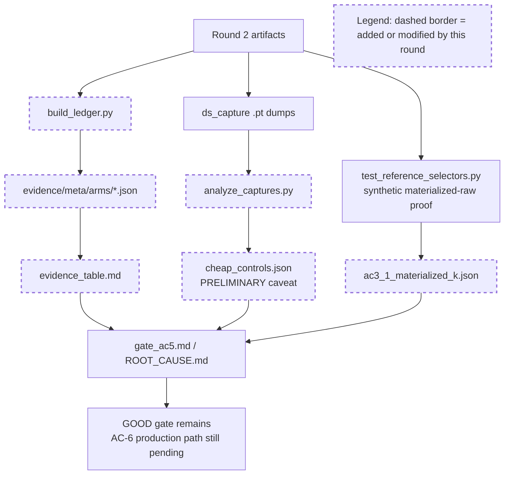

# Round 2 Review Result - Loop 13

Mainline Progress Verdict: ADVANCED

Round 2 improved the evidence package: the DSA baseline is now consistent, the verdict wording is less final, per-arm JSON/table artifacts exist, and the cited CPU selector test passes. The loop is still not complete. Several Round-2 success criteria and original-plan ACs remain unfinished or explicitly preliminary, and Claude's requested deferrals are rejected for loop close-out.

Goal Alignment Summary:
ACs: 7/8 addressed, 1/8 closed | Forgotten items: 0 after tracker update | Unjustified deferrals: 3

Tracker update: I updated the mutable section of `goal-tracker.md` to Plan Version 3, added a Round-2 review correction row, rejected the requested AC-6 / AC-2 / AC-4 scope reduction, and kept the incomplete work active/blocking.

## PR Comprehension

Change summary:
- Round 2 adds a generated-looking evidence ledger via `development/loop13/build_ledger.py` and regenerates `evidence/meta/arms/*.json` plus `evidence/evidence_table.md`.
- It adds `cheap_controls.json` from `ds_capture` + `analyze_captures.py`, but the artifact itself marks the key AC-2.2/2.3 numbers preliminary/invalid for selected-index equivalence.
- It adds `ac3_1_materialized_k.json`, backed by the CPU synthetic `test_materialized_raw_equals_absorbed_raw`, not by captured decode rows.
- It softens `ROOT_CAUSE.md` toward "reference-ceiling; production-path bisection pending", but `gate_ac5.md` still declares the culprits already isolated and defers production-style cosine as a fix-loop concern.
- Runtime code changes this round are comment cleanup only; the substantive selector implementation remains from Round 1.

Walkthrough: the Round-2 execution path is evidence-first. Scores are scraped from committed `.out` files into per-arm JSON, then the markdown table is generated from those records. Capture dumps feed `analyze_captures.py`, which compares head aggregation and selection sets, but it does not align score rows to selection records. A separate CPU test proves the absorbed/materialized raw-dot algebra on synthetic tensors. Those artifacts are then used to keep the GOOD gate, while the production-path bisection remains pending.

Historical review synthesis: the SGLang corpus sweep scanned 32639 threads and matched 784 threads across 323 PRs for DeepSeek/MLA/FP8/top-k/capture/accuracy paths. The recurring maintainer pattern is to require exact model/hardware/config evidence, targeted tests for changed attention or indexer paths, and concrete benchmark/accuracy data before accepting DeepSeek/MLA/FP8 claims. Reviewers repeatedly challenge untested branches, unclear dispatch semantics, and "follow-up" deferrals when correctness or accuracy is affected. That precedent supports accepting Round 2 as useful evidence work, but not accepting final close-out while the promised aligned controls, ledger fields, and GOOD-branch bisection are missing.

## Mainline Gaps

1. AC-2.2/AC-2.3 are not satisfied: `cheap_controls.json` is explicitly preliminary and the selected-index equivalence is invalid.

Evidence: `analyze_captures.py` builds `score_by_layer` and then compares every selection record for a layer against every captured score row for that layer (`development/loop13/analyze_captures.py:117-139`). The generated artifact confirms the result is a "CROSS-RECORD cartesian comparison" and "NOT a valid radix-vs-torch.topk result" without per-`(req_pool_index, layer, decode_step)` alignment (`development/loop13/evidence/cheap_controls.json:29961-29967`). It also says head-agg is PRELIMINARY because `pre_reduce_scores` semantics are unconfirmed and served-SUM does not consistently match post-reduce.

Impact: the plan required these controls to retire radix/top-k, selector-width, and TP head-aggregation suspects. Round 2 produced an artifact, but not the artifact the AC requires.

Required fix: add stable row identity to both score and selection capture records: `req_pool_index`, decode step, layer id, sequence length, row position, selector width, top-k backend, final post-reduce score row, and selected indices. Regenerate `cheap_controls.json` using only exact row joins. Fail if any selected row has no matching score row. Include separate width `[5120]` vs `[]` selected-index equivalence and recall/selected-index corroboration.

2. AC-2.1 and AC-4 still lack required physical-slot/sample/garbage evidence.

Evidence: the Round-2 contract required `evidence/forced_all_assertions.json`, but no such artifact exists; only `ds_forced_all_dense.out` and a server log are present. The generated ledger explicitly lists uninstrumented sample IDs/order and per-step length-cap garbage counters (`development/loop13/build_ledger.py:76-100`; `development/loop13/evidence/evidence_table.md:18`). The table still has missing serial cells for DSA-radix, production DS sparse, faithful raw-dot, cosine, forced-all, and anchor arms (`development/loop13/evidence/evidence_table.md:9-16`). `score_from_out` returns `None` when evidence files are absent, so the generator emits null/`-` instead of failing closed (`development/loop13/build_ledger.py:27-33`, `development/loop13/build_ledger.py:93-98`).

Impact: this does not meet AC-1/AC-4 reproducibility or AC-2.1 physical-slot validation. "fields_not_instrumented" is honest, but the plan's negative tests reject missing metadata/garbage fields.

Required fix: instrument the `logical_to_physical`/adapter handoff for the forced-all and production/reference arms. Persist per-layer/per-step checks for physical slots equal to `req_to_token[req_pool, 0:seq_len]`, duplicate count, `-1` count, unwritten-slot count, out-of-range count, and adapter error count. Use the same counters as AC-4 garbage columns. Modify the GSM8K harness to persist exact sample IDs/order. Regenerate the ledger from measured per-arm records and make the generator fail if required fields or required serial/batched cells are missing.

3. AC-3.1 is still not proven on captured decode rows.

Evidence: `ac3_1_materialized_k.json` points to `test_reference_selectors.py::test_materialized_raw_equals_absorbed_raw` and states the proof is synthetic/input-independent (`development/loop13/evidence/ac3_1_materialized_k.json:1-7`). The CPU test passes, and the algebra is useful, but the original plan and Round-2 contract required selected-index equality on captured decode steps.

Impact: the synthetic proof strengthens confidence in the identity, but it does not satisfy the captured-row acceptance criterion or provide row-level evidence tied to the live GLM-5.1 decode path.

Required fix: use captured decode rows from the served reference path, materialize fp32 `K_label` offline/blockwise for those rows, compute absorbed raw-dot scores on the same rows, and write a JSON artifact with row identifiers, max absolute/relative score diff, top-k equality, top-k size, and pass/fail per row.

4. AC-6 remains incomplete and the requested deferral is not justified.

Evidence: `ROOT_CAUSE.md` says the production-path one-variable bisection is pending (`development/loop13/ROOT_CAUSE.md:60-64`). `gate_ac5.md` says GOOD routes to AC-6, but then declares the two culprits already isolated and defers production-style cosine to "FIX loops / next round" (`development/loop13/evidence/gate_ac5.md:20-28`, `development/loop13/evidence/gate_ac5.md:46-48`).

Impact: the reference-ceiling raw-dot-vs-cosine cliff is strong, but AC-6 requires walking from reference toward production one variable per arm and corroborating deltas. The no-fix constraint prohibits landing a production fix by default; it does not prohibit guarded diagnostic modes or instrumentation in `development/loop13`.

Required fix: run the GOOD-branch bisection now. Add a diagnostic-only production-style cosine mode under the guarded loop13 harness: same production validity, TP aggregation/reduce, radix/top-k, selector width, and decode handoff, but with cosine score computation; keep defaults unchanged. Then run one-variable arms for head aggregation, materialized fp32 vs resident-fp8 absorbed scoring, bf16 vs fp32 reduce, radix vs exact top-k, and selector-width ladder vs full width. For each arm record dense+sparse GSM8K, selected-index/recall or score-rank corroboration, changed variable, responsible commit, and accuracy cost.

## Blocking Side Issues

1. The generated ledger metadata is stale relative to the committed Round-2 HEAD.

Evidence: `build_ledger.py` stamps `git rev-parse HEAD` (`development/loop13/build_ledger.py:23-36`), but the committed table and per-arm JSONs are stamped `62ad64346`, while current HEAD is `ac479aeb3` (`development/loop13/evidence/evidence_table.md:3`). `run_meta.json` also says `git_sha_current` is `62ad64346` (`development/loop13/evidence/meta/run_meta.json:36-38`), contradicting Claude's summary claim that it was corrected to HEAD.

Impact: this is a reproducibility blocker for AC-1/AC-4 because the ledger cannot tell whether a SHA is the measured run SHA or the generator commit. It also means rerunning the generator now would create metadata churn.

Required fix: store two explicit fields per arm: `measured_git_sha` from the server run and `ledger_generated_git_sha` from the generator run. Never overwrite measured SHAs with generation HEAD. Regenerate after the schema change.

2. The tracker had accepted Claude's scope framing too far.

Evidence: the Round-2 plan-evolution row claimed AC-4 ledger and AC-3.1 were satisfied, while the active tasks still showed the missing fields and incomplete bisection. I corrected the mutable section and rejected the requested deferrals.

Impact: without this correction, the next round could skip original-plan work that is still required for completion.

## Queued Side Issues

1. `build_ledger.py` still uses plan-workflow terms in code comments/docstrings (`development/loop13/build_ledger.py:1-10`). This is non-blocking for the diagnosis, but it violates the implementation-note cleanup claim if this harness code is retained.

2. The Round-1 queued issue remains: reference selector modes are eager-only in practice, but config validation still does not fail closed if a reference mode is requested with CUDA graph outside `serve.sh`.

## Goal Alignment

Acceptance Criteria Progress:
- AC-1: partial. Scores are reproduced, but sample IDs/order are missing, several serial cells are absent, and SHA metadata is stale/ambiguous.
- AC-2: partial. Dense GSM8K controls are strong, but forced-all physical assertions are absent and AC-2.2/2.3 capture analysis is explicitly preliminary/invalid.
- AC-3: partial. Served cosine and TF32-off reference remain useful; AC-3.1 still lacks captured-row proof.
- AC-4: partial. Per-arm JSON/table exists, but missing required fields are listed as not instrumented and the generator does not fail closed.
- AC-5: addressed. The GOOD gate arithmetic is now consistent with measured batched DSA 0.975/0.973.
- AC-6: partial. Reference-ceiling deltas are strong, but production-path bisection is not run.
- AC-7: not taken while GOOD gate stands; this deferral remains justified.
- AC-8: partial. The writeup is improved but cannot close until AC-2/AC-4/AC-6 are complete.

Forgotten Items:
- None after the tracker update; the remaining items are tracked as active/blocking rather than forgotten.

Unjustified Deferrals:
- AC-6 production-path bisection / production-style cosine.
- AC-2.1 forced-all physical-slot assertions plus AC-4 garbage counters and sample IDs/order.
- AC-2.2/2.3 aligned analyzer and pre-reduce semantics confirmation.

Rejected Tracker Requests:
- Rejected accepting reference-ceiling AC-6 attribution as final. It remains a strong candidate, not a completed production-path bisection.
- Rejected deferring AC-2.1/AC-4 instrumentation. The plan explicitly requires these artifacts and the review prompt treats deferrals as incomplete.
- Rejected treating preliminary AC-2.2/2.3 cheap controls as load-bearing. They must be aligned and regenerated.

## Required Implementation Plan

1. Fix the capture schema and analyzer first. Add stable identifiers to score and selection capture payloads, regenerate bounded dense+sparse captures, and make `analyze_captures.py` join only exact `(req_pool_index, layer, decode_step)` rows. Include valid TP head-agg, radix-vs-`torch.topk`, selector-width, and recall/selected-index results in `cheap_controls.json`.

2. Add physical-slot and garbage-counter instrumentation. Emit `evidence/forced_all_assertions.json` and per-arm garbage counters from the adapter path with physical equality, duplicate, `-1`, unwritten, out-of-range, and adapter-error counts. Reuse these counters in the AC-4 ledger.

3. Replace the fail-open ledger with a fail-closed one. Persist sample IDs/order from the GSM8K harness, store measured SHA separately from generated SHA, populate every required serial/batched cell or rerun the arm, and make missing required fields fail generation rather than appear as `fields_not_instrumented`.

4. Complete AC-3.1 on captured rows. Materialize fp32 `K_label` offline/blockwise for captured decode rows and compare top-k selection against absorbed raw-dot row by row.

5. Complete AC-6. Implement guarded diagnostic production-style cosine without changing production defaults, then run one-variable production-path arms for head aggregation, fp32/materialized vs fp8/resident scoring, reduce dtype, top-k backend, and selector width. Corroborate every claimed culprit delta with selected-index/recall or score-rank evidence and record responsible commit/cost.

6. Rewrite `ROOT_CAUSE.md`, `gate_ac5.md`, and `evidence_table.md` only after steps 1-5. Keep the GOOD gate if it still holds, keep AC-7 moot, and clearly separate final production-path causality from reference-ceiling evidence.

## Validation Performed By Codex

- Re-read `development/loop13/plan.md`, Round-0/1 summaries and reviews, Round-2 prompt/contract/summary, and `goal-tracker.md`.
- Inspected the Round-2 diff and evidence artifacts.
- Ran `python3 development/loop13/test_reference_selectors.py`: all 5 tests pass.
- Ran the SGLang human-review corpus sweep: 32639 scanned, 784 matched, 323 PRs.
- Updated the mutable section of `goal-tracker.md`; immutable goal/AC text was not modified.

NOT COMPLETE
