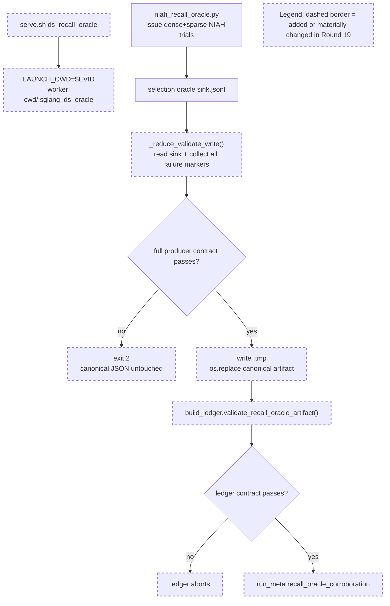

Your work is not finished. Read and execute the below with ultrathink.

## Original Implementation Plan

**IMPORTANT**: Before proceeding, review the original plan you are implementing:
@development/loop13/plan.md

This plan contains the full scope of work and requirements. Ensure your work aligns with this plan.

---

## Round Re-anchor (REQUIRED FIRST STEP)

Before writing code:
- Re-read @development/loop13/plan.md
- Re-read @/sgl-workspace/sglang/.humanize/rlcr/2026-06-20_09-57-51/goal-tracker.md
- Re-read the most recent round summaries/reviews that led to this round
- Write the current round contract to @/sgl-workspace/sglang/.humanize/rlcr/2026-06-20_09-57-51/round-20-contract.md

Your round contract must contain:
- Exactly one **mainline objective**
- The 1-2 target ACs for this round
- Which issues are truly **blocking** that mainline objective
- Which issues are **queued** and explicitly out of scope
- Concrete success criteria for this round

Do not start implementation until the round contract exists.

## Task Lane Rules

Use the Task system (TaskCreate, TaskUpdate, TaskList) with one required tag per task:
- `[mainline]` for plan-derived work that directly advances this round's objective
- `[blocking]` for issues that prevent the mainline objective from succeeding safely
- `[queued]` for non-blocking bugs, cleanup, or follow-up work

Rules:
- `[mainline]` work is the round's primary success condition
- `[blocking]` work is allowed only when it truly blocks the mainline objective
- `[queued]` work must be documented but must NOT replace the round objective
- If a new bug does not block the current objective, tag it `[queued]` and keep moving on mainline work

Before executing each task in this round:
1. Read @/sgl-workspace/sglang/.humanize/bitlesson.md
2. Run `bitlesson-selector` for each task/sub-task
3. Follow selected lesson IDs (or `NONE`) during implementation

---
Below is Codex's review result:
<!-- CODEX's REVIEW RESULT START -->
# Round 19 Review Result - Loop 13

Mainline Progress Verdict: ADVANCED

Round 19 resolves both Round-18 AC-2.4 blockers. The recall-oracle producer now validates before publishing, treats every failure marker as fatal, and leaves the canonical artifact untouched on failure. The serve harness now pins the worker CWD for `ds_recall_oracle`, and the ledger independently rejects wrong-source/failure-marker/partial recall artifacts before recording `run_meta.recall_oracle_corroboration`.

I found no new Round-19 implementation blocker. The full loop is still not complete: AC-3.1 captured materialized-K equality, AC-4 serial cells plus selected-vs-total, and AC-8 final writeup remain open.

## PR Comprehension

Change summary:
- `niah_recall_oracle.py` factors reduction into `_reduce_validate_write()`: read sink, build report in memory, validate the full contract, then atomically publish the canonical JSON.
- `serve.sh` adds `LAUNCH_CWD`; only `ds_recall_oracle` overrides it to `$EVID`, making worker `cwd/.sglang_ds_oracle` match the driver default.
- `build_ledger.py` strengthens `validate_recall_oracle_artifact()` and records the summary only after dense+sparse/source/failure/count/rate checks pass.
- The committed recall artifact was regenerated with the same substantive numbers: dense `1.0`, sparse `0.4103`.



Walkthrough: the server and driver now agree on the oracle directory by construction. The driver reduces the sink into a report but does not touch the canonical JSON unless all issued trials, record counts, failure markers, prompt-token samples, and recall/selected-rate invariants pass. The ledger then repeats the artifact-level contract before rendering the recall corroboration into generated metadata.

## Historical Review Synthesis

Corpus sweep: 32639 SGLang human-review threads scanned; 311 matched across 152 PRs and 598 human comments for DeepSeek/MLA/TP/Double Sparsity/evidence terms.

The recurring SGLang review concern for this subsystem is exact runtime-path evidence: DeepSeek/MLA and distributed TP changes are reviewed around worker assumptions, CUDA-graph/host-side safety, benchmark provenance, and artifacts proving the claimed state rather than a nearby proxy. Round 19 matches that standard: the worker CWD contract is encoded in `serve.sh`, and producer plus consumer now reject partial or failure-marker evidence.

## Implementation Review

No new Round-19 blocking defect found.

Verified claims:
- Producer validation happens before canonical write: `development/loop13/niah_recall_oracle.py:123-214`. Failure markers are aggregated from all names, not a whitelist (`lines 139-185`), and canonical publish is `.tmp` then `os.replace()` only after `problems` is empty (`lines 203-212`).
- Harness path agreement is encoded: `LAUNCH_CWD` defaults to caller CWD (`development/loop13/serve.sh:27-31`), `ds_recall_oracle` sets it to `$EVID` (`lines 155-168`), and launch runs in that cwd while keeping absolute logs/PID tracking (`lines 183-187`).
- Ledger independently gates AC-2.4: exact dense/sparse regimes, `index_topk==2048`, source basename, zero markers, issued/recorded equality, recall/selected counts, recall-rate equality, and prompt-token sample checks are in `development/loop13/build_ledger.py:253-299`; the summary is recorded only after that call (`lines 520-527`).
- The committed artifact has `expected_trials_per_regime: 8`, `failure_markers: {}`, dense and sparse 8/8 trials, count parity, and source basename `.sglang_ds_oracle`.

Validation performed:
- `python3 -m py_compile development/loop13/niah_recall_oracle.py development/loop13/build_ledger.py`
- `bash -n development/loop13/serve.sh`
- Producer synthetic tests: clean sink writes; `no_active_trial`, missing sparse trial, and null sparse prompt tokens each exit 2 and leave the canonical output unchanged.
- Temporary git worktree ledger tests: good artifact passes `build_ledger.py`; injected `failure_markers={"no_active_trial": 1}` makes `build_ledger.py` abort.
- `git status --short` was clean before the review tracker edit.

## Goal Alignment

| AC | Status | Evidence if met | Blocker if not met | Deferral justification |
|----|--------|-----------------|--------------------|------------------------|
| AC-1 | PARTIAL | Baseline scores, metadata, sample IDs/order, effective DS config, and provenance exist. | Remaining serial cells overlap AC-4: DSA-radix serial and production DS sparse serial are still blank. | n/a |
| AC-2 | MET | AC-2.1 forced-all slot assertions verified; AC-2.2 head-agg artifact reconciled; AC-2.3 pruning-valid radix/width equality verified; AC-2.4 recall-oracle now measured and fail-closed. | n/a | n/a |
| AC-3 | PARTIAL | Reference raw-dot/cosine arms serve; DS-active invariants and TF32-off reference path exist. | AC-3.1 captured decode-row materialized fp32 `K_label` selected-index equality is still missing; current proof is synthetic CPU only. | n/a |
| AC-4 | PARTIAL | Per-arm metadata, sample IDs/order, DS configs, selector behavior, and garbage counters for primary served DS arms are guarded. | Strict serial cells and selected-vs-total gaps remain. | n/a |
| AC-5 | MET | GOOD gate recorded from measured DSA and best naive DS/cosine scores. | n/a | n/a |
| AC-6 | PARTIAL | Bisection matrix is internally consistent; current-slot/scorer, reduce, radix/width, and head-agg evidence are recorded. | Final closure still depends on the remaining AC-3.1/AC-4 evidence and AC-8 writeup; fp8-absorbed remains an accepted no-config-route blocker, not a measured production toggle. | n/a |
| AC-7 | DEFERRED/MOOT | n/a | n/a | Valid while AC-5 remains GOOD; BAD branch is not the taken branch. |
| AC-8 | PARTIAL | Interim findings and evidence tables exist. | Final root-cause writeup must be regenerated after AC-3.1 and AC-4 close. | n/a |

Forgotten items detection:
- No original-plan task is absent from Active, Completed, or Deferred.
- I corrected one mutable tracker drift: the queued ergonomics row still listed stale `serve.sh` usage text and duplicate `.sglang_ds_oracle/` ignore entry, both fixed in R19.
- I added AC-2.4 to Completed and Verified now that this review verified the fail-closed producer/consumer/harness contract.

Deferred items audit:
- AC-7 remains justified as moot while AC-5 remains GOOD. It should be reconsidered only if the gate changes to BAD.
- The deferral does not contradict the Ultimate Goal because the plan defines AC-7 as the BAD-branch conditional path. It still prevents a literal all-ACs `COMPLETE` result under the review hook's strict rule.

Goal Completion Summary:
```text
Acceptance Criteria: 2/8 met (1 deferred/moot)
Active Tasks: 7 tracker rows remain partial or close-out dependent
Estimated remaining rounds: 3-4
Critical blockers: AC-3.1 captured materialized-K proof; AC-4 serial cells + selected-vs-total; AC-8 final writeup
```

## Drift Audit

Mainline Progress Verdict: ADVANCED

The current round's objective is clear and singular: repair AC-2.4 evidence integrity after Round 18. The work is a side-issue in form, but it was a true blocking side issue because the previous recall artifact could be partial or wrong-source while still accepted by the ledger. Recent rounds are not stalled: R16 repaired a bad AC-4 artifact, R17 completed reference garbage counters, R18 measured AC-2.4, and R19 hardened that measurement.

Blocking Side Issues: 0 new Round-19 blockers
Queued Side Issues: 3 existing reuse/cleanup items

## Action Items

Mainline Gaps:
1. Produce the AC-3.1 captured decode-row materialized fp32 `K_label` selected-index equality artifact, not just the synthetic CPU proof.
2. Fill AC-4 serial cells and selected-vs-total summaries in the ledger.
3. Write the final AC-8 root-cause document after AC-3.1 and AC-4 pass.

Blocking Side Issues:
- None newly introduced in Round 19.

Queued Side Issues:
- `ac4_garbage_counters.py --arm <non-production>` default CAPDIR remains a reuse footgun, but the ledger catches wrong source before accepting it.
- Remove plan-workflow terms from retained diagnostic code before promoting the harness outside `development/loop13`.
- Reference selector CUDA-graph safety remains queued for any future non-loop13 exposure.

## Goal Tracker Update Requests

Applied directly:
- Kept the Round-19 requested tracker state: Plan Version 22, task4 done, and the two R18 blockers resolved.
- Added an AC-2.4 row to Completed and Verified.
- Updated the queued ergonomics row to remove the R19-fixed `serve.sh` usage and duplicate `.gitignore` nits.

Rejected:
- Full-loop completion remains rejected because AC-3.1, AC-4, and AC-8 are still incomplete, and AC-7 remains conditional/moot rather than executed.

## Stagnation Check

Not stagnating. There was an earlier drift pattern around R3-R5, but the recent sequence is linear and evidence-reducing: bad artifact repaired, missing reference counters produced, recall-oracle measured, recall-oracle guard repaired. The remaining work is now the same close-out list from the original plan, not a repeated unresolved implementation mistake.

NOT_COMPLETE
<!-- CODEX's REVIEW RESULT  END  -->
---

## Goal Tracker Reference

Before starting work, **read** @/sgl-workspace/sglang/.humanize/rlcr/2026-06-20_09-57-51/goal-tracker.md to understand:
- The Ultimate Goal and Acceptance Criteria you're working toward
- Which tasks are Active, Completed, or Deferred
- Which side issues are blocking vs queued
- Any Plan Evolution that has occurred
- The latest side-issue state that needs attention

**IMPORTANT**: Keep the mutable section of `goal-tracker.md` up to date during the round.
Do NOT change the immutable section after Round 0.
If you cannot safely reconcile the tracker yourself, include an optional "Goal Tracker Update Request" section in your summary (see below).

## Mainline Guardrails

- Keep the mainline objective from @/sgl-workspace/sglang/.humanize/rlcr/2026-06-20_09-57-51/round-20-contract.md stable for this round
- Do not let queued issues take over the round
- If Codex reported several findings, classify them into:
  - mainline gaps
  - blocking side issues
  - queued side issues
- Only mainline gaps and blocking side issues should drive the next code changes

### Post-Alignment Check Action Items

This round follows a Full Goal Alignment Check. Pay special attention to:
- **Forgotten Items**: Codex may have identified tasks that were being ignored. Address them.
- **AC Status**: If any Acceptance Criteria were marked NOT MET, prioritize work toward those.
- **Deferred Items**: If any deferrals were flagged as unjustified, un-defer them now.
- **Queued Issues**: Keep non-blocking follow-up work queued unless it now clearly blocks mainline progress.

---

Note: You MUST NOT try to exit by lying, editing loop state files, or executing `cancel-rlcr-loop`.

After completing the work, please:
0. If the `code-simplifier` plugin is installed, use it to review and optimize your code. Invoke via: `/code-simplifier`, `@agent-code-simplifier`, or `@code-simplifier:code-simplifier (agent)`
1. Commit your changes with a descriptive commit message
2. Write your work summary into @/sgl-workspace/sglang/.humanize/rlcr/2026-06-20_09-57-51/round-20-summary.md

## Task Tag Routing Reminder

Follow the plan's per-task routing tags strictly:
- `coding` task -> Claude executes directly
- `analyze` task -> execute via `/humanize:ask-codex`, then integrate the result
- Keep Goal Tracker Active Tasks columns `Tag` and `Owner` aligned with execution

**Optional fallback**: if you could not safely update the mutable section of `goal-tracker.md` directly, include this section in your summary:
```markdown
## Goal Tracker Update Request

### Requested Changes:
- [E.g., "Mark Task X as completed with evidence: tests pass"]
- [E.g., "Add to Blocking Side Issues: bug Y blocks AC-2"]
- [E.g., "Add to Queued Side Issues: cleanup Z is non-blocking"]
- [E.g., "Plan Evolution: changed approach from A to B because..."]
- [E.g., "Defer Task Z because... (impact on AC: none/minimal)"]

### Justification:
[Explain why these changes are needed and how they serve the Ultimate Goal]
```

Codex will review your request and reconcile the Goal Tracker if justified.
