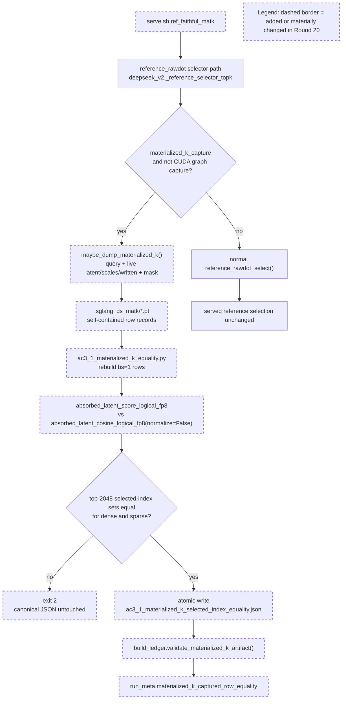

Your work is not finished. Read and execute the below with ultrathink.

## Original Implementation Plan

**IMPORTANT**: Before proceeding, review the original plan you are implementing:
@development/loop13/plan.md

This plan contains the full scope of work and requirements. Ensure your work aligns with this plan.

---

## Round Re-anchor (REQUIRED FIRST STEP)

Before writing code:
- Re-read @development/loop13/plan.md
- Re-read @/sgl-workspace/sglang/.humanize/rlcr/2026-06-20_09-57-51/goal-tracker.md
- Re-read the most recent round summaries/reviews that led to this round
- Write the current round contract to @/sgl-workspace/sglang/.humanize/rlcr/2026-06-20_09-57-51/round-21-contract.md

Your round contract must contain:
- Exactly one **mainline objective**
- The 1-2 target ACs for this round
- Which issues are truly **blocking** that mainline objective
- Which issues are **queued** and explicitly out of scope
- Concrete success criteria for this round

Do not start implementation until the round contract exists.

## Task Lane Rules

Use the Task system (TaskCreate, TaskUpdate, TaskList) with one required tag per task:
- `[mainline]` for plan-derived work that directly advances this round's objective
- `[blocking]` for issues that prevent the mainline objective from succeeding safely
- `[queued]` for non-blocking bugs, cleanup, or follow-up work

Rules:
- `[mainline]` work is the round's primary success condition
- `[blocking]` work is allowed only when it truly blocks the mainline objective
- `[queued]` work must be documented but must NOT replace the round objective
- If a new bug does not block the current objective, tag it `[queued]` and keep moving on mainline work

Before executing each task in this round:
1. Read @/sgl-workspace/sglang/.humanize/bitlesson.md
2. Run `bitlesson-selector` for each task/sub-task
3. Follow selected lesson IDs (or `NONE`) during implementation

---
Below is Codex's review result:
<!-- CODEX's REVIEW RESULT START -->
# Round 20 Review Result - Loop 13

Mainline Progress Verdict: ADVANCED

Round 20 advances the mainline and closes AC-3.1. The new `materialized_k_capture` path captures real served decode-row inputs, the reducer replays the two relevant scoring functions on those captured inputs, and the ledger independently rejects malformed materialized-K artifacts. I found no new Round-20 blocking implementation defect.

This is still not full loop completion. AC-4 serial cells plus selected-vs-total provenance, and AC-8 final root-cause writeup remain open.

## PR Comprehension

Change summary:
- `DoubleSparsityConfig` adds `materialized_k_capture`, default off and config-borne so TP workers receive the flag.
- `deepseek_v2.py` hooks the reference selector path before `reference_rawdot_select`, guarded by `materialized_k_capture` and eager-only current-stream checks.
- `materialized_k_capture.py` dumps a minimal single-request reconstruction: query, gathered live fp8 latent/scales/written bits, and the layer mask/projection tensors.
- `ac3_1_materialized_k_equality.py` rebuilds those records as bs=1 CPU calls, compares absorbed raw-dot vs materialized `K_label` numerator, and writes the canonical JSON only when dense and sparse rows all match.
- `build_ledger.py` now validates the captured-row artifact before recording it in `run_meta.materialized_k_captured_row_equality`.



Walkthrough: the new serve mode runs the faithful raw-dot reference in eager mode. On each capped row, the hook copies the exact tensors needed to replay the scorer offline, but it does not change the selected set. The reducer then calls the same absorbed raw-dot function and the materialized-signature raw numerator on those captured tensors, applies the common top-k selector, and only publishes the artifact when every captured dense and sparse row matches. The ledger repeats the artifact-level contract before adding the result to generated metadata.

## Historical Review Synthesis

Corpus sweep: 32639 SGLang human-review threads scanned; 311 matched across 152 PRs and 598 human comments for DeepSeek/MLA/FP8/TP/KV-cache/evidence/capture terms.

The recurring SGLang reviewer pattern for this subsystem is to demand exact runtime-path evidence, benchmark/evidence provenance, and explicit CUDA-graph/TP assumptions. Reviewers pushed back on nearby proxies in DeepSeek/MLA and FP8 paths, especially when a change depended on gathered KV/cache state or host-side diagnostics. Round 20 mostly matches that standard: it captures the served reference scorer's real tensors, uses a default-off config flag, runs under eager mode, and adds producer plus consumer fail-closed gates.

## Implementation Review

No new Round-20 blocking defect found.

Verified claims:
- The capture flag is parsed and type-checked in `python/sglang/srt/layers/attention/double_sparsity/config.py`.
- The capture hook is copy-only and runs before the unmodified `_select_fn(...)` return path in `python/sglang/srt/models/deepseek_v2.py:2218-2255`.
- The dumped records are self-contained and include query, gathered live latent/scales/written bits, and mask/projection tensors in `python/sglang/srt/layers/attention/double_sparsity/materialized_k_capture.py:48-104`.
- The reducer replays `absorbed_latent_score_logical_fp8` and `absorbed_latent_cosine_logical_fp8(normalize=False)`, compares `select_topk_sequence_order(..., 2048)` sets, requires both regimes, and writes only after success in `development/loop13/ac3_1_materialized_k_equality.py:47-145`.
- The committed artifact has 192 rows: dense 96/96 equal, sparse 96/96 equal, max score diff 2e-9 / 7e-9.
- The ledger independently checks source basename, `index_topk`, exact dense+sparse regimes, and all-equal rows in `development/loop13/build_ledger.py:256-279`.

Validation performed:
- `python3 development/loop13/ac3_1_materialized_k_equality.py development/loop13/evidence/.sglang_ds_matk` reports 96/96 dense and 96/96 sparse equality.
- Reducer negatives: empty capture dir and single-regime capture dir both exit 2 and leave the canonical JSON hash unchanged.
- Ledger negatives in an isolated worktree: `all_selected_index_equal=false`, missing sparse regime, `selected_index_equal_rows < rows`, and wrong `source_dir_basename` each make `build_ledger.py` exit 1; restored artifact passes.
- `python3 -m py_compile development/loop13/ac3_1_materialized_k_equality.py development/loop13/build_ledger.py python/sglang/srt/layers/attention/double_sparsity/materialized_k_capture.py`
- `bash -n development/loop13/serve.sh`
- `python3 development/loop13/build_ledger.py`
- `git diff --check 8a179067d e67f1b5f3`

## Mainline Gaps

1. P1 - AC-4 serial cells and selected-vs-total provenance remain incomplete.

Evidence:
- `development/loop13/evidence/evidence_table.md:11-14` still has blank serial cells for `dsa_noradix`, `production_ds` sparse serial, `ref_faithful`, and `ref_cosine`.
- `development/loop13/build_ledger.py:185-206` still wires DS selected/total as static `ds={...}` literals for the core DS arms, and `development/loop13/build_ledger.py:408` copies those literals into the ledger. The tracker correctly leaves selected-vs-total as an AC-4 remaining item.

Required implementation plan:
1. Run the missing serial GSM8K cells with the existing guarded harness, one TP=8 server at a time, no `PYTHONPATH`, completion API, and teardown to 0 MiB after each mode.
2. For `dsa_noradix`, boot `serve.sh dsa_noradix`, then run `THREADS=1 REGIME=both bash development/loop13/run_gsm8k.sh dsa_noradix_serial`; wire `dense_serial="dsa_noradix_serial_dense"` and `sparse_serial="dsa_noradix_serial_sparse"` into `build_ledger.py`.
3. For production DS, boot `serve.sh ds`, then run `THREADS=1 REGIME=sparse bash development/loop13/run_gsm8k.sh ds_serial`; wire `sparse_serial="ds_serial_sparse"` into `production_ds`.
4. For raw-dot reference, boot `serve.sh ref_faithful`, then run `THREADS=1 REGIME=both bash development/loop13/run_gsm8k.sh ref_faithful_serial`; wire both serial labels into `ref_faithful`.
5. For cosine reference, boot `serve.sh ref_cosine`, then run `THREADS=1 REGIME=both bash development/loop13/run_gsm8k.sh ref_cosine_serial`; wire both serial labels into `ref_cosine`.
6. Replace the remaining static selected/total literals for AC-4 core DS arms with a small artifact-backed probe. Extend or wrap `probe_ds_active.sh` so it records per-arm/per-regime `meta_info["double_sparsity"]` into `evidence/ac4_selected_vs_total.json` for production DS, `ref_faithful`, and `ref_cosine`, covering dense and sparse prompts. The reducer/validator must require dense `selected==total`, sparse `selected<total`, `dense_fallback==0`, and exact source arm labels before `build_ledger.py` renders the values.
7. Add a `validate_selected_vs_total_artifact()` gate to `build_ledger.py`, wire the table from that artifact, and reject blank serial cells for the AC-4 core arms.
8. Regenerate `evidence_table.md`, per-arm JSONs, `run_meta.json`, and `findings.md`; rerun the CPU validation suite and `build_ledger.py`.

2. P1 - AC-8 final root-cause writeup is still pending.

Evidence:
- The tracker still marks task13/task14 partial.
- `development/loop13/ROOT_CAUSE.md` predates the R17-R20 close-out artifacts and must be regenerated after AC-4 is complete.

Required implementation plan:
1. After AC-4 passes, rewrite `development/loop13/ROOT_CAUSE.md` from the final evidence package, not from older interim prose.
2. The writeup must name the primary/ranked cause, include the final per-arm serial+batched table, cite AC-2.1/AC-2.4/AC-3.1/AC-4/AC-6 artifacts, preserve the "diagnosis loop, no fix landed" scope, and state the recommendation.
3. Add a final self-check script or explicit ledger assertion that refuses AC-8 completion while AC-4 core serial cells are blank or the selected-vs-total artifact is absent.

## Blocking Side Issues

None newly introduced in Round 20.

## Queued Side Issues

- R20 adds more plan-workflow terminology in diagnostic code/comments (`AC-3.1` in the new capture module, reducer, serve mode, and ledger comments). This is already tracked as queued cleanup and does not affect evidence correctness.
- Reference diagnostic modes still rely on the guarded eager harness for CUDA-graph safety. This remains queued until these modes leave `development/loop13`.

## Goal Alignment

| AC | Status | Evidence if met | Blocker if not met | Deferral justification |
|----|--------|-----------------|--------------------|------------------------|
| AC-1 | PARTIAL | Baseline scores, metadata, sample IDs/order, effective DS config, and provenance exist. | `dsa_noradix` serial cells still blank; production DS sparse serial still blank. | n/a |
| AC-2 | MET | AC-2.1, AC-2.2, AC-2.3, and AC-2.4 are verified. | n/a | n/a |
| AC-3 | MET | R20 closes AC-3.1 captured-row equality; R1 served cosine + DS-active invariants + TF32-off path remain valid. | n/a | n/a |
| AC-4 | PARTIAL | Batched core arm scores, sample IDs, configs, selector behavior, and garbage counters exist. | Missing serial cells and artifact-backed selected-vs-total close-out. | n/a |
| AC-5 | MET | GOOD gate recorded from measured DSA and best naive DS/cosine scores. | n/a | n/a |
| AC-6 | PARTIAL | Bisection matrix is internally consistent and key legs are measured/retired/accepted-blocked. | Final closure still waits on AC-4 and AC-8 packaging. | n/a |
| AC-7 | DEFERRED/MOOT | n/a | n/a | Justified while AC-5 remains GOOD; BAD branch not taken. |
| AC-8 | PARTIAL | Interim findings and tables exist. | Final writeup must be regenerated after AC-4 closes. | n/a |

Goal Alignment Summary:
```text
ACs: 8/8 addressed (3/8 met, 1 deferred/moot, 4 partial) | Forgotten items: 0 | Unjustified deferrals: 0
```

Deferred items audit:
- AC-7 remains justified as moot while the GOOD gate stands.
- AC-4 and AC-8 are not deferrals; they are active unfinished work and must drive the next round.

## Goal Tracker Update Requests

Applied directly:
- Plan Version -> 24 (Round 20 Review).
- Added a `20-review` Plan Evolution row.
- Marked the captured materialized-K blocking issue resolved.
- Added AC-3.1 to Completed and Verified.
- Narrowed task11/task13/task14 wording so the remaining close-out is AC-4 serial/selected-vs-total plus AC-8.

Rejected:
- Full-loop completion remains rejected because AC-4 and AC-8 are incomplete.

## Stagnation Check

Not stalled. R17 -> R20 is a linear close-out sequence: reference garbage counters, recall-oracle measurement, recall-oracle hardening, then captured-row materialized-K equality. The next round should be the AC-4 table/provenance close-out, not another new diagnostic branch.

NOT_COMPLETE
<!-- CODEX's REVIEW RESULT  END  -->
---

## Goal Tracker Reference

Before starting work, **read** @/sgl-workspace/sglang/.humanize/rlcr/2026-06-20_09-57-51/goal-tracker.md to understand:
- The Ultimate Goal and Acceptance Criteria you're working toward
- Which tasks are Active, Completed, or Deferred
- Which side issues are blocking vs queued
- Any Plan Evolution that has occurred
- The latest side-issue state that needs attention

**IMPORTANT**: Keep the mutable section of `goal-tracker.md` up to date during the round.
Do NOT change the immutable section after Round 0.
If you cannot safely reconcile the tracker yourself, include an optional "Goal Tracker Update Request" section in your summary (see below).

## Mainline Guardrails

- Keep the mainline objective from @/sgl-workspace/sglang/.humanize/rlcr/2026-06-20_09-57-51/round-21-contract.md stable for this round
- Do not let queued issues take over the round
- If Codex reported several findings, classify them into:
  - mainline gaps
  - blocking side issues
  - queued side issues
- Only mainline gaps and blocking side issues should drive the next code changes

---

Note: You MUST NOT try to exit by lying, editing loop state files, or executing `cancel-rlcr-loop`.

After completing the work, please:
0. If the `code-simplifier` plugin is installed, use it to review and optimize your code. Invoke via: `/code-simplifier`, `@agent-code-simplifier`, or `@code-simplifier:code-simplifier (agent)`
1. Commit your changes with a descriptive commit message
2. Write your work summary into @/sgl-workspace/sglang/.humanize/rlcr/2026-06-20_09-57-51/round-21-summary.md

## Task Tag Routing Reminder

Follow the plan's per-task routing tags strictly:
- `coding` task -> Claude executes directly
- `analyze` task -> execute via `/humanize:ask-codex`, then integrate the result
- Keep Goal Tracker Active Tasks columns `Tag` and `Owner` aligned with execution

**Optional fallback**: if you could not safely update the mutable section of `goal-tracker.md` directly, include this section in your summary:
```markdown
## Goal Tracker Update Request

### Requested Changes:
- [E.g., "Mark Task X as completed with evidence: tests pass"]
- [E.g., "Add to Blocking Side Issues: bug Y blocks AC-2"]
- [E.g., "Add to Queued Side Issues: cleanup Z is non-blocking"]
- [E.g., "Plan Evolution: changed approach from A to B because..."]
- [E.g., "Defer Task Z because... (impact on AC: none/minimal)"]

### Justification:
[Explain why these changes are needed and how they serve the Ultimate Goal]
```

Codex will review your request and reconcile the Goal Tracker if justified.
