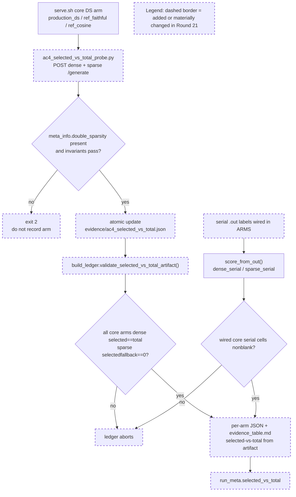

# Round 21 Review Result - Loop 13

Mainline Progress Verdict: ADVANCED

Round 21 advances and closes the Round-21 objective: the AC-4 core evidence table now has strict serial cells and artifact-backed selected-vs-total for the core DS arms. I found no new AC-4 implementation blocker.

This is still not full loop completion. The original plan requires AC-8, and Claude explicitly queued the final root-cause writeup for the next round. Do not output COMPLETE yet.

## PR Comprehension

Change summary:
- `ac4_selected_vs_total_probe.py` adds a live-server probe for `meta_info["double_sparsity"]`, covering dense and sparse prompts per core DS arm.
- `build_ledger.py` wires the previously missing serial labels for `dsa_noradix`, `production_ds`, `ref_faithful`, and `ref_cosine`.
- The static selected-vs-total literals for `production_ds`, `ref_faithful`, and `ref_cosine` are replaced with `validate_selected_vs_total_artifact()` output.
- The ledger rejects missing selected-vs-total artifacts and wired-but-blank serial cells before rendering.
- Generated artifacts now record dense/sparse batched and serial scores plus `selected_vs_total` provenance in `run_meta.json`.



Walkthrough: for each running DS arm, the probe sends one dense prompt that should keep every token and one sparse prompt that should prune to top-k. It publishes only if the server emits DS metadata and the regime-specific invariants hold. The ledger then consumes that artifact, wires it into the AC-4 table, and independently refuses missing arms, missing regimes, no-pruning sparse records, fallback records, dense mismatch, and blank wired serial cells.

## Historical Review Synthesis

Corpus sweep:
- Path-specific sweep for `development/loop13` + evidence/provenance terms scanned 32639 threads and matched 0, so I widened the search.
- Widened sweep scanned 32639 threads and matched 16353 threads across 7033 PRs and 47036 human comments for DeepSeek/MLA/Double Sparsity/evidence/benchmark/provenance/CUDA graph/TP terms.

Recurring SGLang reviewer behavior for this risk surface: reviewers ask for exact runtime-path evidence, command/config provenance, benchmark numbers with reproducible setup, and explicit CUDA-graph/TP assumptions. They push back on stale docs or nearby proxy evidence. Round 21 mostly matches that standard for AC-4: the selected-vs-total data comes from live server response metadata, the table is generated through a validator, and serial/batched mode is explicit.

## Implementation Review

No new Round-21 AC-4 blocker found.

Verified claims:
- Serial labels are wired in `development/loop13/build_ledger.py:187-210` for all AC-4 core arms.
- Core DS arms no longer use static selected-vs-total literals; `production_ds`, `ref_faithful`, and `ref_cosine` start with `ds=None`, then receive `_SVT` from the artifact validator at `development/loop13/build_ledger.py:243-278`.
- The selected-vs-total validator requires exact core arms, exact dense+sparse regimes, `dense_fallback == 0`, dense `selected == total > 0`, and sparse `0 < selected < total` at `development/loop13/build_ledger.py:250-273`.
- The serial blank-cell guard rejects any wired core-arm serial label whose `.out` has no score at `development/loop13/build_ledger.py:474-486`.
- `development/loop13/evidence/ac4_selected_vs_total.json` records production_ds/ref_faithful/ref_cosine as dense `334/334`, sparse `2048/3692`, fallback `0`.
- `development/loop13/evidence/evidence_table.md:10-14` has dense+sparse serial cells for dsa, dsa_noradix, production_ds, ref_faithful, and ref_cosine.

Validation performed:
- `python3 -m py_compile development/loop13/ac4_selected_vs_total_probe.py development/loop13/build_ledger.py`
- `git diff --check e67f1b5f3 cc9865440`
- Local ignored serial `.out` score lines match the committed derived scores: dsa `0.965/0.947`, dsa_noradix `0.965/0.973`, production_ds `0.655/0.013`, ref_faithful `0.965/0.013`, ref_cosine `0.965/0.947`.
- In a throwaway worktree with the ignored `.out` files copied in, `python3 development/loop13/build_ledger.py` passed on the good artifact, then rejected a malformed sparse no-pruning artifact with `AssertionError: selected-vs-total production_ds sparse selected=3692 total=3692, expected 0<sel<tot`.

## Mainline Gaps

1. P1 - AC-8 final root-cause writeup is still pending.

Evidence:
- Claude's own Round 21 summary lists AC-8 as the remaining item.
- `development/loop13/ROOT_CAUSE.md` is still a pre-R21 writeup: the headline is labelled "Round 1" and the scope note "updated Round 7" (`development/loop13/ROOT_CAUSE.md:9-27`), and the per-arm table only reports batched scores (`development/loop13/ROOT_CAUSE.md:41-54`), not the final serial+batched AC-4 table or the R21 selected-vs-total artifact.
- The original plan makes AC-8 mandatory: the writeup must contain the per-arm GSM8K evidence table, recall-oracle/selected-index corroboration, verdict, and recommendation.

Required implementation plan:
1. Rewrite `development/loop13/ROOT_CAUSE.md` from the final evidence package, not from the older Round-7/Round-20 prose.
2. Include the final AC-4 table values for the core arms: batched and serial dense/sparse scores, selected-vs-total from `evidence/ac4_selected_vs_total.json`, selector behavior, and garbage-counter summary.
3. Cite the required corroboration artifacts directly: `forced_all_assertions.json`, `ac2_4_recall_oracle.json`, `ac3_1_materialized_k_selected_index_equality.json`, `ac4_selected_vs_total.json`, `evidence_table.md`, and `ac6_bisection_matrix.json`.
4. Name the final primary/ranked verdict and tie it to numeric evidence: dense current-slot exclusion/H3; sparse raw-dot scorer lock plus current-slot interaction; GOOD gate; AC-7 moot because the GOOD branch was taken.
5. Preserve the diagnosis-loop boundary: no selection/adapter fix landed, recommendation only.
6. Add a final self-check, either a small script or a `build_ledger.py`/writeup validator, that refuses AC-8 completion unless the core AC-4 serial cells are present and `run_meta.selected_vs_total.artifact == "evidence/ac4_selected_vs_total.json"`. The same check should fail if `ROOT_CAUSE.md` omits the final serial table or the selected-vs-total artifact.
7. Reconcile stale summary surfaces during the writeup pass, especially the early `evidence/findings.md` AC-1 table that still shows production DS serial sparse as blank even though the later Round-21 section has `0.013`.

## Blocking Side Issues

None newly introduced in Round 21. The remaining blocker is mainline AC-8 work, not a side issue.

## Queued Side Issues

- Existing queued cleanup remains: remove plan-workflow terms from retained diagnostics before promoting the harness outside `development/loop13`.
- Existing queued safety issue remains: reference selector modes rely on the guarded eager harness for CUDA-graph safety and should not be exposed outside loop13 without additional fail-closed checks.
- Existing queued reuse footgun remains: `ac4_garbage_counters.py --arm <non-production>` defaults to the production capture dir when `CAPDIR` is omitted, although the ledger catches wrong-source artifacts.

## Goal Alignment

| AC | Status | Evidence if met | Blocker if not met | Deferral justification |
|----|--------|-----------------|--------------------|------------------------|
| AC-1 | MET | Baseline/core serial+batched reproduction is now populated, including dsa_noradix and production DS sparse serial. | n/a | n/a |
| AC-2 | MET | Forced-all slot assertions, head-agg, pruning-valid radix/width, and recall-oracle are verified. | n/a | n/a |
| AC-3 | MET | Served raw-dot/cosine reference arms and captured-row materialized-K equality are verified. | n/a | n/a |
| AC-4 | MET | Core per-arm evidence table has batched+serial scores, sample IDs, configs/behavior, garbage counters, and artifact-backed selected-vs-total. | n/a | n/a |
| AC-5 | MET | GOOD gate recorded from measured DSA and best naive DS/cosine scores. | n/a | n/a |
| AC-6 | PARTIAL / packaging-bound | Matrix and key legs are measured/retired/accepted-blocked. | Final AC-8 writeup must cite and adversarially verify the final verdict. | n/a |
| AC-7 | DEFERRED/MOOT | n/a | n/a | Justified while AC-5 remains GOOD; BAD branch not taken. |
| AC-8 | PARTIAL | Interim `ROOT_CAUSE.md` exists. | Must regenerate from the final R21 evidence package and add a final self-check. | n/a |

Goal Alignment Summary:
```text
ACs: 8/8 addressed (5/8 met, 1 deferred/moot, 2 partial) | Forgotten items: 0 | Unjustified deferrals: 0
```

Deferred items audit:
- AC-7 remains justified as moot while the GOOD gate stands.
- AC-8 is not a justified deferral for full-loop completion. It was only queued out of the Round-21 objective and must be the next mainline.

## Goal Tracker Update Requests

Applied directly:
- Plan Version -> 26 (Round 21 Review).
- Added a `21-review` Plan Evolution row.
- Updated task9 status to `done (R21; verified R21-review)`.
- Added AC-4 to Completed and Verified.

Rejected:
- Full-loop completion remains rejected because AC-8 is incomplete.

## Classification

Mainline Gaps:
- AC-8 final root-cause writeup and self-check are still missing.

Blocking Side Issues:
- None.

Queued Side Issues:
- Plan-term cleanup, reference selector CUDA-graph exposure safety, and `ac4_garbage_counters.py` reuse polish remain queued and must not take over the next round.

## Stagnation Check

Not stalled. R18 through R21 is a clean close-out sequence: recall-oracle measurement, recall-oracle hardening, captured materialized-K equality, then AC-4 serial/selected-vs-total close-out. The next round should be AC-8 final packaging, not another diagnostic branch.

NOT_COMPLETE
