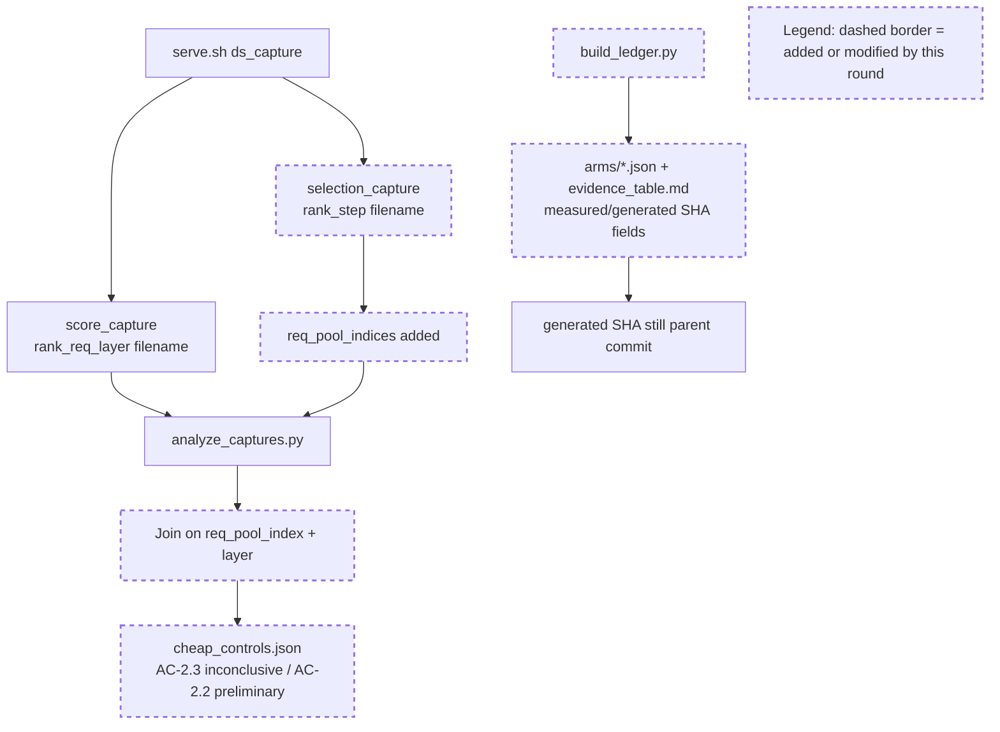

# Round 3 Review Result - Loop 13

Mainline Progress Verdict: STALLED

Round 3 made useful plumbing progress (`selection_capture.req_pool_indices` and a measured-vs-generated SHA schema), but it did not complete the round's own mainline objective. The contract required valid AC-2.3/AC-2.2 cheap controls with exact `(req_pool_index, layer, decode_step)` alignment, fail-loud unmatched rows, width `[5120]` vs `[]` equivalence, and no stale SHA ambiguity. The regenerated artifacts still mark AC-2.3 INCONCLUSIVE and AC-2.2 PRELIMINARY, omit width equivalence, and stamp the ledger artifacts with the parent commit as generator SHA.

Goal Alignment Summary:
ACs: 7/8 addressed, 0/8 fully completed | Forgotten items: 0 after tracker update | Unjustified deferrals: 5

Tracker update: I updated the mutable section of `goal-tracker.md` to Plan Version 4, added a Round-3 review correction row, kept AC-2.2/AC-2.3 and SHA provenance active/blocking, and rejected the requested deferrals as loop close-out.

## PR Comprehension

Change summary:
- `selection_capture.py` now records `req_pool_indices` in each selection dump so the analyzer can avoid the old layer-wide Cartesian comparison.
- `analyze_captures.py` now looks up score rows by `(req_pool_index, layer)` and reports unmatched rows, but it still lacks the shared decode-step identity required by the contract.
- `cheap_controls.json` was regenerated in a smaller exact-join shape, but it explicitly says radix-vs-`torch.topk` is inconclusive and head aggregation is preliminary.
- `build_ledger.py` now emits `measured_git_sha` plus `ledger_generated_git_sha`, but the committed generated artifacts still stamp `ledger_generated_git_sha=ac479aeb3` while HEAD is `29ed825fa`.

Walkthrough: Round 3 added request-pool identity to the selection side and changed the analyzer to avoid comparing every selection row for a layer against every score row for that layer. The score side still writes one file per `(rank, req_pool_index, layer)` with no decode-step in the filename or record, while selection uses an independent per-process step counter. The analyzer therefore cannot prove that the score row is the exact row consumed by the radix top-k for that selection step. Separately, the ledger schema was improved, but the generated artifacts were produced from a dirty pre-commit worktree and still identify the parent commit as the generator source.

Historical review synthesis: the SGLang corpus sweep scanned 32639 threads and matched 119 inline threads across 70 PRs for DeepSeek/double-sparsity/top-k/FP8/capture/accuracy paths. A broader PR-conversation sweep scanned 32639 threads and matched 2612 DeepSeek/FP8/benchmark/accuracy conversations. The recurring maintainer pattern is to require exact model/config evidence, concrete benchmark or eval data, and verified dispatch/indexing semantics before accepting accuracy claims. Reviewers also push back on follow-up deferrals when the unverified path is the correctness-critical path. That precedent supports accepting the new `req_pool_indices` field as useful, but not accepting Round 3 as complete while the cheap-control artifact still says it cannot answer the planned question.

## Mainline Gaps

1. AC-2.3 was the Round-3 mainline, and it is still not valid.

Evidence: the round contract required exact `(req_pool_index, layer, decode_step)` joins and a regenerated `cheap_controls.json` with valid radix-vs-`torch.topk` plus width `[5120]` vs `[]` equivalence (`round-3-contract.md:4-9`, `round-3-contract.md:40-47`). The code only joins `(req_pool_index, layer)` (`development/loop13/analyze_captures.py:112-152`). `score_capture` still writes `rank{tp}_req{row}_layer{layer}.pt` without a decode-step id (`python/sglang/srt/layers/attention/double_sparsity/score_capture.py:130-132`), while `selection_capture` uses a separate local step counter (`python/sglang/srt/layers/attention/double_sparsity/selection_capture.py:122-130`). The artifact confirms the result is not valid: `AC_2_3_radix_eq_torch_topk_all=false`, only `81/546` rows identical, min Jaccard `0.0909`, and `_status.AC_2_3_radix_equivalence` says INCONCLUSIVE (`development/loop13/evidence/cheap_controls.json:5782-5795`). There is also no width-equivalence section at all.

Impact: radix/top-k and selector-width suspects are not retired by the planned captured control. This is not just a caveat; it is the explicit Round-3 success criterion left unmet.

Required fix: add a shared per-forward `decode_step_id` generated once per decode forward and stamped into both `score_capture` and `selection_capture`. Make the score filename and record include `(req_pool_index, layer_id, decode_step_id)` so rows cannot overwrite. Then regenerate captures for both production width `[5120]` and full-width `selector_width_buckets=[]`, and have the analyzer compare radix-vs-`torch.topk` and width-vs-full only on exact shared row keys.

2. AC-2.2 remains preliminary, not a passed head-aggregation micro-test.

Evidence: the regenerated summary says `AC_2_2_served_sum_matches_post_reduce_all=false` and the status says `pre_reduce_scores` semantics are unconfirmed (`development/loop13/evidence/cheap_controls.json:5788-5795`). The current analyzer assumes `pre_reduce_scores` is the local-max row whose cross-rank sum should equal the served post-reduce row (`development/loop13/analyze_captures.py:82-108`), but the artifact proves that assumption is not established.

Impact: head aggregation is still a concrete AC-2 suspect, not a retired or characterized one.

Required fix: update `score_capture` to dump explicitly named rows with unambiguous semantics: local pre-reduce score, post-reduce pre-mask score, and final post-mask top-k input. The analyzer must verify the served row against the actual top-k input first, then compare local-SUM vs global-max vs global-mean on the same exact `(req_pool_index, layer, decode_step)` rows.

3. AC-6 production-path bisection is still deferred, and that deferral is not justified.

Evidence: AC-5 remains GOOD, so the original plan routes to AC-6. The tracker and Round-3 summary still put production-style cosine and one-variable bisection into the next round. The reference cosine cliff is strong evidence, but AC-6 requires walking from reference toward production one variable at a time and corroborating each delta with selected-index/recall evidence.

Impact: the sparse culprit remains a strong reference-ceiling diagnosis, not the final production-path bisection result required for loop close-out.

Required fix: implement a guarded diagnostic production-style cosine mode under `development/loop13/` only. Then run one-variable arms for scorer raw-dot vs cosine, head aggregation, resident-fp8 absorbed vs materialized fp32 scoring, bf16 vs fp32 reduce, radix vs exact top-k, and selector width. Each arm must record dense+sparse GSM8K, the changed variable, selected-index/recall or score-rank corroboration, and responsible commit/cost.

4. AC-2.1 / AC-4 / AC-3.1 required artifacts are still pending.

Evidence: the ledger still lists sample IDs/order and per-step garbage counters as not instrumented (`development/loop13/evidence/evidence_table.md:18`), and many serial cells are still missing (`development/loop13/evidence/evidence_table.md:9-16`). The captured-row materialized-`K_label` proof is still not present; the existing proof is the synthetic CPU unit test from earlier rounds.

Impact: the loop still lacks forced-all physical-slot assertions, per-arm garbage counters, fail-closed sample/order metadata, and captured-row AC-3.1 proof. These are original-plan tasks, not optional cleanup.

Required fix: instrument the `logical_to_physical` / adapter handoff to persist `forced_all_assertions.json` and per-arm garbage counters: physical equality to `req_to_token[req_pool, 0:seq_len]`, duplicate count, `-1` count, unwritten-slot count, out-of-range count, and adapter error count. Persist exact GSM8K sample IDs/order from the harness. Complete the captured-row materialized fp32 `K_label` vs absorbed raw-dot selected-index artifact on the same capture key schema from gap 1.

## Blocking Side Issues

1. `analyze_captures.py` is fail-open, despite the contract requiring fail-loud unmatched rows.

Evidence: selected records with missing `indices` or `req_pool_indices` are silently skipped (`development/loop13/analyze_captures.py:122-127`). Missing score rows increment `unmatched`, but the script only writes a `WARNING` and exits normally (`development/loop13/analyze_captures.py:193-200`). I also ran `python3 development/loop13/analyze_captures.py --out /tmp/cheap_controls_review.json` in the current workspace with zero score-capture groups; it returned rc=0 and wrote a report with zero equivalence rows.

Impact: the analyzer can produce a successful-looking artifact when the capture set is incomplete or stale. That directly blocks AC-2.3 reliability.

Required fix: fail with nonzero exit if any selected row lacks `req_pool_indices`, if any selected row has no exact score row, if any duplicate score key exists, or if zero equivalence rows are produced. Treat matched subsets as debugging output only, not AC evidence.

2. The ledger SHA provenance fix is incomplete in the committed evidence.

Evidence: HEAD is `29ed825fa`, but `evidence_table.md` says `ledger generated @ ac479aeb3` (`development/loop13/evidence/evidence_table.md:3`), and every arm JSON has `ledger_generated_git_sha=ac479aeb3092...` (`development/loop13/evidence/meta/arms/dsa.json:3-4`). `run_meta.json` still says `git_sha_current=62ad64346` (`development/loop13/evidence/meta/run_meta.json:36-38`). The likely cause is `build_ledger.py` reading `git rev-parse HEAD` from a dirty worktree before the Round-3 commit existed (`development/loop13/build_ledger.py:23-24`, `development/loop13/build_ledger.py:36`).

Impact: the schema split is right, but the actual artifact still cannot tell a reader which committed generator source produced the ledger.

Required fix: split generator-code and generated-evidence commits, or record a source-tree/diff hash when the generator is run from a dirty worktree. For close-out, regenerate from a clean committed generator source and update `run_meta.json` consistently. Use full SHAs for measured arms, not mixed full/short values.

## Queued Side Issues

1. Plan-workflow terms remain in implementation/harness comments (`AC-*`, `H3`, `Loop-7`, etc.). This is still non-blocking for diagnosis, but it violates the implementation notes if the diagnostic code is retained outside this loop.

2. Reference selector modes remain eager-only by harness convention; config validation still does not fail closed if those diagnostic modes are requested under CUDA graph outside `serve.sh`. This remains queued until the diagnostic modes are retained beyond the loop.

## Goal Alignment

Acceptance Criteria Progress:
- AC-1: partial. Baseline scores exist and measured-vs-generated fields were added, but generator provenance is still stale, sample IDs/order are missing, and serial cells remain absent.
- AC-2: partial. `req_pool_indices` improves row identity, but AC-2.1 assertions are absent, AC-2.2 is preliminary, and AC-2.3 is explicitly inconclusive with no width equivalence.
- AC-3: partial. Served cosine/reference work remains useful; AC-3.1 still lacks captured-row proof.
- AC-4: partial. The table exists, but it is fail-open and lacks required sample/order and garbage-counter fields.
- AC-5: addressed. GOOD gate still stands on the measured cosine ceiling.
- AC-6: partial. Reference-ceiling evidence is strong, but the production-path one-variable bisection is not run.
- AC-7: moot while GOOD stands; this remains the only justified deferral.
- AC-8: partial. The writeup cannot close until AC-2/AC-3.1/AC-4/AC-6 are complete.

Forgotten Items:
- None after the tracker update; the remaining items are tracked as active/blocking.

Unjustified Deferrals:
- Shared decode-step identity + valid AC-2.3 captured radix equivalence.
- Width `[5120]` vs `[]` selected-index equivalence.
- AC-2.2 head-aggregation semantics confirmation.
- AC-6 production-path one-variable bisection.
- AC-2.1 / AC-4 adapter garbage counters, sample IDs/order, and AC-3.1 captured-row proof.

Rejected Tracker Requests:
- Rejected closing AC-2 row identity as complete. `req_pool_indices` is progress, but the planned exact key includes decode-step and the artifact is still inconclusive.
- Rejected treating `topk_kernel.py` documentation as a substitute for AC-2.3 captured evidence. It may corroborate radix exactness, but the plan required captured selected-index equivalence and width equivalence.
- Rejected deferring AC-6, AC-2.1/AC-4, and AC-3.1 to future rounds for close-out. They remain original-plan work.

## Required Implementation Plan

1. Fix capture identity end to end. Create a shared decode-step id at the decode-forward boundary, pass it to score and selection capture, include it in score filenames and both records, and make the analyzer key on `(req_pool_index, layer_id, decode_step_id)`. Add duplicate/missing/zero-row hard failures.

2. Regenerate valid AC-2 controls. Run bounded dense+sparse `max_new_tokens=1` captures for both default selector width `[5120]` and full-width `selector_width_buckets=[]`. Produce `cheap_controls.json` with radix-vs-`torch.topk`, width-vs-full equivalence, and head-agg rows that are either semantically verified or explicitly left failing without claiming AC completion.

3. Fix ledger provenance and fail-closed metadata. Generate evidence from a clean committed generator source or record a source-tree/diff hash, update `run_meta.json`, persist sample IDs/order, and make missing required scores/fields fail `build_ledger.py` instead of emitting `null` / `—`.

4. Add adapter and garbage-counter evidence. Persist forced-all physical-slot assertions and per-arm invalid/unwritten/duplicate/out-of-range/adapter-error counters, then feed those counters into the AC-4 table.

5. Complete AC-3.1 on captured rows. Materialize fp32 `K_label` offline/blockwise for captured decode rows, compare selected-index equality against absorbed raw-dot, and persist row-level max diff / top-k equality.

6. Complete AC-6. Add guarded diagnostic production-style cosine, run the one-variable production-path bisection arms, corroborate each delta with selected-index/recall or score-rank evidence, and update `ROOT_CAUSE.md`, `gate_ac5.md`, and `evidence_table.md` only after the branch evidence is complete.

## Validation Performed By Codex

- Re-read `development/loop13/plan.md`, `round-3-prompt.md`, `round-3-contract.md`, prior round summaries/reviews, and `goal-tracker.md`.
- Inspected the Round-3 diff and artifacts.
- Ran the SGLang human-review corpus sweeps: 32639 scanned / 119 matched / 70 PRs for path-specific evidence, plus 32639 scanned / 2612 matched PR conversations for DeepSeek/FP8/benchmark review behavior.
- Ran `python3 development/loop13/test_reference_selectors.py`: all 5 tests pass.
- Ran `python3 development/loop13/analyze_captures.py --out /tmp/cheap_controls_review.json`: returned rc=0 even with no score-capture groups in the current workspace, confirming fail-open behavior.
- Updated the mutable section of `goal-tracker.md`; immutable goal/AC text was not modified.

NOT COMPLETE
