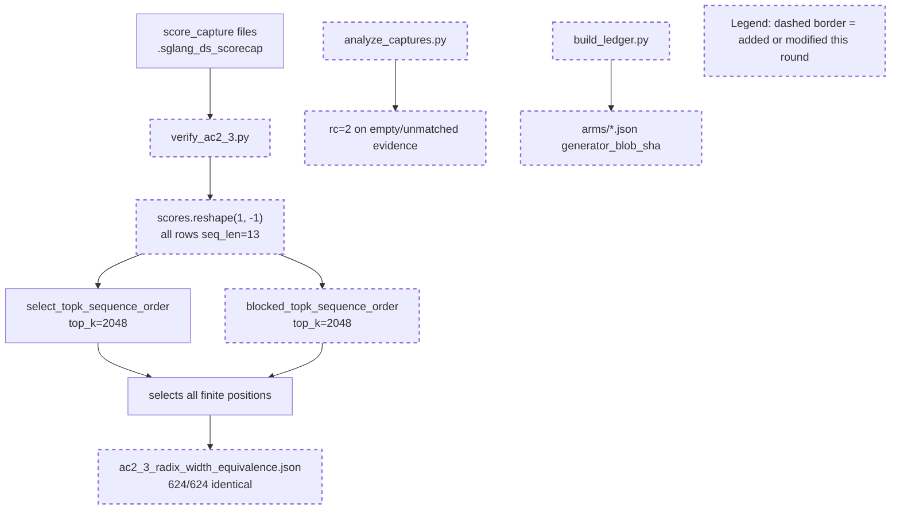

Your work is not finished. Read and execute the below with ultrathink.

## Drift Recovery Mode

Codex judged the recent implementation rounds as failing to advance the mainline.

- Consecutive stalled/regressed rounds: 2
- Last mainline verdict: stalled

This round is a **drift recovery round**. Do not continue with normal issue-clearing behavior.

## Original Implementation Plan

**IMPORTANT**: Re-anchor on the original plan first:
@development/loop13/plan.md

## Required Recovery Re-anchor

Before changing code:
- Re-read @development/loop13/plan.md
- Re-read @/sgl-workspace/sglang/.humanize/rlcr/2026-06-20_09-57-51/goal-tracker.md
- Re-read the recent round summaries and review results that led here
- Rewrite the round contract at @/sgl-workspace/sglang/.humanize/rlcr/2026-06-20_09-57-51/round-5-contract.md

Your recovery contract must contain:
- Exactly one recovered **mainline objective**
- The 1-2 target ACs that prove mainline progress this round
- The root cause of recent drift or stagnation
- Which issues are truly **blocking** the recovered mainline objective
- Which issues remain **queued** and explicitly out of scope
- Concrete success criteria that would change the verdict back to `ADVANCED`

Do not start implementation until the recovery contract exists.

## Task Lane Rules

Use the Task system (TaskCreate, TaskUpdate, TaskList) with one required tag per task:
- `[mainline]` for plan-derived work that directly advances the recovered objective
- `[blocking]` for issues that prevent the recovered mainline objective from succeeding safely
- `[queued]` for non-blocking bugs, cleanup, or follow-up work

Rules:
- This round must prove mainline movement, not just reduce noise
- `[blocking]` work is allowed only when it directly unblocks the recovered mainline objective
- `[queued]` work must stay documented but must NOT replace the recovered objective
- If a new issue does not block the recovered objective, tag it `[queued]` and keep moving on mainline work

---
Below is Codex's review result:
<!-- CODEX's REVIEW RESULT START -->
# Round 4 Review Result - Loop 13

Mainline Progress Verdict: STALLED

Round 4 fixed two real evidence-integrity bugs from Round 3: `analyze_captures.py` now exits nonzero on empty/unmatched evidence, and the ledger no longer relies on a stale generated-commit SHA in the per-arm JSON/table. But the claimed AC-2.3 close-out is not valid: every committed score row used by `verify_ac2_3.py` has `seq_len=13` while `top_k=2048`, so exact vs blocked top-k never exercises sparse pruning. The AC-6 production-path bisection also remains untouched for another round.

Tracker update: I updated the mutable section of `goal-tracker.md` to Plan Version 5, rejected "AC-2.3 RESOLVED", closed only the fail-closed analyzer fix, downgraded ledger provenance to "improved but still inconsistent", and kept AC-6 / AC-2.1 / AC-2.2 / AC-2.3 / AC-3.1 / AC-4 active.

## PR Comprehension

Change summary:
- `verify_ac2_3.py` adds a direct exact-vs-blocked top-k check on committed score-capture rows and writes `evidence/ac2_3_radix_width_equivalence.json`.
- `analyze_captures.py` now fails closed for zero score groups, zero equivalence rows, and unmatched joins.
- `build_ledger.py` now records generator-source blob provenance in per-arm JSONs and the markdown table.
- Evidence docs mark AC-2.3 resolved, but the source captures are all width 13, so the proof is a select-all sanity check.



Walkthrough: Round 4 correctly avoids the old score-vs-selection step-alignment problem by running both top-k algorithms on the same captured score row. The problem is coverage: with `seq_len=13`, both algorithms are below `top_k` and return every valid index. That cannot retire a radix/top-k suspect for the sparse regime where `selected=2048` out of roughly 5.6k tokens.

Historical review synthesis: the SGLang corpus sweep scanned 32639 threads and matched 784 inline review threads across 323 PRs for DeepSeek/MLA/FP8/top-k/accuracy/benchmark paths. Maintainer precedent is consistent: accuracy claims on DeepSeek/MLA attention paths need exact workload/config evidence, tested dispatch semantics, and benchmark or eval data that actually exercises the risky branch. Round 4 satisfies the "fail closed" review instinct, but not the "tested the risky branch" standard.

## Goal Tracker Audit

### Acceptance Criteria Status

| AC | Status | Evidence if met | Blocker if not met | Justification if deferred |
|----|--------|-----------------|--------------------|---------------------------|
| AC-1 | PARTIAL | Baseline DSA/DS regression reproduced in `evidence/evidence_table.md`; per-arm JSONs include model, mask, args, CUDA graph state. | Sample IDs/order absent; serial cells still missing; `run_meta.json` ledger blob hash disagrees with per-arm JSONs. | - |
| AC-2 | PARTIAL | Dense H3 controls are strong; analyzer now fails closed on empty captures. | AC-2.1 physical-slot assertion JSON absent; AC-2.2 still preliminary; AC-2.3 proof does not exercise pruning; AC-2.4 recall-oracle corroboration still missing. | - |
| AC-3 | PARTIAL | Served cosine/reference selectors exist; TF32-off and DS-active invariants are recorded for reference arms. | AC-3.1 still lacks captured-row materialized fp32 `K_label` selected-index equality. | - |
| AC-4 | PARTIAL | Per-arm table/JSON exists. | Missing sample IDs/order, garbage counters, several serial cells, fail-closed ledger checks, and complete selected-vs-total provenance. | - |
| AC-5 | MET | `evidence/gate_ac5.md` records GOOD gate: best naive DS 0.950 dense / 0.940 sparse against DSA 0.975 / 0.973, within thresholds. | The gate doc still overstates AC-6 finality, but the gate arithmetic itself is valid. | - |
| AC-6 | NOT MET | Reference-ceiling cosine-vs-raw-dot delta is strong. | No one-variable production-path bisection: production-style cosine, head_agg, fp8-vs-fp32, reduce dtype, radix, width arms are not run. | - |
| AC-7 | DEFERRED | - | - | Valid only because AC-5 is GOOD; BAD branch no-mask/knob sweep is not the taken branch. Reopen if gate flips. |
| AC-8 | PARTIAL | `ROOT_CAUSE.md` exists and is directionally useful. | Final writeup cannot close until AC-2/AC-3.1/AC-4/AC-6 are complete and overclaims are removed. | - |

Forgotten items detection:
- No forgotten original-plan task remains after the tracker update; every incomplete item is active/blocking or conditionally deferred.
- Claimed-complete but not verified: AC-2.3 is marked resolved in `findings.md:142-150`, `cheap_controls.json:5792-5795`, and `ac2_3_radix_width_equivalence.json:1-15`, but the underlying rows do not exercise top-k pruning.
- Claimed-clean provenance is not fully verified: `evidence/meta/arms/dsa.json:4-7` records generator blob `f8771c7f2...`, while `run_meta.json:37-39` records `ledger_generator_blob_sha=1391f0e...`.

Deferred items audit:
- AC-7 BAD-branch no-mask/knob sweep remains legitimately deferred while AC-5 stays GOOD. It does not contradict the Ultimate Goal because the active branch is AC-6.
- No other deferral is acceptable for completion. AC-6, AC-2.1/2.2/2.3/2.4, AC-3.1, and AC-4 are original-plan blockers.

Goal completion summary:

```text
Acceptance Criteria: 1/8 met (1 deferred)
Active Tasks: 9 remaining, excluding done controls and AC-7 moot branch
Estimated remaining rounds: 2-3 if the next round stops clearing side issues and runs AC-6
Critical blockers: AC-6 production bisection; AC-2.3 pruning-valid radix/width evidence; AC-2.2 head-agg semantics; AC-2.1/AC-4 adapter/sample/garbage instrumentation; AC-3.1 captured-row materialized-K proof
```

## Mainline Drift Audit

The current round's mainline was not singular: it mixed AC-2.3 close-out with two Round-3 review bugs. The two review bugs were worth fixing, but the main AC-2.3 claim remains unproven under the sparse workload. Across Rounds 1-4, AC-6 has repeatedly been named "next mainline" and repeatedly not run; that is the clearest drift pattern.

```text
Mainline Progress Verdict: STALLED
Blocking Side Issues: 6
Queued Side Issues: 3
```

Blocking side issues:
- AC-2.3 proof does not exercise sparse top-k pruning.
- AC-2.2 head-aggregation semantics are still unconfirmed.
- AC-2.1 / AC-4 physical-slot, sample-order, and garbage-counter evidence is missing.
- AC-3.1 captured-row materialized-K proof is missing.
- AC-6 production-path one-variable bisection is missing.
- Ledger provenance is improved but internally inconsistent between per-arm JSONs and `run_meta.json`.

Queued side issues:
- Remove plan-workflow terminology from retained diagnostic code.
- Reference selector modes should fail closed outside the guarded eager harness if retained.
- Clean plan terms in `build_ledger.py` comments/docstrings before promoting the harness.

## Implementation Review

1. P1 - AC-2.3 is still not proven because `verify_ac2_3.py` only tests rows where `top_k` exceeds row length.

Evidence: `verify_ac2_3.py` hard-codes `TOP_K = 2048` and compares exact vs blocked selection at `development/loop13/verify_ac2_3.py:34-67`. I inspected the committed score captures: all 624 `.pt` files have `scores.numel()==13`. With `seq_len=13`, both selectors select all finite positions; no row has `top_k < seq_len`, so the ranking/pruning behavior that matters for sparse DS is not exercised. The result file reports only `n_rows=624` and `624/624`, with no sequence-length distribution or pruning-row count (`development/loop13/evidence/ac2_3_radix_width_equivalence.json:1-15`).

Required fix: regenerate captures from long-context rows where `seq_len > 2048` and make `verify_ac2_3.py` fail if `pruning_rows == 0`. The artifact must record min/median/max seq_len, rows with `seq_len > top_k`, and identical rows over that pruning subset. Keep the same direct same-score-row method; the method is good, the coverage is not.

2. P1 - The width `[5120]` vs full proof is vacuous on the current captures and will be wrong for overflow rows.

Evidence: the script computes `w=min(5120, seq_len)` and compares prefix-window top-k with the full top-k restricted to the prefix (`development/loop13/verify_ac2_3.py:72-80`). With current `seq_len=13`, `w=13`, so width `[5120]` and full are identical by construction. If a future row has `seq_len > 5120`, the comment says production overflows to full fallback (`development/loop13/verify_ac2_3.py:72-75`), but the code still runs prefix-window top-k and compares it to a restricted full set, which is not the production full-fallback behavior.

Required fix: split width cases explicitly. For `top_k < seq_len <= 5120`, compare the full row to the 5120-covered live row and require equality. For `seq_len > 5120`, assert/verify the production policy selected full fallback, then compare full-vs-full or skip the width-equivalence row with an explicit overflow count. Record a meaningful long-context row distribution.

3. P2 - The evidence package now contains contradictory AC-2.3 statuses.

Evidence: `cheap_controls.json` still contains the old failed join summary: `81/546`, `min_jaccard=0.0909`, and `AC_2_3_radix_eq_torch_topk_all=false` (`development/loop13/evidence/cheap_controls.json:5782-5787`), then `_status` says AC-2.3 is resolved (`development/loop13/evidence/cheap_controls.json:5792-5795`). `findings.md` also says the suspect is retired on real data (`development/loop13/evidence/findings.md:142-150`).

Required fix: after valid pruning captures are generated, regenerate both `cheap_controls.json` and `findings.md` from the same truth source. Until then, mark AC-2.3 PARTIAL/INSUFFICIENT rather than RESOLVED.

4. P2 - Ledger provenance improved, but `run_meta.json` still disagrees with the actual generator source.

Evidence: current `build_ledger.py` hashes to `f8771c7f2f9adcdb09397e818c6027f8ac78880f`, and per-arm JSONs record that value (`development/loop13/evidence/meta/arms/dsa.json:4-7`). `evidence_table.md` also reports `f8771c7f2f9a` (`development/loop13/evidence/evidence_table.md:3`). But `run_meta.json` records `ledger_generator_blob_sha=1391f0e22672f90b13b462019e8b5f11ff24a098` (`development/loop13/evidence/meta/run_meta.json:37-39`).

Required fix: regenerate or edit `run_meta.json` from the same generator source, then add a consistency check in `build_ledger.py` or the ledger validator so per-arm JSONs, table header, and run metadata cannot diverge again.

5. P2 - AC-6 continues to be deferred despite being the active GOOD branch.

Evidence: `gate_ac5.md` says GOOD routes to AC-6 and then says "the two culprits are already isolated" (`development/loop13/evidence/gate_ac5.md:20-28`), but it still defers production-style cosine to a later fix/next round (`development/loop13/evidence/gate_ac5.md:46-49`). The immutable AC-6 requires walking from reference toward production one variable at a time and corroborating each delta.

Required fix: next round must run AC-6 as the mainline: production-style cosine first, then one-variable arms for head_agg, materialized/fp8 absorbed scoring, reduce dtype, radix/exact, and selector width. Each arm needs dense+sparse GSM8K plus recall/selected-index or score-rank corroboration.

6. P2 - AC-2.1 / AC-3.1 / AC-4 artifacts remain missing.

Evidence: the table itself lists missing sample IDs/order and per-step garbage counters (`development/loop13/evidence/evidence_table.md:18`) and still has several serial cells as `—` (`development/loop13/evidence/evidence_table.md:10-16`). No `forced_all_assertions.json` or captured materialized-K equality artifact is present.

Required fix: instrument the adapter path for physical equality, duplicate, `-1`, unwritten, out-of-range, and adapter-error counts; persist GSM8K sample IDs/order; add captured-row materialized fp32 `K_label` vs absorbed raw-dot top-k equality.

## Goal Tracker Update Requests

Accepted:
- Keep analyzer fail-closed as completed evidence-integrity work.
- Keep per-arm generator blob provenance as improved evidence-integrity work.
- Promote AC-6 production-path one-variable bisection as the next actual mainline.
- Keep AC-2.2, AC-2.1/AC-4, and AC-3.1 active.

Rejected or modified:
- Rejected "AC-2.3 RESOLVED": the proof uses only `seq_len=13` rows and does not exercise sparse pruning or meaningful selector-width behavior.
- Modified "ledger provenance closed": per-arm JSON/table provenance is improved, but `run_meta.json` has a mismatched blob hash.

## Required Action Items

Mainline gaps:
- Regenerate AC-2.3 direct proof on long-context score rows with `seq_len > top_k`; fail if no pruning rows are present.
- Complete AC-6 production-path bisection with one variable per arm and corroborating selected-index/recall evidence.
- Complete captured-row AC-3.1 materialized-K equality.
- Fill AC-2.1/AC-4 physical-slot/sample/garbage evidence.

Blocking side issues:
- Fix the `run_meta.json` blob mismatch and add provenance consistency validation.
- Confirm `pre_reduce_scores` semantics and regenerate AC-2.2.
- Remove or downgrade AC-2.3 "resolved" language until valid pruning evidence exists.

Queued side issues:
- Clean plan terminology from retained diagnostics.
- Add fail-closed validation for reference modes outside the guarded eager harness if those modes survive this loop.
- Clean `build_ledger.py` comments before making it reusable.

## Stagnation Check

Development is not circuit-breaker stalled yet because Round 4 closed real evidence-integrity defects and added a useful direct-proof script shape. However, the repeated pattern is serious: AC-6 has been "next" since Round 1, and AC-2.3 was over-claimed again without exercising the risky workload. If Round 5 does not either produce pruning-valid AC-2.3 evidence or begin AC-6 production bisection, the STOP threshold should be considered met.

## Validation Performed By Codex

- Read `development/loop13/plan.md`, `goal-tracker.md`, and Round 0-3 summaries/reviews.
- Inspected Round 4 commit `393966c02` and the changed scripts/artifacts.
- Ran SGLang review corpus sweep: 32639 scanned / 784 matched / 323 PRs.
- Ran `python3 development/loop13/test_reference_selectors.py`: all 5 tests pass.
- Ran `python3 development/loop13/verify_ac2_3.py`: exits 0 and writes 624/624, but all source score rows are `seq_len=13`.
- Ran empty-capture `analyze_captures.py`: exits rc=2, confirming fail-closed behavior.
- Verified `build_ledger.py` blob is `f8771c7f2...`; found `run_meta.json` mismatch (`1391f0e...`).
- Updated `goal-tracker.md` mutable section only; immutable goal/AC text was not modified.

NOT COMPLETE
<!-- CODEX's REVIEW RESULT  END  -->
---

## Goal Tracker Reference

Before starting work, **read and update** @/sgl-workspace/sglang/.humanize/rlcr/2026-06-20_09-57-51/goal-tracker.md as needed:
- Keep the immutable section unchanged
- Record the drift/stagnation cause in the mutable section if it changed planning
- Keep blocking vs queued issue classification accurate
- Ensure the tracker and contract now describe the same recovered mainline objective

## Recovery Guardrails

- Do not spend this round mostly on queued cleanup
- Do not broaden scope to compensate for previous stalls
- If the original approach was flawed, log the plan evolution explicitly instead of silently changing direction
- If you cannot produce a credible recovered mainline objective, say so in the summary with concrete blockers

## BitLesson Selection (REQUIRED FOR EACH TASK)

Before executing each task or sub-task, you MUST:

1. Read @/sgl-workspace/sglang/.humanize/bitlesson.md
2. Run `bitlesson-selector` for each task/sub-task to select relevant lesson IDs
3. Follow the selected lesson IDs (or `NONE`) during implementation

Reference: @/sgl-workspace/sglang/.humanize/bitlesson.md

### Post-Alignment Check Action Items

This round follows a Full Goal Alignment Check. Pay special attention to:
- **Forgotten Items**: Codex may have identified tasks that were being ignored. Address them.
- **AC Status**: If any Acceptance Criteria were marked NOT MET, prioritize work toward those.
- **Deferred Items**: If any deferrals were flagged as unjustified, un-defer them now.
- **Queued Issues**: Keep non-blocking follow-up work queued unless it now clearly blocks mainline progress.

---

Note: You MUST NOT try to exit by lying, editing loop state files, or executing `cancel-rlcr-loop`.

After completing the work, please:
0. If the `code-simplifier` plugin is installed, use it to review and optimize your code. Invoke via: `/code-simplifier`, `@agent-code-simplifier`, or `@code-simplifier:code-simplifier (agent)`
1. Commit your changes with a descriptive commit message
2. Write your work summary into @/sgl-workspace/sglang/.humanize/rlcr/2026-06-20_09-57-51/round-5-summary.md

## Task Tag Routing Reminder

Follow the plan's per-task routing tags strictly:
- `coding` task -> Claude executes directly
- `analyze` task -> execute via `/humanize:ask-codex`, then integrate the result
- Keep Goal Tracker Active Tasks columns `Tag` and `Owner` aligned with execution

**Optional fallback**: if you could not safely update the mutable section of `goal-tracker.md` directly, include this section in your summary:
```markdown
## Goal Tracker Update Request

### Requested Changes:
- [E.g., "Mark Task X as completed with evidence: tests pass"]
- [E.g., "Add to Blocking Side Issues: bug Y blocks AC-2"]
- [E.g., "Add to Queued Side Issues: cleanup Z is non-blocking"]
- [E.g., "Plan Evolution: changed approach from A to B because..."]
- [E.g., "Defer Task Z because... (impact on AC: none/minimal)"]

### Justification:
[Explain why these changes are needed and how they serve the Ultimate Goal]
```

Codex will review your request and reconcile the Goal Tracker if justified.
