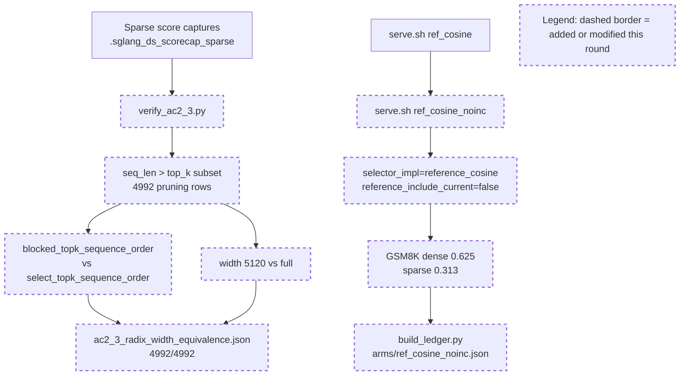

# Round 5 Review Result - Loop 13

Mainline Progress Verdict: ADVANCED

Round 5 recovered from the R3-R4 stall: AC-2.3 is now proven on sparse pruning rows, and Claude ran a real GSM8K single-variable AC-6 arm (`ref_cosine_noinc`). This is mainline movement, not just cleanup. The loop is still not complete: the new AC-6 arm lacks the required selected-index/recall/score-rank corroboration, the remaining GOOD-branch bisection legs are being over-deferred, the new arm's measured provenance is inaccurate, and one evidence artifact still exposes the old AC-2.3 failure as a peer machine-readable summary.

Tracker update: I updated the mutable section of `goal-tracker.md` to Plan Version 6, accepted AC-2.3 as verified, kept AC-6 partial/blocking, added the missing AC-6 corroboration and `ref_cosine_noinc` provenance blockers, downgraded task4 to partial because AC-2.4 recall-oracle evidence is still absent, and rejected the requested reclassification of the remaining AC-6 numeric legs as closed/out-of-scope.

## PR Comprehension

Change summary:
- `verify_ac2_3.py` now requires `seq_len > top_k` pruning rows, records the sequence-length distribution, and verifies radix/top-k plus width equivalence on `evidence/.sglang_ds_scorecap_sparse`.
- `serve.sh` adds `ref_cosine_noinc`, which is `ref_cosine` with `reference_include_current=false`.
- `build_ledger.py` adds the `ref_cosine_noinc` arm and asserts generator-blob consistency across per-arm JSON, table, and `run_meta.json`.
- `ROOT_CAUSE.md`, `findings.md`, and the evidence table now claim the scorer x current-slot 2x2 is measured and that remaining numeric legs are out of scope.



Walkthrough: the AC-2.3 path is now direct and pruning-valid: captured post-reduce score rows feed both the exact and blocked top-k algorithms on the same tensor, avoiding score-vs-selection join ambiguity. The AC-6 path adds one new served mode whose only config change relative to faithful cosine is current-slot inclusion flipped off; that mode feeds GSM8K outputs and the generated ledger. The issue is not the measurement itself; it is that the AC-6 acceptance contract also required corroboration and accurate measured provenance.

Historical review synthesis: the SGLang corpus sweep scanned 32639 threads and matched 311 threads across 152 PRs for `development/loop13`, double-sparsity, DeepSeek/MLA/FP8, top-k, accuracy, benchmark, evidence, and GSM8K terms. The recurring maintainer pattern is consistent with prior rounds: accuracy and top-k claims need workload evidence that exercises the risky branch, exact source/config provenance, and benchmark/eval data tied to the dispatch path under review. Round 5 now satisfies the "risky branch was exercised" standard for AC-2.3, but not the "each claimed bisection delta is corroborated and traceable" standard for AC-6 close-out.

## Mainline Gaps

1. P1 - The new AC-6 arm is measured, but it does not satisfy AC-6 because no selected-index/recall/score-rank corroboration was recorded.

Evidence: the immutable plan requires each AC-6 measured delta to be corroborated by recall@2048 and/or selected-index/score-rank mismatch versus the reference. The Round-5 contract repeats that requirement for the single arm. The new arm JSON records scores only and has `ds_selected_vs_total_by_regime: null` (`development/loop13/evidence/meta/arms/ref_cosine_noinc.json:22-28`). The only committed `ref_cosine_noinc` artifacts are the dense/sparse GSM8K `.out` files and server log; there is no recall-oracle, selected-index, or score-rank artifact for this arm. The evidence table also shows no selected/total metadata for the arm (`development/loop13/evidence/evidence_table.md:14`). `ds_anchor` is useful interaction evidence, but it is another GSM8K arm, not the per-arm AC-6 corroboration requested here.

Required fix: persist a dedicated `evidence/ac6_ref_cosine_noinc_corrob.json` artifact. It must compare `ref_cosine` vs `ref_cosine_noinc` on the same dense and sparse capture regime, include row identifiers, selected-index overlap/Jaccard or recall@2048, and a score-rank/current-slot rank summary. Then wire the artifact path into the arm JSON and evidence table, and make `build_ledger.py` fail if an AC-6 arm has scores but no corroboration artifact.

2. P1 - The remaining AC-6 numeric legs are still active work; the blanket "out of scope under no fix" conclusion is not justified.

Evidence: `ROOT_CAUSE.md` says the fp8-absorbed, bf16-reduce, and head_agg legs are untested and out of scope because a production-path cosine kernel would be a code change (`development/loop13/ROOT_CAUSE.md:97-104`). The same claim is repeated in the evidence table (`development/loop13/evidence/evidence_table.md:21`) and findings (`development/loop13/evidence/findings.md:158-159`). But the original AC-6 explicitly lists those variables and says to prefer existing config toggles, falling back to git-stepping where no toggle exists. The no-fix constraint forbids landing a selection/adapter fix; it does not allow silently closing planned diagnostic bisection legs.

Required implementation plan: continue AC-6 as the next mainline. First fix the current-slot arm corroboration above. Then add a generated `evidence/ac6_bisection_matrix.json` where every AC-6 leg has `base_arm`, `changed_variable`, config diff, dense/sparse GSM8K, corroboration artifact, and verdict. Run every leg that has an existing diagnostic/config route (`head_agg`, `score_reduce_dtype`, radix/top-k and width already retired by AC-2.3). For any leg that truly needs new production-path cosine scoring, add a guarded diagnostic mode under `development/loop13/serve.sh` and the selector seam, with production defaults unchanged, or record a per-leg blocker that cites the exact code path and why no non-fix diagnostic route exists. Do not mark AC-6 closed until each leg is either measured or has that explicit blocker accepted by review.

## Blocking Side Issues

1. P1 - `ref_cosine_noinc` records the wrong measured source SHA.

Evidence: `build_ledger.py` stamps `ref_cosine_noinc` with `measured_sha=R1_SHA` (`development/loop13/build_ledger.py:88-96`), and the generated arm JSON records `"measured_git_sha": "fea920c06"` (`development/loop13/evidence/meta/arms/ref_cosine_noinc.json:2-3`). That cannot be the source state that ran the new arm because the `ref_cosine_noinc` serve mode is introduced in Round 5 (`development/loop13/serve.sh:76-85`). The JSON does record the generator source as dirty `393966c02`, but that is generator provenance, not measured-run provenance.

Impact: AC-1/AC-4 require every arm to record its git SHA/source state. A reader cannot replay the Round-5 arm from `fea920c06` because the named serve mode does not exist there.

Required fix: regenerate `ref_cosine_noinc.json` and the evidence table with a truthful measured source identity: the run HEAD (`393966c02` at measurement time) plus dirty-worktree state and either the `serve.sh`/generator blob hashes or a source-tree/diff hash. If the arm is rerun after commit `c7b66f04b`, record that full commit SHA instead.

2. P2 - `cheap_controls.json` still has a stale machine-readable AC-2.3 failure beside the resolved status.

Evidence: `cheap_controls.json.summary` still says `AC_2_3_radix_eq_torch_topk_all=false`, `81/546`, and `min_jaccard=0.0909` (`development/loop13/evidence/cheap_controls.json:5782-5787`). `_status` then says AC-2.3 is resolved by the new sparse verifier and that the 81/546 is old (`development/loop13/evidence/cheap_controls.json:5792-5795`). The explanatory note helps a human reader, but any script or quick reader consuming `summary` still sees the old failure as the current summary.

Required fix: regenerate or restructure the artifact so there is one authoritative machine-readable AC-2.3 verdict. Move the old join result under `superseded_round3_join_summary` or similar, and put the pruning-valid `4992/4992` result in `summary`.

## Queued Side Issues

- Plan terminology remains in diagnostic code/comments (`AC-*`, `H3`). Still queued; do not let this displace AC-6.
- Reference selector modes still rely on the guarded eager harness rather than failing closed for arbitrary CUDA-graph use. Still queued until these modes are retained beyond loop13.

## Goal Alignment

Acceptance Criteria:
- AC-1: partial. Baselines exist, generator blob consistency improved, but sample IDs/order, some serial cells, and the new arm's measured source provenance remain incomplete.
- AC-2: partial. AC-2.3 is now verified on pruning rows; AC-2.1 assertions, AC-2.2 semantics, and AC-2.4 recall-oracle remain open.
- AC-3: partial. Served reference/cosine and TF32-off evidence are useful; captured-row materialized-K equality is still missing.
- AC-4: partial. Ledger exists but remains fail-open for missing fields and now has the new-arm measured SHA issue.
- AC-5: met for routing. GOOD gate still stands.
- AC-6: advanced but not met. One clean GSM8K arm was run, but corroboration and remaining legs are incomplete.
- AC-7: conditionally deferred. Justified while AC-5 remains GOOD.
- AC-8: partial. Writeup improved but overstates AC-6 finality and cannot close until the blockers above are fixed.

Goal Alignment Summary:
```text
ACs: 8/8 addressed | Forgotten items: 0 | Unjustified deferrals: 1
```

The unjustified deferral is the requested reclassification of remaining AC-6 numeric legs as documented out-of-scope. AC-7 remains a justified conditional deferral because the GOOD gate stands.

## Goal Tracker Update Requests

Accepted:
- Mark AC-2.3 radix/top-k and width equivalence verified on pruning-valid sparse rows.
- Mark AC-6 as advanced by the first GSM8K-measured single-variable arm.
- Close the old generator-blob mismatch between per-arm JSON/table/run_meta.

Rejected or modified:
- Rejected closing/reclassifying the remaining AC-6 numeric legs as non-blocking out-of-scope.
- Rejected treating the `ref_cosine_noinc` arm as AC-6-complete without selected-index/recall/score-rank corroboration.
- Rejected the claim that `cheap_controls.json` no longer contradicts itself; the stale summary fields remain and must be moved or regenerated.
- Modified task4 from done to partial because AC-2.4 recall-oracle evidence is still absent.

## Validation Performed

- Read `development/loop13/plan.md`, `round-5-prompt.md`, `round-5-contract.md`, `goal-tracker.md`, and Round 2-4 summaries/reviews.
- Inspected commit `c7b66f04b` and the changed harness/evidence files.
- Ran SGLang review corpus sweep: 32639 scanned / 311 matched / 152 PRs.
- Ran `python3 development/loop13/verify_ac2_3.py development/loop13/evidence/.sglang_ds_scorecap_sparse`: 4992/4992 pruning rows, exit 0.
- Ran `python3 development/loop13/build_ledger.py`: provenance assertion passes; restored generated timestamp churn afterward.
- Ran `python3 development/loop13/test_reference_selectors.py`: all 5 pass.
- Updated the mutable section of `goal-tracker.md`; immutable goal/AC text was not modified.

NOT COMPLETE
