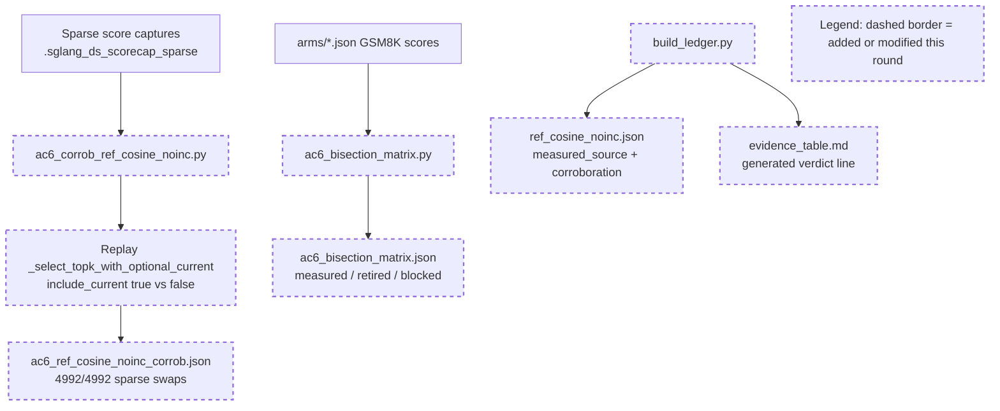

# Round 6 Review Result - Loop 13

Mainline Progress Verdict: ADVANCED

Round 6 made real progress: the `ref_cosine_noinc` provenance is now replayable, `cheap_controls.json.summary` no longer exposes the stale AC-2.3 failure as the authoritative verdict, and the sparse current-slot replay is a useful AC-6 corroboration artifact. The round is still not complete. The AC-6 matrix over-closes at least one runnable leg (`score_reduce_dtype`), the current-slot corroboration is sparse-only while the writeup uses it for the dense cost too, and the generated evidence table still contradicts the new matrix.

Tracker update: I updated the mutable section of `goal-tracker.md` to Plan Version 7. I accepted the R6 provenance, cheap-controls, and sparse current-slot corroboration progress, but rejected AC-6 close-out and added the remaining AC-6 blockers.

## PR Comprehension

Change summary:
- `ac6_corrob_ref_cosine_noinc.py` replays `_select_topk_with_optional_current` on `evidence/.sglang_ds_scorecap_sparse` and writes `ac6_ref_cosine_noinc_corrob.json`.
- `ac6_bisection_matrix.py` generates a seven-leg AC-6 matrix from existing arm JSONs, classifying scorer/current-slot as measured, radix/width as retired, head_agg as not a differing variable, and fp8/bf16 as blocked.
- `build_ledger.py` now attaches `ac6_leg`, `corroboration_artifact`, and `measured_source` to `ref_cosine_noinc`, and asserts AC-6 arms with scores have a corroboration artifact.
- `cheap_controls.json` moves the old 81/546 AC-2.3 join result under `superseded_round3_join_summary`.



Walkthrough: the corroboration script reads captured sparse score rows, forces the current logical position into the top-k set, and compares that result with the normal production-masked selection. The matrix script then summarizes already-measured arms and claims every reference-to-production leg is either measured, retired, not a difference, or blocked. The failure is not that these artifacts are fake; it is that the matrix classifies a runnable production config route as blocked and the sparse-only replay is used as if it corroborates both sparse and dense regimes.

Historical review synthesis: the SGLang corpus sweep scanned 32639 threads and matched 311 inline threads across 152 PRs for DeepSeek/MLA/FP8/top-k/evidence/GSM8K terms. A broader conversation sweep matched 2458 PR conversations and 468 review submissions for DeepSeek/FP8/BF16/benchmark/accuracy/evidence. The recurring maintainer pattern is steady: accuracy and precision-path claims need exact config evidence, runnable dispatch-path validation, and benchmark/eval results for the risky branch. Reviewers repeatedly ask for FP8/BF16 accuracy checks and reject follow-up deferrals when an existing flag can test the concern. That precedent supports accepting the sparse replay, but not accepting a `score_reduce_dtype` blocker while the production config already exposes `fp32`.

## Mainline Gaps

1. P1 - The AC-6 matrix incorrectly marks the BF16 score-reduce leg as blocked even though the production selector already has a runnable `score_reduce_dtype="fp32"` config route.

Evidence: `ac6_bisection_matrix.py` classifies leg 7 as blocked because testing it “under cosine” would need a production cosine kernel (`development/loop13/ac6_bisection_matrix.py:103`). But `DoubleSparsityConfig` explicitly accepts `score_reduce_dtype` values `fp32` and `bf16` (`python/sglang/srt/layers/attention/double_sparsity/config.py:250`), `deepseek_v2.py` threads that config into `score_reduce_bf16` (`python/sglang/srt/models/deepseek_v2.py:2588`), and the selector passes the flag to `reduce_token_scores` (`python/sglang/srt/layers/attention/double_sparsity/selection_kernel.py:811`). The no-fix constraint blocks implementing a new production cosine kernel; it does not block running the existing raw-dot production selector with `score_reduce_dtype="fp32"`.

Impact: AC-6 is still incomplete. Round 5 review explicitly required existing config routes to be run before accepting blockers. The generated artifact also claims a “second-order bound” using `ref_faithful` vs `production_ds`, but that comparison changes multiple variables at once: current-slot inclusion, fp8 scoring, BF16 reduce, radix/width, and graph-safe production path.

Required fix: add a guarded `serve.sh` mode such as `ds_reduce_fp32` with the same config as `ds` plus `"score_reduce_dtype": "fp32"`. Run dense and sparse GSM8K. For corroboration, capture production BF16 and FP32 reduce score rows or selected indices on the same sparse workload and persist `evidence/ac6_score_reduce_fp32_corrob.json` with selected-set overlap, score-rank deltas, and row counts. Add an arm JSON, wire it into `build_ledger.py`, and regenerate `ac6_bisection_matrix.json` so the BF16 leg is measured, not blocked.

2. P1 - The current-slot corroboration artifact only covers sparse pruning rows but claims to corroborate the dense drop too.

Evidence: `ac6_corrob_ref_cosine_noinc.py` skips all rows with `seq_len <= TOP_K` (`development/loop13/ac6_corrob_ref_cosine_noinc.py:67`), and the artifact source says it uses only sparse pruning rows (`development/loop13/evidence/ac6_ref_cosine_noinc_corrob.json:14`). Nevertheless, the verdict states that this proves the measured `0.940->0.625` dense cost (`development/loop13/evidence/ac6_ref_cosine_noinc_corrob.json:34`). Dense is not the same cardinality case: when `seq_len <= top_k`, excluding the current slot changes valid length/coverage rather than producing the fixed-size sparse swap with symdiff==2.

Impact: sparse current-slot corroboration is good evidence, but the dense current-slot delta still lacks the selected-index/score-rank corroboration AC-6 requires for the measured arm.

Required fix: add dense-regime current-slot replay. Use real dense score captures if present; otherwise run an eager dense capture with the same guarded harness. The dense artifact should assert the current slot is masked in the exclude case, `include_current=True` adds it back, `valid_length` changes from `seq_len-1` to `seq_len` when all other live slots are finite, and the selected set delta is the current slot rather than the sparse symdiff==2 swap. Then either merge dense+sparse into one corroboration artifact with separate regime sections or scope the current artifact explicitly to sparse only.

## Blocking Side Issues

1. P1 - Generated evidence still contains contradictory AC-6 close-out wording.

Evidence: `evidence_table.md` says “Untested numeric legs (fp8/bf16-reduce/head_agg) need a production-path cosine kernel = code change, out of scope” (`development/loop13/evidence/evidence_table.md:21`). That contradicts the new matrix, where head_agg is “not-a-differing-variable” with AC-2.2 separate, and it also contradicts the runnable `score_reduce_dtype` route above. The stale wording is generated by `build_ledger.py` (`development/loop13/build_ledger.py:197`).

Required fix: update `build_ledger.py`’s generated verdict text after the AC-6 matrix is corrected. The table should not say head_agg is an out-of-scope numeric leg, and it should not call BF16 reduce blocked unless the existing raw-dot FP32 reduce arm has been run or failed for a concrete reason.

2. P2 - `cheap_controls.json` summary is fixed, but `_status` still contains stale wording that says the old 81/546 result is “in summary”.

Evidence: the current `summary` correctly carries `AC_2_3_radix_eq_torch_topk=4992/4992`, but `_status.AC_2_3_radix_equivalence` still says “The 81/546 in `summary` here is the OLD...” (`development/loop13/evidence/cheap_controls.json:5796`). The old data is now under `superseded_round3_join_summary`.

Required fix: update the `_status` sentence to point to `superseded_round3_join_summary`. This is smaller than the AC-6 matrix issue, but it is another evidence-integrity paper cut in the exact area that caused prior rounds to stall.

## Queued Side Issues

- Plan terminology remains in diagnostic code and generated comments. Still queued; do not let this displace the AC-6 route.
- Reference selector modes still rely on guarded eager harness discipline rather than config-level fail-closed validation outside loop13. Still queued unless the reference modes are retained after the diagnosis loop.

## Goal Alignment

Acceptance Criteria:
- AC-1: partial. R6 fixed `ref_cosine_noinc` measured-source provenance, but sample IDs/order and several serial cells remain missing.
- AC-2: partial. AC-2.3 is verified; AC-2.1 physical-slot assertions, AC-2.2 head-agg semantics, and AC-2.4 recall-oracle/corroboration remain open.
- AC-3: partial. Served reference/cosine exists and TF32 is disabled; captured-row materialized-K equality is still missing.
- AC-4: partial. Ledger exists but remains fail-open for missing required fields, and the generated table currently over-closes AC-6.
- AC-5: met for routing. GOOD gate still stands.
- AC-6: advanced but not met. Scorer/current-slot measurements exist and sparse current-slot replay is useful; BF16 reduce route is unrun, dense current-slot corroboration is missing, and head_agg/cross-TP remains unresolved under AC-2.2.
- AC-7: conditionally deferred. Justified while AC-5 remains GOOD.
- AC-8: partial. Writeup cannot close while AC-2/3/4/6 gaps remain.

Goal Alignment Summary:
```text
ACs: 8/8 addressed | Forgotten items: 0 | Unjustified deferrals: 2
```

The unjustified deferrals are: treating `score_reduce_dtype` as blocked despite an existing production config route, and using sparse-only current-slot replay as dense corroboration. AC-7 remains a justified conditional deferral because the GOOD gate stands.

## Goal Tracker Update Requests

Applied directly:
- Plan Version moved to 7 with a Round 6 review row.
- Task 11 changed from “matrix complete” to partial.
- R6 provenance and cheap-controls summary fixes accepted.
- Added blockers for the unrun `score_reduce_dtype="fp32"` route and the contradictory generated evidence wording.
- Changed the current-slot corroboration blocker to partial: sparse accepted, dense still missing.

Rejected:
- Rejected closing AC-6.
- Rejected accepting the BF16/fp8 blocker as written. Only “production cosine kernel is unavailable” is accepted; that does not block the raw-dot score-reduce diagnostic.

## Required Implementation Plan

1. Add `serve.sh ds_reduce_fp32` as a config-only diagnostic arm: production `ds` config plus `"score_reduce_dtype": "fp32"`, with no selection/adapter fix.
2. Run dense and sparse GSM8K for `ds_reduce_fp32` through the guarded harness, one TP=8 server at a time, and persist the `.out` files.
3. Capture or replay BF16-vs-FP32 reduce corroboration on the sparse workload: selected-set overlap/Jaccard, row counts, score-rank/current-slot summaries, and fail-closed zero-row handling. Write `evidence/ac6_score_reduce_fp32_corrob.json`.
4. Add the new arm to `build_ledger.py`, including `ac6_leg` and `corroboration_artifact`, regenerate arm JSONs/table, and update `ac6_bisection_matrix.py` so leg 7 is measured.
5. Add dense current-slot replay/corroboration, either as a separate artifact or as a dense section in `ac6_ref_cosine_noinc_corrob.json`. Do not reuse the sparse fixed-size swap invariant for dense.
6. Regenerate `ROOT_CAUSE.md`, `findings.md`, `evidence_table.md`, and tracker-facing summaries with no “out of scope” language for runnable config routes.
7. Continue the remaining close-out items after AC-6: `forced_all_assertions.json` for AC-2.1, valid head-agg semantics for AC-2.2, captured-row materialized-K equality for AC-3.1, sample IDs/order and garbage counters for AC-4, and the final AC-8 writeup.

## Validation Performed

- Read `development/loop13/plan.md` before reviewing the implementation scope.
- Read `round-6-prompt.md`, `goal-tracker.md`, Round 3-5 summaries/reviews, and the Pensieve review pipeline.
- Inspected commit `8b55dfba3` and the changed Round 6 files.
- Ran SGLang human-review corpus sweeps:
  - path/risk sweep: 32639 scanned / 311 matched / 152 PRs
  - PR conversation sweep: 32639 scanned / 2458 matched
  - review submission sweep: 32639 scanned / 468 matched
- Reran `python3 development/loop13/ac6_corrob_ref_cosine_noinc.py`: 4992/4992 sparse current-slot swaps, exit 0.
- Reran `python3 development/loop13/ac6_bisection_matrix.py`: generated the claimed verdict distribution, exit 0.
- Reran `python3 development/loop13/test_reference_selectors.py`: all 5 pass.
- Reran `python3 development/loop13/verify_ac2_3.py development/loop13/evidence/.sglang_ds_scorecap_sparse`: 4992/4992 pruning rows, exit 0.
- Did not rerun `build_ledger.py` because it rewrites provenance fields from the current HEAD and would create review-only generated churn.
- Updated the mutable section of `goal-tracker.md`; immutable goal/AC text was not modified.

NOT COMPLETE
