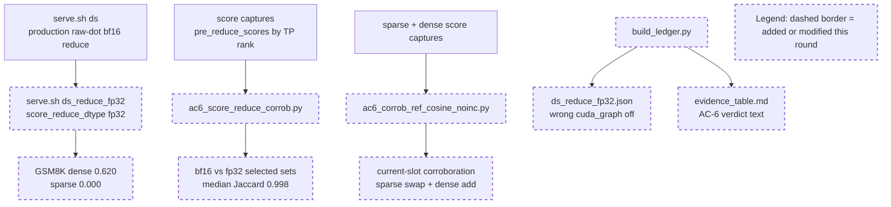

# Round 7 Review Result - Loop 13

Mainline Progress Verdict: ADVANCED

Round 7 advanced the actual AC-6 evidence: the previously blocked `score_reduce_dtype="fp32"` route was measured on the real workload, dense current-slot corroboration now uses the correct `seq_len <= top_k` invariant, and the stale generated "out of scope" wording is gone. The round is still not complete. The `ds_reduce_fp32` machine-readable ledger records the wrong CUDA-graph state and server args, and the original-plan close-out tasks that Claude lists as "remaining" still block final completion.

Tracker update: I updated the mutable section of `goal-tracker.md` to Plan Version 8. I accepted the R7 measurement progress and fp8-absorbed per-leg blocker, but added a new blocker for the incorrect `ds_reduce_fp32` ledger metadata and kept the original-plan close-out tasks active.

## PR Comprehension

Change summary:
- `serve.sh` adds `ds_reduce_fp32`, intended to be production `ds` plus only `score_reduce_dtype="fp32"`.
- `ac6_score_reduce_corrob.py` replays bf16-vs-fp32 reduce from captured per-rank `pre_reduce_scores` and writes `ac6_score_reduce_fp32_corrob.json`.
- `ac6_corrob_ref_cosine_noinc.py` now emits sparse and dense regime sections, with sparse swap and dense add invariants separated.
- `ac6_bisection_matrix.py` now marks reduce as measured and leaves only fp8 absorbed scoring blocked.
- `build_ledger.py` adds the new arm and regenerates `evidence_table.md`, but hard-codes the wrong `--disable-cuda-graph` metadata for `ds_reduce_fp32`.



Walkthrough: the intended AC-6 path is clean: production DS and `ds_reduce_fp32` should differ only by the reduce transport dtype. The actual server log supports that intent (`score_reduce_dtype="fp32"`, `disable_cuda_graph=False`, decode `cuda graph: True`). The evidence tooling then corroborates that bf16 and fp32 reduce select nearly identical top-k sets. The failure is in the generated ledger, which records the arm as if it used `--disable-cuda-graph`; that contradicts the run log and would make the arm appear multi-variable to any AC-4/AC-6 consumer.

Historical review synthesis: the SGLang corpus sweep scanned 32639 threads and matched 311 inline DeepSeek/MLA/FP8/top-k/evidence threads across 152 PRs. A broader conversation sweep matched 2799 PR conversations, and review submissions matched 546 threads for DeepSeek/FP8/BF16/benchmark/accuracy/evidence terms. The recurring maintainer pattern is stable: precision-path and accuracy claims need exact command/config provenance, tested dispatch-path evidence, and e2e accuracy numbers. Round 7 satisfies the measurement/corroboration standard for the reduce leg, but not the exact provenance standard until the ledger reflects the actual graph-enabled run.

## Mainline Gaps

1. P1 - `ds_reduce_fp32` is measured, but the ledger records the wrong CUDA-graph state and server args.

Evidence: `serve.sh ds_reduce_fp32` does not add `--disable-cuda-graph`; its `EXTRA` is `--disable-radix-cache --enable-double-sparsity --double-sparsity-config ...` with only `"score_reduce_dtype": "fp32"` changed (`development/loop13/serve.sh:49-57`). The actual run log agrees: `serve_ds_reduce_fp32.log` records `score_reduce_dtype="fp32"` and `disable_cuda_graph=False` in `server_args` (`development/loop13/evidence/serve_ds_reduce_fp32.log:12`), and decode used CUDA graph (`development/loop13/evidence/serve_ds_reduce_fp32.log:1552`). But `build_ledger.py` hard-codes the arm with `extra="--disable-radix-cache --disable-cuda-graph --enable-double-sparsity"` (`development/loop13/build_ledger.py:111`), so the generated arm JSON says `--disable-cuda-graph` and `cuda_graph: "off"` (`development/loop13/evidence/meta/arms/ds_reduce_fp32.json:13`).

Impact: AC-1/AC-4 require exact server args and CUDA-graph on/off. AC-6 rejects arms that change more than one variable. The measurement itself appears to be the correct graph-enabled single-variable arm, but the committed machine-readable evidence contradicts that and makes leg 7 look unclean.

Required fix:
1. Change `build_ledger.py` so `ds_reduce_fp32` uses the same extra args as `serve.sh ds_reduce_fp32`: `--disable-radix-cache --enable-double-sparsity`, with no `--disable-cuda-graph`.
2. Regenerate `evidence/meta/arms/ds_reduce_fp32.json`, `evidence/evidence_table.md`, and `evidence/meta/run_meta.json`.
3. Add a fail-closed consistency check for AC-6 arms: for `ds_reduce_fp32`, the generated `server_args` must not contain `--disable-cuda-graph`, `cuda_graph` must be graph-enabled, and the recorded config must contain `"score_reduce_dtype": "fp32"`.
4. Keep the existing GSM8K outputs and server log; no rerun is required unless the regenerated ledger cannot be reconciled with `serve_ds_reduce_fp32.log`.

2. P1 - Round 7 cannot be final because original-plan close-out work is still pending.

Evidence: Claude's own summary leaves AC-2.1, AC-2.2, AC-2.4, AC-3.1, AC-4 sample/garbage fields, and AC-8 final writeup for later. Those are not optional under the review prompt. The tracker still has them active/partial, and the immutable plan says a `COMPLETE` result requires the root-cause writeup plus the planned evidence table and controls.

Required implementation plan:
1. Fix the `ds_reduce_fp32` ledger metadata first and rerun the lightweight ledger validation.
2. Persist `evidence/forced_all_assertions.json` for AC-2.1: physical slots equal `req_to_token[req_pool, 0:seq_len]`, no duplicates, no `-1`, no unwritten slots, no out-of-range slots, adapter errors zero.
3. Settle AC-2.2 with a valid head-aggregation artifact. Capture or reconstruct per-head dot products on aligned decode rows, compute local-max-per-rank plus TP SUM vs true global max and global mean, and write a fail-closed `head_agg_tp_semantics.json`.
4. Record AC-2.4 recall-oracle@2048 for dense and sparse using the intended recall-oracle instrument; if it is NIAH-only, run the NIAH dense/sparse oracle and label it as corroboration rather than GSM8K selected-index equivalence.
5. Replace the synthetic AC-3.1 proof with captured-row materialized fp32 `K_label` selected-index equality against `absorbed_latent_score_logical` at top-2048.
6. Complete AC-4 metadata: persist sample IDs/order for each GSM8K arm, selected-vs-total for DS arms, and length-cap garbage counters (invalid physical slots, unwritten slots, duplicate indices, out-of-range lanes) from the adapter path; regenerate the table so missing required fields fail closed instead of appearing as `null` or `--`.
7. Only after those artifacts pass, write the AC-8 root-cause close-out with the accepted fp8-absorbed blocker, the scorer/current-slot/reduce/radix/width matrix, and the research-vs-targeted-fix recommendation.

## Blocking Side Issues

- P1 - The new `ds_reduce_fp32` ledger-metadata blocker above blocks AC-4 and AC-6 evidence integrity until fixed.
- P1 - The existing original-plan evidence blockers remain: forced-all assertions, head-agg semantics, recall-oracle corroboration, captured-row materialized-K equality, sample IDs/order, garbage counters, and AC-8 writeup.

## Queued Side Issues

- Plan terminology remains in diagnostic comments and generated notes. Keep queued unless the diagnostics are retained outside `development/loop13`.
- Reference selector modes still rely on guarded eager harness discipline rather than general config-level fail-closed validation. Keep queued until the reference modes are promoted beyond this diagnosis loop.

## Goal Alignment

Acceptance Criteria:
- AC-1: partial. Baselines and the new reduce run exist, but the new arm's generated server-args/CUDA-graph metadata is wrong, and sample IDs/order remain missing.
- AC-2: partial. AC-2.3 is verified; dense current-slot corroboration is improved. AC-2.1 forced-all assertions, AC-2.2 head-agg semantics, and AC-2.4 recall-oracle remain open.
- AC-3: partial. Served reference/cosine and TF32-off evidence exist; captured-row materialized fp32 `K_label` equality is still missing.
- AC-4: partial. Ledger exists, but `ds_reduce_fp32` metadata is incorrect and required sample/garbage fields remain absent.
- AC-5: met for routing. GOOD gate still stands.
- AC-6: advanced but not fully clean. R7 measured reduce and fixed dense current-slot corroboration; fp8-absorbed blocker is accepted as a no-config-route blocker. The reduce arm metadata must be fixed before AC-6 evidence is considered clean.
- AC-7: conditionally deferred. Justified while AC-5 remains GOOD.
- AC-8: partial. Final writeup cannot close until the evidence blockers above are fixed.

Goal Alignment Summary:
```text
ACs: 8/8 addressed | Forgotten items: 0 | Unjustified deferrals: 0
```

Deferred items audit: AC-7 remains a justified conditional deferral because the GOOD gate stands. The other remaining items are not accepted deferrals; they are active incomplete work.

## Goal Tracker Update Requests

Applied directly:
- Plan Version moved to 8 with a Round 7 review row.
- Accepted R7 measurement progress for the reduce leg and dense current-slot corroboration.
- Accepted the fp8-absorbed leg as a documented no-config-route blocker.
- Added a blocking side issue for the incorrect `ds_reduce_fp32` server-args/CUDA-graph metadata.
- Updated task9 and task11 so AC-4/AC-6 remain partial until the metadata contradiction is fixed.

Rejected:
- Rejected treating Round 7 as full completion.
- Rejected treating the generated `ds_reduce_fp32` arm JSON as valid AC-4 metadata in its current state.

## Validation Performed

- Read `development/loop13/plan.md` before reviewing, plus `round-7-prompt.md`, `round-7-contract.md`, `round-7-summary.md`, `goal-tracker.md`, and Round 4-6 summaries/reviews.
- Read Pensieve review pipeline and project maxims.
- Ran SGLang review corpus sweeps:
  - inline path/risk sweep: 32639 scanned / 311 matched / 152 PRs
  - PR conversation sweep: 32639 scanned / 2799 matched
  - review submission sweep: 32639 scanned / 546 matched
- Inspected the Round 7 diff from `8b55dfba3..HEAD`.
- Reran `python3 development/loop13/test_reference_selectors.py`: all 5 pass.
- Reran `python3 development/loop13/verify_ac2_3.py development/loop13/evidence/.sglang_ds_scorecap_sparse`: 4992/4992 pruning rows, exit 0.
- Reran `python3 development/loop13/ac6_corrob_ref_cosine_noinc.py`: sparse 4992/4992 and dense 3744/3744, exit 0.
- Reran `python3 development/loop13/ac6_score_reduce_corrob.py`: 702 groups, `sum(pre)==post` 702/702, median Jaccard 0.998, exit 0.
- Reran `python3 development/loop13/ac6_bisection_matrix.py`: measured [2,3,7], retired [4,5], not-a-difference [1], blocked [6], exit 0.
- Inspected `serve_ds_reduce_fp32.log`: actual run had `score_reduce_dtype="fp32"`, `disable_cuda_graph=False`, and decode `cuda graph: True`.
- Did not rerun `build_ledger.py` because it would rewrite generated provenance against current HEAD and create review-only churn; the source bug is visible in `build_ledger.py:111`.
- Updated the mutable section of `goal-tracker.md`; immutable goal/AC text was not modified.

NOT COMPLETE
