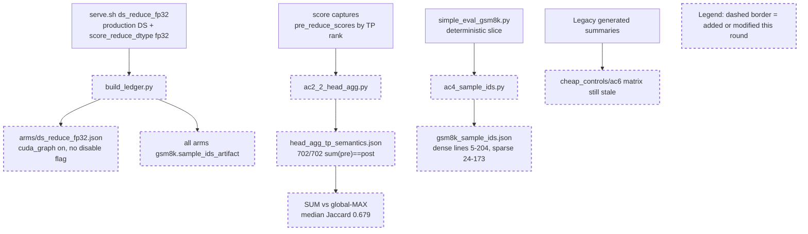

Your work is not finished. Read and execute the below with ultrathink.

## Original Implementation Plan

**IMPORTANT**: Before proceeding, review the original plan you are implementing:
@development/loop13/plan.md

This plan contains the full scope of work and requirements. Ensure your work aligns with this plan.

---

## Round Re-anchor (REQUIRED FIRST STEP)

Before writing code:
- Re-read @development/loop13/plan.md
- Re-read @/sgl-workspace/sglang/.humanize/rlcr/2026-06-20_09-57-51/goal-tracker.md
- Re-read the most recent round summaries/reviews that led to this round
- Write the current round contract to @/sgl-workspace/sglang/.humanize/rlcr/2026-06-20_09-57-51/round-9-contract.md

Your round contract must contain:
- Exactly one **mainline objective**
- The 1-2 target ACs for this round
- Which issues are truly **blocking** that mainline objective
- Which issues are **queued** and explicitly out of scope
- Concrete success criteria for this round

Do not start implementation until the round contract exists.

## Task Lane Rules

Use the Task system (TaskCreate, TaskUpdate, TaskList) with one required tag per task:
- `[mainline]` for plan-derived work that directly advances this round's objective
- `[blocking]` for issues that prevent the mainline objective from succeeding safely
- `[queued]` for non-blocking bugs, cleanup, or follow-up work

Rules:
- `[mainline]` work is the round's primary success condition
- `[blocking]` work is allowed only when it truly blocks the mainline objective
- `[queued]` work must be documented but must NOT replace the round objective
- If a new bug does not block the current objective, tag it `[queued]` and keep moving on mainline work

Before executing each task in this round:
1. Read @/sgl-workspace/sglang/.humanize/bitlesson.md
2. Run `bitlesson-selector` for each task/sub-task
3. Follow selected lesson IDs (or `NONE`) during implementation

---
Below is Codex's review result:
<!-- CODEX's REVIEW RESULT START -->
# Round 8 Review Result - Loop 13

Mainline Progress Verdict: ADVANCED

Round 8 advanced the close-out: the `ds_reduce_fp32` CUDA-graph metadata bug from Round 7 is fixed and guarded, `head_agg_tp_semantics.json` is a valid AC-2.2 artifact, and `gsm8k_sample_ids.json` correctly derives the deterministic GSM8K slices. It is still not complete. The generated evidence package was not reconciled after the new head-agg artifact, and the per-arm ledger still does not record full DS launch configs/server args as required by AC-1/AC-4.

Tracker update: I updated the mutable section of `goal-tracker.md` to Plan Version 9. I accepted the core R8 artifacts, rejected treating AC-2.2/AC-6 as fully clean while generated evidence contradicts them, and added the missing full-DS-config metadata blocker. The immutable goal/AC section was not changed.

## PR Comprehension

Change summary:
- `build_ledger.py` removes the erroneous `--disable-cuda-graph` from `ds_reduce_fp32`, records a partial `ds_config`, wires `gsm8k_sample_ids.json`, and adds a consistency assertion for the reduce arm.
- `ac2_2_head_agg.py` groups captured per-rank `pre_reduce_scores`, validates `sum(pre)==post` on 702 8-rank groups, and compares served SUM against global MAX and MEAN.
- `ac4_sample_ids.py` replays the stock `GSM8KEval` slicing rule and writes ordered dense/sparse GSM8K example identities.
- Generated artifacts were updated, but older generated surfaces still expose stale AC-2.2 state.



Walkthrough: the core Round 8 path is CPU-only. The reduce arm metadata now matches the graph-enabled server log, the head-aggregation script answers the intended SUM-vs-MAX question from existing sparse captures, and the sample-ID script mirrors the current GSM8K loader. The failure is in the evidence integration layer: `cheap_controls.json` and `ac6_bisection_matrix.json` still publish stale/preliminary AC-2.2 statements, and the ledger still calls abbreviated DS args "server_args" even though the real `serve.sh` commands include `--double-sparsity-config`.

Historical review synthesis: the SGLang corpus sweep scanned 32639 threads and matched 311 inline DeepSeek/MLA/FP8/top-k/evidence threads across 152 PRs. Broader conversation and review-submission sweeps matched 2740 PR conversations and 548 review submissions for DeepSeek/FP8/benchmark/accuracy/GSM8K/server-args/evidence terms. The repeated maintainer pattern is exact: accuracy and precision-path claims need complete command/config provenance, dispatch-path validation, and non-contradictory benchmark evidence. Round 8 satisfies that standard for the new head-agg artifact itself, but not for the generated evidence package that downstream readers will consume.

## Mainline Gaps

1. P1 - The AC-2.2 artifact is valid, but generated evidence still contradicts it and AC-6 still says the head-agg control is preliminary.

Evidence: the new artifact says `sum(pre_reduce)==post` is 702/702 and SUM-vs-global-MAX median Jaccard is 0.679 (`development/loop13/evidence/head_agg_tp_semantics.json`). But `cheap_controls.json.summary` still reports only 78 rows and `AC_2_2_served_sum_matches_post_reduce_all=false` with the old "trust only if..." note (`development/loop13/evidence/cheap_controls.json:5782`). The `_status` field then says Round 8 settled it (`development/loop13/evidence/cheap_controls.json:5797`), so a machine reader sees two peer verdicts. Separately, `ac6_bisection_matrix.json` leg 1 still says AC-2.2 is "still PRELIMINARY" (`development/loop13/evidence/ac6_bisection_matrix.json:36`). `findings.md` also overclaims that "cosine recovers under both" aggregations (`development/loop13/evidence/findings.md:198`), but no production-cosine + cross-TP-SUM arm exists; the measured fact is only that raw-dot collapses under production-SUM and reference-local aggregation.

Impact: AC-2.2 cannot be marked clean in the tracker while the generated package says both SETTLED and PRELIMINARY. AC-6/AC-8 also cannot rely on the unsupported "cosine under both aggregations" sentence.

Required fix:
1. Update `cheap_controls.json.summary` from `head_agg_tp_semantics.json`, or move the old 78-row fields under a clearly named superseded section. The current summary must carry the 702/702 validation and SUM-vs-MAX/MEAN results.
2. Update `ac6_bisection_matrix.py` leg 1 so it references the settled AC-2.2 artifact instead of "still PRELIMINARY", then regenerate `ac6_bisection_matrix.json`.
3. Rewrite the exoneration wording in `findings.md`, `cheap_controls.json._status`, and tracker-facing text: say raw-dot collapses under both measured aggregations; do not say cosine recovers under production-SUM unless a production-cosine+SUM route is measured.
4. Add a fail-closed check in the generator/matrix path so once `head_agg_tp_semantics.json` exists with `capture_validation_sum_pre_eq_post == "702/702"`, no generated evidence may still contain `PRELIMINARY` or the old `served_sum_matches_post_reduce_all=false` verdict.

2. P1 - Per-arm `server_args` still are not full server args/configs for DS arms.

Evidence: `serve.sh` launches DS modes with `--double-sparsity-config "$DS_CONFIG"` (`development/loop13/serve.sh:35`, `development/loop13/serve.sh:37`, `development/loop13/serve.sh:56`, `development/loop13/serve.sh:57`). `build_ledger.py` records only abbreviated extras such as `--disable-radix-cache --enable-double-sparsity` for `production_ds` and `ds_reduce_fp32` (`development/loop13/build_ledger.py:87`, `development/loop13/build_ledger.py:111`). The generated arm JSON reflects that omission: `production_ds.json` has no `--double-sparsity-config` and no structured `ds_config` (`development/loop13/evidence/meta/arms/production_ds.json:13`); `ds_reduce_fp32.json` also omits the config from `server_args` and records only a partial `ds_config` with three fields (`development/loop13/evidence/meta/arms/ds_reduce_fp32.json:13`, `development/loop13/evidence/meta/arms/ds_reduce_fp32.json:35`).

Impact: AC-1 requires full server args for every arm, and AC-4 is the per-arm evidence table. Round 8 fixed the specific CUDA-graph contradiction, but the machine-readable ledger still cannot reconstruct the actual DS launch command/config for most DS arms.

Required fix:
1. Add canonical per-arm DS config construction to `build_ledger.py`, matching `serve.sh` for every DS mode: `top_k`, `page_size`, `channel_mask_path` or mask SHA, `device_buffer_size`, `scorer_norm`, `head_agg`, `anchor_mode`, `anchor_budget`, lifted-budget flags, selector mode, `reference_include_current`, capture flags, and `score_reduce_dtype` where applicable.
2. Either include `--double-sparsity-config <canonical json>` in `server_args`, or add a complete structured `ds_config` for every DS arm and rename/define `server_args` so it is not falsely "full" without the config.
3. Add a ledger assertion: any arm with `--enable-double-sparsity` must have either `--double-sparsity-config` in `server_args` or a complete `ds_config` containing the required keys. For `ds_reduce_fp32`, keep the existing no-`--disable-cuda-graph` and `score_reduce_dtype=fp32` checks.
4. Regenerate arm JSONs, `evidence_table.md`, and `run_meta.json`.

## Blocking Side Issues

- P1 - Original-plan close-out is still pending: AC-2.1 forced-all physical-slot assertions, AC-2.4 recall-oracle corroboration, AC-3.1 captured-row materialized fp32 `K_label` equality, AC-4 length-cap garbage counters/selected-vs-total gaps/remaining serial cells, and AC-8 final writeup.
- P1 - The generated AC-2.2/AC-6 contradictions above block a trustworthy final writeup even though the new head-agg artifact itself is useful.
- P1 - Full per-arm DS launch config is still missing from the ledger, so AC-1/AC-4 metadata remains partial.

Required implementation plan for the next round:
1. First reconcile evidence generators: update `cheap_controls.json`, `ac6_bisection_matrix.py/json`, `findings.md`, and the ledger so they agree on the settled head-agg artifact and full DS configs. This is CPU-only and should be done before new GPU capture.
2. Add/persist `evidence/forced_all_assertions.json`: physical slots equal `req_to_token[req_pool, 0:seq_len]`, no duplicates, no `-1`, no unwritten/out-of-range slots, adapter error count zero.
3. Add the adapter instrumentation needed for AC-4 garbage counters at the same physical-slot boundary; emit invalid/unwritten/duplicate/out-of-range counts per layer/step and wire them into the ledger.
4. Capture the resident latent needed for AC-3.1, then run the offline/blockwise materialized fp32 `K_label` selected-index equality against `absorbed_latent_score_logical` at top-2048 on captured decode rows.
5. Run the AC-2.4 recall-oracle workload as NIAH-only corroboration, clearly labeled as corroboration rather than GSM8K selected-index equivalence.
6. Only after those artifacts pass, revise the AC-8 root-cause writeup. The writeup must avoid unsupported aggregation claims and must not propose or land a selection/adapter fix.

## Queued Side Issues

- Plan terminology remains in diagnostic code/comments. Keep queued unless the diagnostics are retained beyond `development/loop13`.
- Reference selector modes still rely on guarded eager harness discipline rather than general config-level fail-closed validation. Keep queued until the reference modes are promoted beyond this diagnosis loop.

## Goal Alignment

Acceptance Criteria:
- AC-1: partial. Baselines exist and `ds_reduce_fp32` graph metadata is fixed, but DS per-arm full launch config/server args are incomplete and a few serial cells are still missing.
- AC-2: partial. AC-2.3 is verified and the new AC-2.2 artifact is valid, but generated summaries still contradict AC-2.2. AC-2.1 forced-all assertions and AC-2.4 recall-oracle remain open.
- AC-3: partial. Served reference/cosine and TF32-off evidence exist; captured-row materialized `K_label` equality is still missing.
- AC-4: partial. Sample IDs/order are now done, but full DS config metadata, garbage counters, selected-vs-total gaps, and some serial cells remain open.
- AC-5: met for routing. GOOD gate still stands.
- AC-6: advanced but not clean. Reduce/current-slot/scorer/radix/width evidence is useful, but the AC-6 matrix still carries stale AC-2.2 wording and the head-agg exoneration is overclaimed.
- AC-7: conditionally deferred. Justified while AC-5 remains GOOD.
- AC-8: partial. Final writeup cannot close until the evidence package is internally consistent and the remaining planned artifacts exist.

Goal Alignment Summary:
```text
ACs: 8/8 addressed | Forgotten items: 0 after tracker correction | Unjustified deferrals: 0
```

Deferred items audit: AC-7 remains the only justified conditional deferral because the GOOD gate stands. The other remaining items are active incomplete work, not accepted deferrals.

## Goal Tracker Update Requests

Applied directly:
- Plan Version moved to 9 with a Round 8 review row.
- Accepted `ds_reduce_fp32` CUDA-graph metadata fix and sample IDs/order progress.
- Kept task3 partial until stale generated AC-2.2 summaries/matrix are reconciled.
- Updated task1/task9 to track the missing full DS launch config/server args.
- Added/updated blocking side issues for head-agg evidence contradictions and incomplete per-arm DS config metadata.

Rejected:
- Rejected marking AC-2.2 fully done while `cheap_controls.json.summary` and `ac6_bisection_matrix.json` still contradict the new artifact.
- Rejected calling AC-6 evidence clean while the matrix still says the head-agg control is preliminary.
- Rejected treating current per-arm `server_args` as full AC-1/AC-4 metadata for DS arms.

## Validation Performed

- Read `development/loop13/plan.md` first, plus Round 5-7 summaries/reviews, `round-8-prompt.md`, and `goal-tracker.md`.
- Read the Pensieve review pipeline and SGLang Humanize Review skill; ran corpus sweeps:
  - inline path/risk sweep: 32639 scanned / 311 matched / 152 PRs
  - PR conversation sweep: 32639 scanned / 2740 matched / 2740 PRs
  - review submission sweep: 32639 scanned / 548 matched / 548 PRs
- Inspected commit `752752f6d`.
- Reran `python3 development/loop13/ac2_2_head_agg.py`: 702 groups, `sum(pre)==post` 702/702, SUM-vs-MAX median Jaccard 0.679, exit 0.
- Reran `python3 development/loop13/ac4_sample_ids.py`: dataset sha `3730d312...`, dense lines 5-204, sparse lines 24-173, exit 0.
- Reran `python3 development/loop13/build_ledger.py`: provenance consistent, exit 0; restored review-only generated provenance churn afterward.
- Reran `python3 development/loop13/test_reference_selectors.py`: 5/5 pass.
- Reran `python3 development/loop13/verify_ac2_3.py development/loop13/evidence/.sglang_ds_scorecap_sparse`: 4992/4992 pruning rows, exit 0.
- Reran `python3 development/loop13/ac6_score_reduce_corrob.py`: 702 groups, `sum(pre)==post` 702/702, median Jaccard 0.998, exit 0.
- Reran `python3 development/loop13/ac6_bisection_matrix.py`: measured [2,3,7], retired [4,5], not-a-difference [1], blocked [6], exit 0; observed stale "still PRELIMINARY" text remains.
- Negative-tested `ac2_2_head_agg.py` on an empty directory: exits rc=2 with "zero 8-rank groups".
- Confirmed the worktree has no review-only generated churn except the required `.humanize` tracker/review files.

NOT COMPLETE
<!-- CODEX's REVIEW RESULT  END  -->
---

## Goal Tracker Reference

Before starting work, **read** @/sgl-workspace/sglang/.humanize/rlcr/2026-06-20_09-57-51/goal-tracker.md to understand:
- The Ultimate Goal and Acceptance Criteria you're working toward
- Which tasks are Active, Completed, or Deferred
- Which side issues are blocking vs queued
- Any Plan Evolution that has occurred
- The latest side-issue state that needs attention

**IMPORTANT**: Keep the mutable section of `goal-tracker.md` up to date during the round.
Do NOT change the immutable section after Round 0.
If you cannot safely reconcile the tracker yourself, include an optional "Goal Tracker Update Request" section in your summary (see below).

## Mainline Guardrails

- Keep the mainline objective from @/sgl-workspace/sglang/.humanize/rlcr/2026-06-20_09-57-51/round-9-contract.md stable for this round
- Do not let queued issues take over the round
- If Codex reported several findings, classify them into:
  - mainline gaps
  - blocking side issues
  - queued side issues
- Only mainline gaps and blocking side issues should drive the next code changes

---

Note: You MUST NOT try to exit by lying, editing loop state files, or executing `cancel-rlcr-loop`.

After completing the work, please:
0. If the `code-simplifier` plugin is installed, use it to review and optimize your code. Invoke via: `/code-simplifier`, `@agent-code-simplifier`, or `@code-simplifier:code-simplifier (agent)`
1. Commit your changes with a descriptive commit message
2. Write your work summary into @/sgl-workspace/sglang/.humanize/rlcr/2026-06-20_09-57-51/round-9-summary.md

## Task Tag Routing Reminder

Follow the plan's per-task routing tags strictly:
- `coding` task -> Claude executes directly
- `analyze` task -> execute via `/humanize:ask-codex`, then integrate the result
- Keep Goal Tracker Active Tasks columns `Tag` and `Owner` aligned with execution

**Optional fallback**: if you could not safely update the mutable section of `goal-tracker.md` directly, include this section in your summary:
```markdown
## Goal Tracker Update Request

### Requested Changes:
- [E.g., "Mark Task X as completed with evidence: tests pass"]
- [E.g., "Add to Blocking Side Issues: bug Y blocks AC-2"]
- [E.g., "Add to Queued Side Issues: cleanup Z is non-blocking"]
- [E.g., "Plan Evolution: changed approach from A to B because..."]
- [E.g., "Defer Task Z because... (impact on AC: none/minimal)"]

### Justification:
[Explain why these changes are needed and how they serve the Ultimate Goal]
```

Codex will review your request and reconcile the Goal Tracker if justified.
