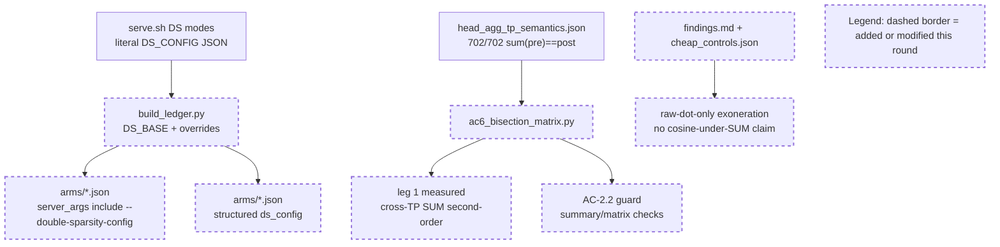

# Round 9 Review Result - Loop 13

Mainline Progress Verdict: ADVANCED

Round 9 advanced the evidence package: the DS arms now record the literal `--double-sparsity-config` launch JSON, `cheap_controls.summary` no longer carries the old AC-2.2 PRELIMINARY verdict, and `ac6_bisection_matrix.json` now references the settled head-aggregation artifact. It is still not complete. Two generated surfaces still contradict the new head-agg classification, and the structured `ds_config` is not yet the full effective runtime config AC-4 needs.

Tracker update: I updated the mutable section of `goal-tracker.md` to Plan Version 10. I accepted the literal DS launch JSON and AC-2.2 artifact progress, but kept AC-1/AC-4/AC-6/AC-8 partial for the residual evidence contradictions and missing effective DS defaults. The immutable goal/AC section was not changed.

## PR Comprehension

Change summary:
- `build_ledger.py` adds `DS_BASE` / `DS_OVERRIDES`, appends a canonical `--double-sparsity-config` JSON to DS arm `server_args`, emits structured `ds_config`, and asserts every `--enable-double-sparsity` arm has the launch JSON plus base keys.
- `ac6_bisection_matrix.py` changes leg 1 from old preliminary/not-a-difference wording to a measured second-order cross-TP aggregation leg, and adds an AC-2.2 consistency guard.
- `ac2_2_head_agg.py`, `head_agg_tp_semantics.json`, `findings.md`, and `cheap_controls.json` narrow the head-agg exoneration to raw-dot evidence only.
- Generated arm JSONs/table/run_meta were regenerated, but not every generated summary line was updated.



Walkthrough: the Round 9 execution path is CPU-only. The ledger now reconstructs the literal DS launch JSON for each measured DS arm, while the head-aggregation path consumes the already-validated AC-2.2 artifact and updates the bisection matrix. The remaining problem is integration: `evidence_table.md` and one AC-6 summary in `findings.md` still describe head aggregation with the old classification, and the structured config records only the launch JSON fields, not the effective config after defaults.

Historical review synthesis: the SGLang corpus sweep scanned 32639 threads and matched 310 inline DeepSeek/MLA/FP8/top-k/evidence threads across 151 PRs. Broader sweeps matched 2928 PR conversations and 557 review submissions for DeepSeek/FP8/benchmark/accuracy/server-args/config terms. The recurring human-review pattern is stable: accuracy and precision-path claims need exact command/config provenance, tested dispatch-path evidence, and non-contradictory benchmark artifacts. Round 9 improves provenance, but still falls short of the non-contradictory artifact standard.

## Goal Tracker Audit

| AC | Status | Evidence if met | Blocker if not met | Deferral justification |
|----|--------|-----------------|--------------------|------------------------|
| AC-1 | PARTIAL | Baselines and production regression are reproduced in `evidence/evidence_table.md`; DS arms now include literal `--double-sparsity-config` in `server_args`. | DSA-radix serial and production DS sparse serial cells are still missing; effective DS defaults are not fully expanded in machine-readable config. | n/a |
| AC-2 | PARTIAL | AC-2.2 artifact valid (`head_agg_tp_semantics.json`, 702/702); AC-2.3 pruning-valid radix/width equality is 4992/4992. | AC-2.1 `forced_all_assertions.json` absent; AC-2.4 recall-oracle absent; AC-2.2 generated integration still has stale surfaces. | n/a |
| AC-3 | PARTIAL | Served raw-dot/cosine references exist; TF32-off/reference tests pass. | AC-3.1 captured-row materialized fp32 `K_label` selected-index equality is still missing. | n/a |
| AC-4 | PARTIAL | Per-arm table, sample IDs/order, literal DS launch JSON, and ds_reduce_fp32 graph metadata exist. | Effective DS defaults, garbage counters, selected-vs-total gaps, and some serial cells remain missing. | n/a |
| AC-5 | MET | GOOD gate recorded from measured batched DSA 0.975/0.973 and best naive DS 0.950/0.940. | n/a | n/a |
| AC-6 | PARTIAL | Scorer/current-slot/reduce measured; radix/width retired; fp8 absorbed has accepted no-config-route blocker. | `evidence_table.md` / `findings.md` still contradict the matrix on head aggregation; leg 1 needs generated-summary cleanup before AC-6 is clean. | n/a |
| AC-7 | DEFERRED | n/a | n/a | Conditional BAD branch is not taken while AC-5 remains GOOD. Reconsider only if AC-5 flips. |
| AC-8 | PARTIAL | Interim findings/root-cause artifacts exist. | Final writeup cannot close until AC-2.1, AC-2.4, AC-3.1, AC-4 garbage/effective-config gaps, and AC-6 evidence consistency are complete. | n/a |

Forgotten items detection:
- No original plan tasks are absent from Active/Completed/Deferred after the tracker update.
- Round 9's summary overstates two items: the forbidden-string scan is false for top-level `cheap_controls.head_agg_test` row fields, and the DS `ds_config` is not a full effective config.
- The tracker had drifted: task9 still said DS launch config was incomplete, while task11 still mentioned the old PRELIMINARY matrix blocker. I corrected both, while preserving the residual gaps.

Deferred items audit:
- AC-7 remains the only explicit deferral. The justification is still valid because the decision gate is GOOD; it does not contradict the ultimate goal unless later evidence flips AC-5 to BAD.

Goal completion summary:
```text
Acceptance Criteria: 1/8 met (1 deferred)
Active Tasks: 9 remaining/partial
Estimated remaining rounds: 2-4, depending on GPU/instrumentation availability
Critical blockers: AC-2.1 forced-all physical-slot assertions; AC-2.4 recall-oracle; AC-3.1 captured materialized-K proof; AC-4 garbage counters/effective config; AC-6 generated-summary consistency; AC-8 final writeup
```

## Mainline Drift Audit

Mainline Progress Verdict: ADVANCED

Round 9's objective was clear and singular: CPU-only reconciliation before the next GPU capture. That was the right mainline move after Round 8. It partially cleared the exact R8 blockers, but did not finish the package consistency job. The remaining true blocking side issues are the generated evidence contradictions and metadata gaps that can mislead AC-8; queued issues remain plan-term cleanup and reference-mode hardening outside loop13.

```text
Blocking Side Issues: 2
Queued Side Issues: 2
```

## Mainline Gaps

1. P1 - R9 reclassified head aggregation in the matrix, but the ledger table and AC-6 findings summary still publish the old classification.

Evidence: `ac6_bisection_matrix.py` now classifies leg 1 as measured, with cross-TP aggregation differing but second-order (`development/loop13/ac6_bisection_matrix.py:54`). The generated matrix agrees (`development/loop13/evidence/ac6_bisection_matrix.json:29`). But `build_ledger.py` still generates the table footer with `head_agg NOT-a-differing-variable` (`development/loop13/build_ledger.py:277`), and the committed table carries that stale text (`development/loop13/evidence/evidence_table.md:22`). `findings.md` also says the full matrix has `head_agg NOT-a-differing-variable` (`development/loop13/evidence/findings.md:158`).

Impact: AC-6/AC-8 still have two peer generated descriptions of the same leg. A reader of the table sees a different verdict than a reader of `ac6_bisection_matrix.json`.

Required fix: update `build_ledger.py`'s generated footer and the AC-6 summary block in `findings.md`, regenerate `evidence_table.md`, and extend the AC-2.2 guard to scan the generated table/findings for stale `head_agg NOT-a-differing-variable` wording once leg 1 is measured.

2. P1 - The "complete" structured `ds_config` omits effective DoubleSparsityConfig defaults that AC-4 needs.

Evidence: `production_ds.json` records only the literal serve.sh JSON fields under `ds_config` (`development/loop13/evidence/meta/arms/production_ds.json:43`). The runtime config has additional effective fields with defaults: `recall_oracle`, `selection_capture`, `latent_capture`, `score_capture`, `selector_width_buckets`, `selector_width_overflow_policy`, `score_reduce_dtype`, `selector_impl`, `forced_all_dense_control`, and `reference_include_current` (`python/sglang/srt/layers/attention/double_sparsity/config.py:153`). AC-4 explicitly asks for selector width, score-reduce dtype, and related per-arm metadata, but for production DS those are only implicit or in prose.

Impact: Round 9 fixed the literal launch JSON, which is real progress, but the machine-readable config still cannot compare effective per-arm DS behavior without consulting code defaults at the measured SHA. The fail-closed assertion only checks `DS_BASE`, so it would pass even if `selector_width_buckets` or default `score_reduce_dtype` remain absent.

Required fix: emit an `effective_ds_config` or expand `ds_config` through the same defaults as `DoubleSparsityConfig` (`selector_width_buckets: [5120]`, `selector_width_overflow_policy: full_fallback`, `score_reduce_dtype: bf16` for default arms, capture flags false, `selector_impl: production`, `reference_include_current: false`, etc.). The assertion should require the AC-4-relevant effective keys, not only the launch JSON keys.

3. P2 - `cheap_controls.json` still exposes the old 78-row head-agg rows as top-level active-looking data.

Evidence: the current summary is settled, but the file still starts with `n_score_groups: 78` and a top-level `head_agg_test` array whose rows contain `served_sum_matches_post_reduce` (`development/loop13/evidence/cheap_controls.json:3`, `development/loop13/evidence/cheap_controls.json:6`, `development/loop13/evidence/cheap_controls.json:16`). The superseded summary is correctly labeled later (`development/loop13/evidence/cheap_controls.json:5810`).

Impact: this is less severe than the table/matrix contradiction because `summary` is now authoritative, but it disproves the Round 9 "forbidden strings only under superseded" claim and can still confuse machine readers.

Required fix: move the old `head_agg_test` rows and `n_score_groups` under `superseded_round2_head_agg_test`, or rename them with an explicit `superseded_*` key and note. Extend the guard so stale row-level keys are allowed only under superseded sections.

## Blocking Side Issues

- P1 - AC-6 generated evidence consistency: update `build_ledger.py`, `evidence_table.md`, and `findings.md` so head aggregation has one classification across the package.
- P1 - AC-1/AC-4 effective DS config: record runtime-defaulted DS config fields and guard them.
- P1 - Original-plan close-out remains: AC-2.1 forced-all physical-slot assertions, AC-2.4 recall-oracle, AC-3.1 captured materialized-K equality, AC-4 garbage counters/selected-vs-total/serial gaps, and AC-8 final writeup.

## Queued Side Issues

- Plan terminology remains in diagnostic code/comments. Keep queued unless the diagnostics are retained outside `development/loop13`.
- Reference selector modes still rely on guarded eager harness discipline rather than general config-level fail-closed validation. Keep queued until reference modes are promoted beyond this diagnosis loop.

## Goal Tracker Update Requests

Applied directly:
- Plan Version moved to 10 with a Round 9 review row.
- Accepted literal per-arm DS launch JSON progress, but did not accept the structured config as complete effective AC-4 metadata.
- Kept AC-2.2 artifact done, but moved evidence-table/findings cleanup into AC-6/AC-8 blockers.
- Updated task9/task11 to remove stale tracker statements and add the residual generated-summary/effective-config work.
- Changed the head-aggregation blocker from RESOLVED to PARTIAL.

Rejected:
- Rejected closing AC-2.2/AC-6 evidence consistency while `evidence_table.md` and `findings.md` still contradict `ac6_bisection_matrix.json`.
- Rejected calling per-arm `ds_config` complete until it includes effective default fields such as selector width and default reduce dtype.

## Stagnation Check

Development is not stagnating. R6, R7, R8, and R9 each addressed concrete prior review feedback, and R9's CPU-only reconciliation was the correct sequencing before new GPU capture. The pattern to watch is evidence-package drift: generated surfaces keep lagging the authoritative artifact. The next round should fix the two CPU issues above quickly, then move to the GPU/instrumentation items; another broad CPU-only polish round after that would start looking like renewed drift.

## Validation Performed

- Read `development/loop13/plan.md` first.
- Read `goal-tracker.md` and Round 6-8 summaries/review results.
- Read Pensieve review pipeline/maxims and relevant DS/DSA design docs: `docs/advanced_features/attention_backend.md`, `development/past_implementations/study/08-current-system-architecture.md`, and `development/past_implementations/study/06-proposed-architecture.md`.
- Ran SGLang review corpus sweeps:
  - inline path/risk sweep: 32639 scanned / 310 matched / 151 PRs
  - PR conversation sweep: 32639 scanned / 2928 matched
  - review submission sweep: 32639 scanned / 557 matched
- Inspected commit `5d48cbd0d`.
- Reran `python3 development/loop13/build_ledger.py`: provenance consistent, exit 0; restored review-only generated provenance churn afterward.
- Reran `python3 development/loop13/ac6_bisection_matrix.py`: measured [1,2,3,7], retired [4,5], blocked [6], exit 0.
- Reran `python3 development/loop13/ac2_2_head_agg.py`: 702 groups, `sum(pre)==post` 702/702, exit 0.
- Reran `python3 development/loop13/test_reference_selectors.py`: all 5 pass.
- Reran `python3 development/loop13/verify_ac2_3.py development/loop13/evidence/.sglang_ds_scorecap_sparse`: 4992/4992 pruning rows, exit 0.
- Reran `python3 development/loop13/ac6_score_reduce_corrob.py`: 702 groups, median Jaccard 0.998, exit 0.
- Reran `python3 development/loop13/ac6_corrob_ref_cosine_noinc.py`: sparse 4992/4992 and dense 3744/3744 invariants pass, exit 0.

NOT COMPLETE
